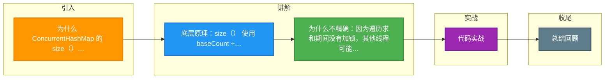

# 为什么 ConcurrentHashMap 的 size() 不精确？如何获取精确的元素数量？

【size() 不精确的底层原理】
- **并发计数机制**：JDK 8 的 `ConcurrentHashMap` 摒弃了 JDK 7 的分段锁全局计数，转而采用类似 LongAdder 的 `LongAdder` 机制（内部实现其实是 `baseCount` + `CounterCell[]`）。
- **写操作策略**：
  1. 优先尝试 CAS 更新 `baseCount`。
  2. 若竞争激烈，初始化或扩容 `CounterCell[]` 数组。
  3. 线程 Hash 到特定的 Cell，只更新该 Cell 的值。
- **读操作策略**：`size()` 方法执行 `sumCount()`，即 `baseCount + 遍历所有 CounterCell 累加`。
- **不精确原因**：在遍历累加 Cell 数组的过程中，**没有锁**保护。其他线程可能正在修改 baseCount 或某个 Cell 的值。因此，返回值只是一个“某个时刻的近似快照”。

【并发计数架构图】
```text
               ConcurrentHashMap
        ┌───────────────────────────┐
        │  CounterCell[] (Hot Spot) │
        ├─────┬──────┬──────┬───────┤
        │Cell0│Cell1 │Cell2 │ Cell3 │ ...
        │  ↑  │  ↑   │      │       │
        │  │  │  │   │      │       │
Thread1─┘  │  │   └──────┘       │
Thread2─────┘  │                  │
Thread3────────┘                  │
                                   │
        ┌──────────────────────────┴───────┐
        │            baseCount              │ (初始CAS更新)
        └───────────────────────────────────┘
                   ▲         ▲
                   │         │
               sum() = base + Σ(Cells)
```

【实战案例】
在分布式缓存系统中，如果业务逻辑依赖 `map.size() > threshold` 来决定是否触发热点数据预热，可能会因为 size() 的误差导致预热不及时或误触发。解决思路是改用监控系统的计数或外部计数器（如 Redis），而非依赖 CHM 内部统计。

【为什么线程池特别危险？】
CHM 并没有提供强一致性的 `size()`，原因在于：如果为了保证精确而锁定所有 Segment 或 Cell，那么在高并发写入（如批量导入）场景下，获取 size() 会变成一个全局暂停点，阻塞所有更新操作，这在生产环境是不可接受的风险。

【对比表格：JDK 7 vs JDK 8 size() 实现】
| 特性 | JDK 7 (Segment) | JDK 8 (CounterCell) |
| :--- | :--- | :--- |
| **计数结构** | 全局 count + Segment 分段 count | baseCount + CounterCell[] |
| **统计方式** | 先乐观重试，失败则锁定所有 Segment | 累加 base + Cells (无锁) |
| **精确度** | 锁定时绝对精确 | 弱一致性 (近似值) |
| **性能影响** | 锁全表时性能急剧下降 | 极高，几乎无阻塞 |

【如何获取精确值？】
1. **mappingCount()**：JDK 8 引入，返回 `long` 类型，为了解决 size() 返回 int 可能溢出的问题。但内部实现与 size() 完全一致，**依然不精确**。
2. **替代方案**：
   - **全局锁**：不推荐，性能极差。
   - **AtomicLong 计数器**：在业务层维护一个 `AtomicLong`，在 `put/remove` 时手动原子增减。注意这会增加 contention。
   - **容忍误差**：接受 `size()` 的弱一致性，这是使用 CHM 的默认契约。

【代码示例：利用 forEach 进行精确计数（不推荐用于生产，仅演示原理）】
```java
// 如果必须获取精确值且无法接受外部锁，可尝试暂停写入（极不推荐，仅作原理演示）
ConcurrentHashMap<Integer, String> map = new ConcurrentHashMap<>();
// 模拟精确计数的唯一方式：无并发修改时遍历
// 注意：这无法保证与调用时刻完全一致，除非全宇宙暂停写入
long exactSize = 0;
for (Integer key : map.keySet()) {
    if (map.containsKey(key)) { // 再次检查，防止并发删除
        exactSize++;
    }
}
// 真实场景建议：使用外部 AtomicLong 记录变更
```

【关于迭代器的弱一致性】
- CHM 的迭代器具有“弱一致性”。
- 它不会抛出 `ConcurrentModificationException`。
- 它可能反映迭代器创建时的状态，也可能反映迭代过程中的部分修改，甚至可能反映创建后才插入的元素，但不保证一定反映所有修改。


## 核心流程图

```mermaid
flowchart TD
    PUT([put 调用]) --> HASH[计算 hash<br/>spread 高低位异或]
    HASH --> INIT{table 初始化?}
    INIT -->|是 多线程竞争| CAS_INIT[CAS 抢初始化<br/>sizeCtl 标记]
    INIT -->|否| IDX[定位桶 bucket<br/>n-1 & hash]

    IDX --> BUCKET[i]
    BUCKET --> EMPTY{桶为空?}
    EMPTY -->|是| CAS_N[CAS 写入新 Node<br/>无锁]
    EMPTY -->|否| FH{节点类型}

    FH -->|forwarding 迁移中| HELP[协助扩容<br/>helpTransfer]
    FH -->|TreeBin 红黑树| TREE[加 synchronized<br/>树操作 putTreeVal]
    FH -->|链表 Node| LIST[加 synchronized<br/>首节点锁]
    LIST --> LEN{链表 ≥ 8?}
    LEN -->|是 数组 ≥ 64| TREEIFY[转红黑树<br/>O(logn)]
    LEN -->|是 数组 < 64| RESIZE2[先扩容不树化]
    LEN -->|否| APPEND[尾插法追加]

    CAS_N --> ADDCNT
    TREE --> ADDCNT
    APPEND --> ADDCNT
    ADDCNT[addCount<br/>LongAdder 分段计数<br/>baseCount + CounterCell]

    ADDCNT --> SIZE_CHK{size ≥ 阈值<br/>0.75 × capacity?}
    SIZE_CHK -->|是| TRANSFER[多线程扩容 transfer<br/>步长 16 分段迁移]
    SIZE_CHK -->|否| DONE([插入完成])
    TRANSFER --> DONE

    style PUT fill:#4CAF50,color:#fff
    style DONE fill:#2196F3,color:#fff
    style CAS_N fill:#009688,color:#fff
    style LIST fill:#FF9800,color:#fff
    style TREEIFY fill:#9C27B0,color:#fff
    style TRANSFER fill:#F44336,color:#fff

```

## 记忆要点

- 底层原理：size() 使用 baseCount + CounterCell[] 累加，且统计过程无锁。
- 为什么不精确：因为遍历求和期间没有加锁，其他线程可能正在并发修改数据，所以只是近似快照。
- 注意区别：JDK8 的 mappingCount() 返回 long，仅为防溢出，内部实现与 size() 一致，依然不精确。
- 如果强依赖精确值：建议在业务层使用 AtomicLong 等外部计数器维护。

## 结构化回答

**30 秒电梯演讲：** 像数散落在操场上的硬币，为了不封锁操场（加锁），允许人继续进出，只用眼睛快速扫描一遍，数出来的数大概对但不绝对准。

**展开框架：**
1. **计数机制** — 计数机制：baseCount + CounterCell[] 分段统计
2. **不精确原因** — 不精确原因：sum() 遍历时不加锁，并发修改导致偏差
3. **设计权衡** — 设计权衡：牺牲一致性以换取高并发性能

**收尾：** 关于这个问题，我还可以展开聊——ConcurrentHashMap 的迭代器是弱一致性的，这意味着什么？您想从哪个角度深入？

## 视频脚本

> 预计时长：3 分钟 | 由浅入深

| 时间 | 画面/字幕 | 口播台词 | 讲解要点 |
|------|----------|----------|----------|
| 0:00 | 标题卡：为什么 ConcurrentHashMap 的 size() 不精确？如何获取精确的元素数量 | 今天这道题：为什么 ConcurrentHashMap 的 size() 不精确？如何获取精确的元素数量。30 秒先给你讲清楚。 | 开场钩子 |
| 0:20 | 核心概念动画/示意图 | 像数散落在操场上的硬币，为了不封锁操场（加锁），允许人继续进出，只用眼睛快速扫描一遍，数出来的数大概对但不绝对准。 | 核心概念 |
| 0:40 | 计数机制示意图 | 计数机制：baseCount + CounterCell[] 分段统计 | 计数机制 |
| 1:10 | 总结卡 + 下期预告 | 记住三个词就能答好这道题。下期追问：ConcurrentHashMap 的迭代器是弱一致性的，这意味着什么？ | 收尾 |

### 视频流程图



