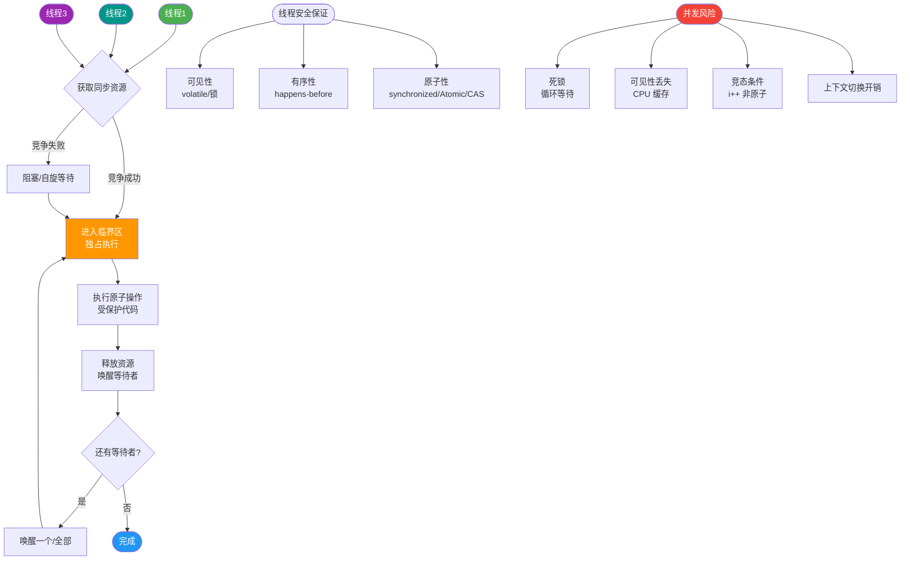

# Java 并发

【Java 并发核心优化与 Synchronized 原理】

**1. JIT 编译器优化（提升并发性能的基础）**
- **逃逸分析**：分析对象的作用域。
  - **栈上分配**：如果对象未逃逸（方法外无法引用），可直接分配在栈内存，随栈帧销毁而销毁，减少 GC 压力。
  - **标量替换**：将聚合对象拆解为基本类型成员，消除对象分配。
  - **锁消除**：如果对象未逃逸，不可能被其他线程访问，JIT 会自动消除该对象的 Synchronized 锁。
- **公共子表达式消除**：避免重复计算，减少指令执行时间，间接减少临界区执行时间。
- **数组边界检查消除**：循环中根据访问模式分析，移除不必要的数组越界检查指令。

【实战案例】
在高并发的报表导出服务中，遇到性能瓶颈。通过 JitWatch 工具分析 JIT 编译日志，发现热点方法内的 `StringBuffer`（局部变量）发生了逃逸分析失败，导致对象频繁在堆上分配且未被锁消除。优化代码结构将其限制在方法内后，GC 次数减少了 40%，吞吐量显著提升。

**2. Synchronized 关键字深度解析**
- **核心作用**：保证原子性、可见性（Monitor Exit 刷回主内存）、可重入性。
- **三种用法及锁对象**：
  1. **实例方法**：锁是当前实例对象 (`this`)。
  2. **静态方法**：锁是类的 Class 对象 (`Class.class`)。
  3. **代码块**：锁是括号内指定的对象。

**3. 对象头与 Monitor 机制**
- **对象头结构**：
  - `Mark Word`：存储 HashCode、GC 分代年龄、**锁状态标志**、指向 Monitor 的指针等。
  - `Class Pointer`：指向类元数据。
- **Monitor（管程）**：操作系统的互斥量。Synchronized 依赖 ObjectMonitor 实现（重量级锁）。
  - 包含 `_owner`（持有锁的线程）、`_WaitSet`（调用 wait 的线程）、`_EntryList`（阻塞等待锁的线程）。

**4. 锁升级过程（JDK 1.6 优化）**
Synchronized 不是直接使用重量级锁，而是根据竞争情况逐步升级，**不可逆**。

```text
┌─────────────┐
│  无锁       │ (对象创建)
└──────┬──────┘
       │ 线程 A 访问
       ▼
┌─────────────┐
│  偏向锁     │ (Mark Word 记录线程ID)
└──────┬──────┘
       │ 线程 B 尝试获取 (撤销偏向)
       ▼
┌─────────────┐
│  轻量级锁   │ (CAS 竞争 Mark Word 指向 Lock Record)
└──────┬──────┘
       │ CAS 失败 / 自旋次数超限
       ▼
┌─────────────┐
│  重量级锁   │ (依赖 OS Mutex，用户态/内核态切换)
└─────────────┘
```
- **偏向锁**：假定锁只有一个线程访问，通过替换 Mark Word 中的 ThreadID 实现，无额外开销。
- **轻量级锁**：假定锁存在短暂竞争，线程尝试在栈帧中创建 Lock Record，并用 CAS 替换 Mark Word。失败则自旋等待。
- **重量级锁**：竞争激烈时，依赖 OS Mutex，线程挂起，涉及上下文切换，开销最大。

【对比表格：锁升级各阶段特征】
| 锁状态 | Mark Word 内容 | 适用场景 | 开销 |
| :--- | :--- | :--- | :--- |
| **无锁** | 对象 HashCode/分代年龄 | 无并发 | 无 |
| **偏向锁** | 线程 ID、Epoch、分代年龄 | 单线程反复访问 | 极低（仅替换 ID） |
| **轻量级锁** | 指向栈中 Lock Record 的指针 | 两个线程交替/短暂竞争 | 低（CAS 自旋） |
| **重量级锁** | 指向堆中 ObjectMonitor 的指针 | 多线程激烈竞争 | 高（内核态切换） |

【代码示例：验证偏向锁延迟开启（JVM 参数）】
```java
// JVM 启动参数通常有几秒的偏向锁延迟
// -XX:BiasedLockingStartupDelay=0 可关闭延迟用于测试
public class LockTest {
    public static void main(String[] args) throws InterruptedException {
        LockTest t = new LockTest();
        synchronized(t) {
            System.out.println("First lock"); // 偏向锁未开启前，可能直接升级为轻量级
        }
        Thread.sleep(5000); // 等待偏向锁开启
        synchronized(t) {
            System.out.println("Second lock"); // 此时大概率是偏向锁
        }
    }
}
```

## 常见考点
1. **Synchronized 和 ReentrantLock 的区别？**：Synchronized 是 JVM 层面实现，自动释放锁，支持偏向/轻量级优化；ReentrantLock 是 JDK API 层面实现，需手动 `unlock()`，支持公平锁、可中断锁、尝试锁等更灵活的功能。
2. **什么是锁粗化？**：JIT 循环体内或连续代码块中反复加锁解锁，会被优化为扩大范围的一次加锁（如 for 循环外加锁）。
3. **为什么说 synchronized 是可重入的？**：因为同一个线程再次获取锁时，识别 Monitor 的 `_owner` 是自己，计数器 +1 即可，无需阻塞。


## 核心流程图



## 记忆要点

- 锁升级：无锁 -> 偏向锁 -> 轻量级锁(自旋CAS) -> 重量级锁(OS阻塞)，且不可逆。
- 适用场景：单线程偏向，短暂竞争轻量级，激烈竞争重量级。
- 因为 JIT 会做逃逸分析，所以未逃逸的局部同步对象会被自动锁消除。
- 核心机制：重量级锁依赖对象头的 Mark Word 指向操作系统的 Monitor (Mutex) 实现。

## 结构化回答

**30 秒电梯演讲：** 逃逸分析像快递员只在本楼栋送信（栈上分配），Synchronized像会议室钥匙（一人持有，他人等待）。

**展开框架：**
1. **逃逸分析** — 逃逸分析支持栈上分配和同步消除，减少GC和锁开销
2. **标量替换将对象** — 标量替换将对象拆解为基本类型，避免对象创建
3. **公共子表达式和边界检查** — 公共子表达式和边界检查消除通过编译器优化减少冗余计算

**收尾：** 这块我踩过一些坑，您想深入聊哪一段——原理细节、实战案例还是常见踩坑？

## 视频脚本

> 预计时长：6 分钟 | 由浅入深

| 时间 | 画面/字幕 | 口播台词 | 讲解要点 |
|------|----------|----------|----------|
| 0:00 | 标题卡：Java 并发 | 今天这道题：Java 并发。30 秒先给你讲清楚。 | 开场钩子 |
| 0:20 | 核心概念动画/示意图 | 逃逸分析像快递员只在本楼栋送信（栈上分配），Synchronized像会议室钥匙（一人持有，他人等待）。 | 核心概念 |
| 0:40 | 逃逸分析示意图 | 逃逸分析支持栈上分配和同步消除，减少GC和锁开销 | 逃逸分析 |
| 1:10 | 标量替换将对象示意图 | 标量替换将对象拆解为基本类型，避免对象创建 | 标量替换将对象 |
| 1:40 | 公共子表达式和边界检查示意图 | 公共子表达式和边界检查消除通过编译器优化减少冗余计算 | 公共子表达式和边界检查 |
| 2:10 | 总结卡 + 下期预告 | 记住今天这几个关键词，面试一定用得上。下期见。 | 收尾 |
