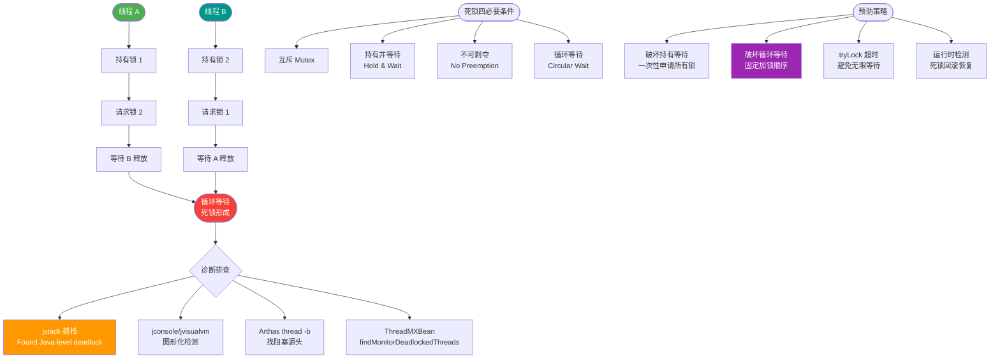

# 什么是死锁？如何避免死锁

死锁是指两个或多个进程在争夺系统资源时，由于互相等待对方释放资源而无法继续执行的状态。

死锁只有同时满足以下四个条件才会发生：
1. **互斥条件**：一个进程占用了某个资源时，其他进程无法同时占用该资源。
2. **请求与保持条件**：一个进程因请求资源而阻塞时，对已获得的资源保持不放。
3. **不可剥夺条件**：资源不能被强制性地从一个进程中剥夺，只能由持有者自愿释放。
4. **环路等待条件**：多个进程之间形成一个循环等待资源的链，每个进程都在等待下一个进程所占有的资源。

```text
   线程 A (持有资源 R1)            线程 B (持有资源 R2)
   ┌─────────────────┐           ┌─────────────────┐
   │  等待资源 R2    │──────────▶│  等待资源 R1    │
   │  ─────────────  │◀─────────│  ─────────────  │
   │  (持有 R1)      │           │  (持有 R2)      │
   └─────────────────┘           └─────────────────┘
            ▲                             │
            └────────── 死锁循环 ─────────┘
```

只需要破坏上面其中一个条件就可以避免死锁：
*   **破坏请求与保持条件**：一次性申请所有的资源（静态分配策略）。
*   **破坏不可剥夺条件**：占用部分资源的进程进一步申请其他资源时，如果申请不到，可以主动释放它占有的资源（资源剥夺）。
*   **破坏循环等待条件**：按序申请资源。让所有进程按照相同的顺序请求资源（有序资源分配）。

### 实战案例
在微服务架构中，服务A调用服务B，服务B回调用服务A（如回调通知），如果两者都使用数据库事务且持有行锁未提交，极易发生分布式死锁。解决方案是统一调用方向或设置超时自动回滚。

### 代码示例 (Java)
```java
// 破坏循环等待条件：约定所有线程必须按照 R1 -> R2 的顺序加锁
public void safeTransfer() {
    synchronized (R1) {       // 先锁定 R1
        synchronized (R2) {   // 再锁定 R2
            // 执行业务逻辑
        }
    }
}
```

### 常见考点
1. **死锁检测与恢复**：除了预防和避免，系统如何检测死锁（如资源分配图）以及如何恢复（如撤销进程、剥夺资源）？
2. **银行家算法**：这是死锁避免的经典算法，面试官可能会要求简述其核心思想（寻找安全序列）。
3. **数据库死锁**：数据库中死锁是如何发生的？数据库通常采用哪种策略（超时机制或等待图检测）？


## 核心流程图



## 记忆要点

- 口诀死锁四条件：互斥、请求保持、不剥夺、循环等待。
- 因为四者缺一不可，所以破坏其一即可避免死锁。
- 破坏策略三连记：一次性申请全量资源、主动释放、按序加锁。
- 实战避坑：微服务间避免相互回调嵌套事务，防分布式死锁。

## 结构化回答

**30 秒电梯演讲：** 两辆车在窄桥相遇，互不相让，谁都过不去。

**展开框架：**
1. **同时满足互斥** — 必须同时满足互斥、请求保持、不可剥夺、环路等待四个条件
2. **预防策略** — 预防策略：静态分配、资源剥夺、有序分配
3. **检测与恢复** — 检测与恢复：允许死锁发生，定期检测并剥夺资源

**收尾：** 这块我踩过一些坑，您想深入聊哪一段——原理细节、实战案例还是常见踩坑？

## 视频脚本

> 预计时长：3 分钟 | 由浅入深

| 时间 | 画面/字幕 | 口播台词 | 讲解要点 |
|------|----------|----------|----------|
| 0:00 | 标题卡：什么是死锁？如何避免死锁 | 今天这道题：什么是死锁？如何避免死锁。30 秒先给你讲清楚。 | 开场钩子 |
| 0:20 | 核心概念动画/示意图 | 两辆车在窄桥相遇，互不相让，谁都过不去。 | 核心概念 |
| 0:40 | 同时满足互斥示意图 | 必须同时满足互斥、请求保持、不可剥夺、环路等待四个条件 | 同时满足互斥 |
| 1:10 | 总结卡 + 下期预告 | 记住今天这几个关键词，面试一定用得上。下期见。 | 收尾 |
