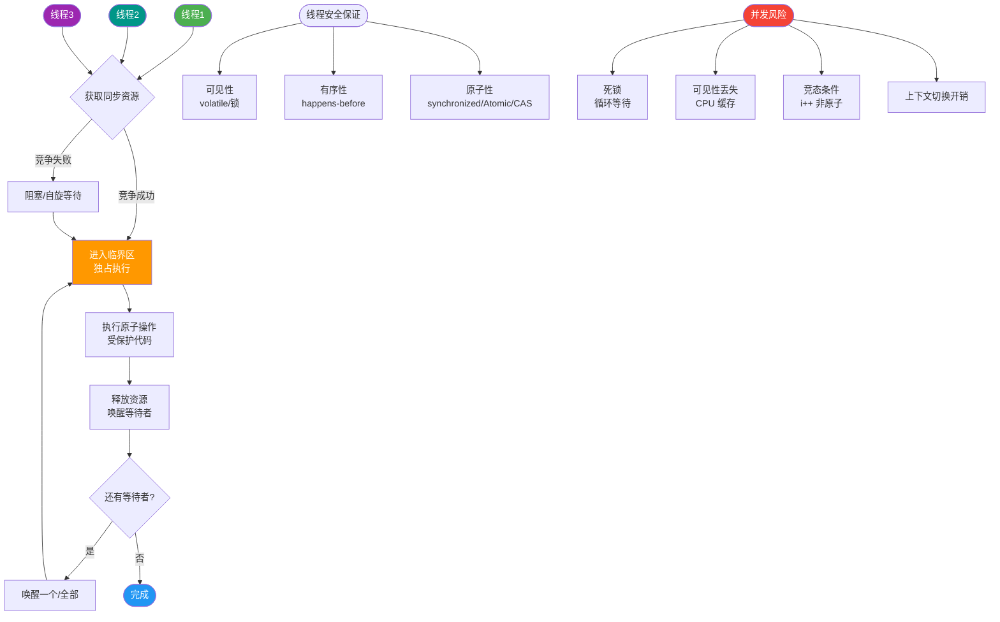
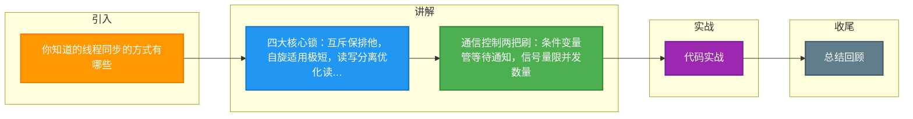

# 你知道的线程同步的方式有哪些

常见的线程同步机制主要有以下几种：

1. **互斥锁**：是最常见的线程同步机制。它确保同一时间只有一个线程能访问被保护的临界区（共享资源）。如 Java 中的 `synchronized` 或 `ReentrantLock`。
2. **自旋锁**：是一种基于忙等待的锁，线程在尝试获取锁时会不断轮询，直到锁被释放。适用于锁持有时间极短的场景，避免了线程上下文切换的开销，但会占用 CPU 资源。
3. **读写锁**：允许多个线程同时读取共享资源（共享锁），但在写操作时（排他锁）必须完全互斥。分为读锁和写锁。如 Java 中的 `ReentrantReadWriteLock`。
4. **条件变量**：用于线程间通信。允许一个线程等待某个条件满足，而其他线程可以发出信号通知等待线程。通常与互斥锁一起使用，如 Java 中的 `wait()`/`notify()` 或 `Condition` 接口。
5. **信号量**：用于控制同一时刻并发访问资源的线程数量，本质上是一个计数器。初始化为 N 时，允许 N 个线程同时访问。如 Java 中的 `Semaphore`。

从设计理念上分类还有：
*   **悲观锁**：认为并发冲突概率高，操作前必须上锁（如 Synchronized）。
*   **乐观锁**：认为并发冲突概率低，操作时不加锁，更新时判断是否被修改过（如 CAS）。

```text
   线程同步机制层级图
   ┌─────────────────────────────────────┐
   │         应用层 
   ├─────────────────────────────────────┤
   │  synchronized  │  ReentrantLock    │
   │  (悲观锁/互斥)  │  (可重入/可中断)  │
   ├─────────────────────────────────────┤
   │  ReentrantReadWriteLock (读写分离)  │
   ├─────────────────────────────────────┤
   │  Semaphore (流量控制)               │
   ├─────────────────────────────────────┤
   │  CAS / Atomic (乐观锁/无锁)         │
   └─────────────────────────────────────┘
               ↓ 调用底层
   ┌─────────────────────────────────────┐
   │      JVM / OS 内核实现      │
   └─────────────────────────────────────┘
```

### 实战案例
在高并发抢购场景下，使用 `ReentrantLock` 的 `tryLock(timeout)` 替代 `synchronized` 可以避免线程无限期阻塞，从而实现获取锁失败后的快速降级处理（如直接返回“系统繁忙”），防止雪崩。

### 代码示例 (Java)
```java
private final ReentrantLock lock = new ReentrantLock();

public void updateWithLock() {
    if (lock.tryLock(100, TimeUnit.MILLISECONDS)) { // 尝试获取锁，最多等100ms
        try {
            // 临界区代码
        } finally {
            lock.unlock();
        }
    } else {
        // 获取锁失败，执行降级逻辑
    }
}
```

### 对比表格
| 特性 | Synchronized | ReentrantLock |
| :--- | :--- | :--- |
| **实现层面** | JVM 关键字，底层基于 Monitor | JDK 类，基于 AQS (AbstractQueuedSynchronizer) |
| **释放锁** | 自动释放 (代码块执行完或异常) | 必须在 `finally` 块中手动调用 `unlock()` |
| **公平性** | 非公平锁 | 可选公平或非公平 (构造函数传参) |
| **等待中断** | 不可中断，必须等待锁释放 | 支持响应中断 (`lockInterruptibly`) |
| **条件绑定** | 一个锁只能有一个条件队列 (`wait/notify`) | 支持多个条件队列 (`Condition`)，精细化控制 |

### 常见考点
1. **Synchronized 与 ReentrantLock 的区别**：前者是 JVM 层面实现、自动释放锁、不可中断；后者是 JDK 层面实现、需手动释放、支持公平锁/非公平锁选择。
2. **CAS (Compare-And-Swap) 的 ABA 问题**：什么是 ABA 问题？如何通过版本号解决（如 AtomicStampedReference）？
3. **自旋锁的适应性**：在什么情况下自旋锁会失效（锁持有时间长），JVM 对自旋锁有哪些优化（如自适应自旋）？


## 核心流程图



## 记忆要点

- 四大核心锁：互斥保排他，自旋适用极短，读写分离优化读多。
- 通信控制两把刷：条件变量管等待通知，信号量限并发数量。
- Synchronized 是 JVM 关键字自动释放，而 ReentrantLock 是 API 级手动释放。
- 因为 tryLock 支持超时中断，所以能避免雪崩实现快速降级。

## 结构化回答


**30 秒电梯演讲：** 单间厕所一次只能进一人（互斥），多人阅览室可同时读书（读写锁）。

**展开框架：**
1. **互斥锁保证临** — 互斥锁保证临界区原子性
2. **读写锁实现读写分离** — 读写锁实现读写分离，提高并发读性能
3. **条件变量** — 条件变量用于线程间的等待与通知

**收尾：** 这是我实战中的理解，您想深入哪一段？


## 视频脚本

> 预计时长：3 分钟 | 由浅入深

| 时间 | 画面/字幕 | 口播台词 | 讲解要点 |
|------|----------|----------|----------|
| 0:00 | 标题卡：你知道的线程同步的方式有哪些 | 今天这道题：你知道的线程同步的方式有哪些。30 秒先给你讲清楚。 | 开场钩子 |
| 0:20 | 核心概念动画/示意图 | 单间厕所一次只能进一人（互斥），多人阅览室可同时读书（读写锁）。 | 核心概念 |
| 0:40 | 互斥锁示意图 | 互斥锁保证临界区原子性 | 互斥锁 |
| 1:10 | 总结卡 + 下期预告 | 记住今天这几个关键词，面试一定用得上。下期见。 | 收尾 |

### 视频流程图



