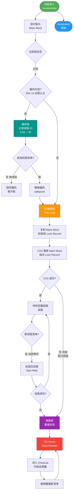
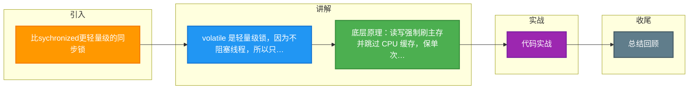

# 比sychronized更轻量级的同步锁

**volatile 关键字的作用**

Java 语言提供了一种稍弱的同步机制，即 volatile 变量，用来确保将变量的更新操作通知到其他线程。volatile 变量具备两种特性：

1. **保证可见性**：volatile 变量不会被缓存在寄存器或者对其他处理器不可见的地方。当一个线程修改了值，新值对其他线程立即可见。
2. **禁止指令重排序**：volatile 关键字禁止了特定类型的指令重排优化。

**为什么是轻量级同步锁**
在访问 volatile 变量时不会执行加锁操作，因此也就不会使执行线程阻塞，所以 volatile 变量是一种比 synchronized 关键字更轻量级的同步机制。

**底层原理**
当对非 volatile 变量进行读写时，每个线程可能先从内存拷贝变量到 CPU 缓存中。而声明变量是 volatile 的，JMM 保证了每次读变量都直接从主内存读取，跳过 CPU cache 这一步；写入时也立即刷新到主内存。

**适用场景与限制**
*   **适用**：保证标志位可见性、单例双重检查锁。
*   **限制**：volatile 变量的单次读/写操作具有原子性（如 long/double），但**不能保证复合操作**（如 `i++`）的原子性。

### 实战案例
在单例模式的双重检查锁定中，`instance` 变量必须加 `volatile`。否则，由于指令重排序，对象可能未完全初始化就被其他线程引用，导致调用未初始化的成员变量报错。

### 代码示例 (Java)
```java
public class Singleton {
    // 必须使用 volatile 防止指令重排
    private static volatile Singleton instance;

    private Singleton() {}

    public static Singleton getInstance() {
        if (instance == null) { // 第一次检查
            synchronized (Singleton.class) {
                if (instance == null) { // 第二次检查
                    instance = new Singleton(); 
                    // 1.分配内存 2.初始化对象 3.指向引用
                    // volatile 保证 2 和 3 不会重排
                }
            }
        }
        return instance;
    }
}
```

## 技术原理

volatile 的"轻量级同步"靠的是 JMM（Java 内存模型）的两层保障——可见性和有序性，但它故意不保证原子性，这是它和 synchronized 的本质区别：

- **可见性的内存屏障原理**：普通变量读写可能缓存在 CPU 寄存器或 L1/L2 cache 里，其他核心看不到。volatile 写操作会插入 Store-Load 屏障，强制把 cache 行刷回主内存并让其他 CPU 的 cache 行失效；volatile 读会插入 Load 屏障，强制从主内存读。这保证了"一个线程写，所有线程立刻能看到"。
- **禁止重排序的 happens-before**：`new Singleton()` 不是原子操作，分三步：分配内存、初始化对象、引用指向内存。JVM 可能重排成"分配→引用指向→初始化"，此时其他线程拿到未初始化的对象就崩了。volatile 通过插入内存屏障禁止 2、3 步重排，保证对象完全初始化后才对其他线程可见。
- **为什么不能保证 i++ 原子性**：`i++` 是"读-改-写"三步复合操作，volatile 只保证单次读或单次写的可见性，但"读到 i=1→计算 2→写回 2"之间其他线程可能也读到 1，导致丢失更新。需要原子性得用 `AtomicInteger` 或 `synchronized`。

## 注意事项

1. **volatile 不保证复合操作原子性**：`i++`、`check-then-act` 这类多步操作仍需 `Atomic` 类或锁，volatile 只保单次读写的可见性。
2. **单例双重检查锁必须加 volatile**：`instance` 字段不加 volatile，对象初始化指令重排会让其他线程拿到未初始化的对象，这是高频踩坑点。
3. **适用场景有限**：volatile 适合"一个线程写、多个线程读"的标志位场景（如停止标志 `volatile boolean running`），不适合写并发高的计数器。
4. **long/double 的特殊作用**：非 volatile 的 long/double 读写可能被拆成两次 32 位操作（非原子），volatile 能保证其读写原子性，这是 volatile 的一个附带用途。

## 对比表

| 维度 | volatile | synchronized | AtomicInteger |
|:---|:---|:---|:---|
| **可见性** | 保证 | 保证 | 保证 |
| **原子性** | 仅单次读/写 | 保证（互斥） | 保证（CAS） |
| **禁止重排** | 保证 | 保证 | 保证 |
| **是否阻塞** | 不阻塞 | 阻塞 | 不阻塞（CAS 自旋） |
| **适用场景** | 标志位、单例 DCL | 临界区复合操作 | 计数器 i++ |
| **性能** | 最高 | 最低（重量级） | 中（高竞争退化） |


## 核心流程图



## 记忆要点

- volatile 是轻量级锁，因为不阻塞线程，所以只保可见性和禁重排。
- 底层原理：读写强制刷主存并跳过 CPU 缓存，保单次读写的原子性。
- 限制避坑：volatile 无法保证 i++ 等复合操作的原子性。
- 实战必考：单例双重检查锁必须加 volatile，防对象初始化指令重排。

## 结构化回答


**30 秒电梯演讲：** 公告栏更新，所有人立刻看到最新内容，不需要排队拿锁。

**展开框架：**
1. **保证线程间变量修改的** — 保证线程间变量修改的可见性
2. **禁止指令重排** — 禁止指令重排序
3. **无法保证原子** — 无法保证原子性（如i++）

**收尾：** 这是我实战中的理解，您想深入哪一段？


## 视频脚本

> 预计时长：4 分钟 | 由浅入深

| 时间 | 画面/字幕 | 口播台词 | 讲解要点 |
|------|----------|----------|----------|
| 0:00 | 标题卡：比sychronized更轻量级的同步锁 | 今天这道题：比sychronized更轻量级的同步锁。30 秒先给你讲清楚。 | 开场钩子 |
| 0:20 | 核心概念动画/示意图 | 公告栏更新，所有人立刻看到最新内容，不需要排队拿锁。 | 核心概念 |
| 0:40 | 保证线程间变量修改的示意图 | 保证线程间变量修改的可见性 | 保证线程间变量修改的 |
| 1:10 | 禁止指令重排序示意图 | 禁止指令重排序 | 禁止指令重排序 |
| 1:40 | 总结卡 + 下期预告 | 记住今天这几个关键词，面试一定用得上。下期见。 | 收尾 |

### 视频流程图



