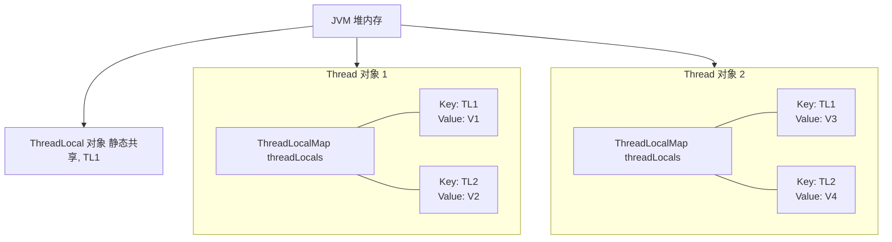
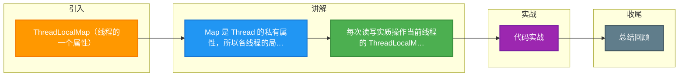

# ThreadLocalMap（线程的一个属性）

**ThreadLocal 作用（线程本地存储）**
ThreadLocal 叫做线程本地变量或线程本地存储。它的作用是提供线程内的局部变量，这种变量在线程的生命周期内起作用，减少同一个线程内多个函数或者组件之间传递公共变量的复杂度。

**ThreadLocalMap 原理**
1.  **独立存储**：每个线程中都有一个自己的 `ThreadLocalMap` 类对象（作为 Thread 类的属性），可以将线程自己的对象保持其中，各线程互不干扰。
2.  **Key-Value 结构**：将一个共用的 ThreadLocal 静态实例作为 key，将不同对象的引用保存到不同线程的 ThreadLocalMap 中。
3.  **访问机制**：线程执行的各处通过这个静态 ThreadLocal 实例的 `get()` 方法取得自己线程保存的那个对象，避免了将对象作为参数层层传递的麻烦。

**源码定义**
ThreadLocalMap 其实就是线程里面的一个属性，它在 Thread 类中定义：
`ThreadLocal.ThreadLocalMap threadLocals = null;`



### 实战案例
在使用 Tomcat 等线程池容器时，**务必**在请求结束时手动 `remove()` ThreadLocal。因为线程是复用的，如果不清理，上一个请求的数据会被下一个请求读取到，导致严重的“数据污染”或内存泄漏。

### 代码示例 (Java)
```java
private static final ThreadLocal<User> userContext = new ThreadLocal<>();

public void processRequest(HttpServletRequest req) {
    try {
        User user = getUserFromDB(req);
        userContext.set(user); // 绑定当前线程用户
        // 执行业务逻辑...
        doBusiness();
    } finally {
        // 关键：防止内存泄漏和数据污染，必须清理
        userContext.remove(); 
    }
}
```


## 记忆要点

- Map 是 Thread 的私有属性，所以各线程的局部变量独立互不干扰。
- 每次读写实质操作当前线程的 ThreadLocalMap，用共享的 ThreadLocal 做 Key。
- 线程池复用必踩坑：因为线程不销毁，所以用完务必 remove()。
- 不清理会导致上一个请求数据泄漏，引发严重的数据污染。

## 结构化回答


**30 秒电梯演讲：** 每个工人的个人储物柜，大家拿同名钥匙开各自的柜子。

**展开框架：**
1. **ThreadLo** — calMap 是线程内部属性
2. **以ThreadLocal实…** — 以ThreadLocal实例为Key，存储数据对象
3. **实现线程封闭** — 实现线程封闭，无锁化线程安全

**收尾：** 这是我实战中的理解，您想深入哪一段？


## 视频脚本

> 预计时长：4 分钟 | 由浅入深

| 时间 | 画面/字幕 | 口播台词 | 讲解要点 |
|------|----------|----------|----------|
| 0:00 | 标题卡：ThreadLocalMap（线程的一个属性） | 今天这道题：ThreadLocalMap（线程的一个属性）。30 秒先给你讲清楚。 | 开场钩子 |
| 0:20 | 核心概念动画/示意图 | 每个工人的个人储物柜，大家拿同名钥匙开各自的柜子。 | 核心概念 |
| 0:40 | ThreadLocalMap示意图 | ThreadLocalMap 是线程内部属性 | ThreadLocalMap |
| 1:10 | 以ThreadLocal实例示意图 | 以ThreadLocal实例为Key，存储数据对象 | 以ThreadLocal实例 |
| 1:40 | 总结卡 + 下期预告 | 记住今天这几个关键词，面试一定用得上。下期见。 | 收尾 |

### 视频流程图



