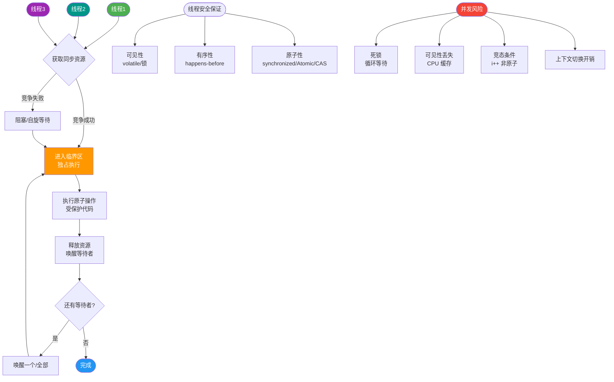

# Cassandra

**Apache Cassandra 概念**
Cassandra 是高度可扩展、高性能的分布式 NoSQL 数据库。它旨在跨多个商品服务器处理大量数据，提供高可用性且无单点故障。

**数据模型**
1.  **Keyspace**：对应 SQL 数据库中的 Database，包含若干个 Column Family，定义了复制策略和副本数。
2.  **Column Family (CF)**：对应 SQL 数据库中的 Table，由一系列 Row 组成。存储数据的物理容器。
3.  **Key (Row Key)**：每一行数据的唯一标识，用于在集群中定位数据分区。
4.  **Column**：Cassandra 中每个 key/value 对中的 value 称为 column，是一个三元组：`name`, `value`, `timestamp`。Timestamp 用于解决冲突，通常由客户端生成。
5.  **Super Column**（注：CQL 3 以后较少使用，被冻结的嵌套表替代）：允许 value 是一个 map (key/value_list)，即嵌套列结构。

**一致性与哈希**
Cassandra 使用一致性 Hash 环进行数据分片。系统为每个节点分配一个 Token（默认范围 0~2^63-1），根据 Token 值决定节点在环上的位置及数据范围。这种架构避免了单点故障，并支持数据的多副本复制。

**分区器**
决定 Row Key 如何映射为 Token 的关键组件，常见的有：
*   **Murmur3Partitioner**：默认分区器，数据分布均匀。
*   **RandomPartitioner**：基于 MD5，数据均匀但范围查询性能差。
*   **ByteOrderedPartitioner**：基于字节序，支持范围查询但可能导致数据分布不均（负载倾斜）。

**复制策略**
*   **SimpleStrategy**：仅适用于单数据中心，按顺时针方向在环上复制副本。
*   **NetworkTopologyStrategy**：适用于多数据中心，可指定每个数据中心的副本数，不仅考虑环形顺序还考虑机架感知，提升容灾能力。

**Gossip 协议与 Snitch**
*   **Gossip**：节点间通过 P2P 通信，每秒交换一次状态信息，每 3 秒交换一次摘要。用于故障检测。
*   **Snitch**：负责定义集群拓扑（数据中心、机架），告知复制策略节点的物理位置，如 `DynamicSnitch`（动态选择性能最好的节点路由）。

**写流程**
客户端连接任意节点 -> Coordinator（协调器）节点 -> 写入 Commit Log（持久化） -> 写入 MemTable（内存） -> 返回。MemTable 满后刷入 SSTable（不可变）。

**实战案例**
在物联网时序数据存储场景中，曾因直接使用时间戳作为 clustering key 导致大量写入集中在同一节点（热点）。**解决方案**是引入 Bucket 策略（如将时间戳分桶）或使用随机 Partition Key，将写压力均匀分散到集群各节点，避免单节点 OOM。

**关键代码 (CQL)**
```cql
-- 创建 Keyspace，定义多数据中心复制策略
CREATE KEYSPACE iot_data 
WITH replication = {
  'class': 'NetworkTopologyStrategy',
  'dc1': 3, -- 数据中心1 副本数
  'dc2': 2  -- 数据中心2 副本数
};

-- 创建表，使用复合主键避免写入热点
CREATE TABLE sensor_readings (
  sensor_id uuid,
  bucket_id int, -- 引入分桶字段打散写入
  timestamp timestamp,
  value double,
  PRIMARY KEY ((sensor_id, bucket_id), timestamp)
) WITH CLUSTERING ORDER BY (timestamp DESC);
```

**架构示意图**
```
                    Client
                       |
                       v
              +------------------+
              |   Coordinator    | (任一节点)
              +--------+---------+
                       |
          Consistency Level (N, R, W)
                       |
       +---------------+---------------+
       |               |               |
   +---+---+       +---+---+       +---+---+
   | Node 1|       | Node 2|       | Node 3|
   +---+---+       +---+---+       +---+---+
       |               |               |
 [Commit Log]    [Commit Log]    [Commit Log]
       |               |               |
  [MemTable]      [MemTable]      [MemTable]
       |               |               |
       v               v               v
```


## 核心流程图



## 记忆要点

- 层级关系口诀：Worker 是物理节点，Executor 是其上的 JVM 进程，Task 是其内线程。
- 职责对比：Worker 只管汇报资源，Executor 运行 Task 并存数据。
- Task 是最小执行单元，其总数等于 RDD 的 Partition 分区数。
- 调优痛点：Executor 的 cores 设为 1 极度浪费，配置 5 核左右并发吞吐最佳。

## 结构化回答


**30 秒电梯演讲：** 分布式的P2P网络，每个节点地位平等，数据自动切片备份。

**展开框架：**
1. **无中心节点** — 无中心节点，无单点故障
2. **数据模型** — Keyspace -> CF -> Row -> Column
3. **使用一致性Has** — 使用一致性Hash进行数据分片

**收尾：** 这是我实战中的理解，您想深入哪一段？


## 视频脚本

> 预计时长：4 分钟 | 由浅入深

| 时间 | 画面/字幕 | 口播台词 | 讲解要点 |
|------|----------|----------|----------|
| 0:00 | 标题卡：Cassandra | 今天这道题：Cassandra。30 秒先给你讲清楚。 | 开场钩子 |
| 0:20 | 核心概念动画/示意图 | 分布式的P2P网络，每个节点地位平等，数据自动切片备份。 | 核心概念 |
| 0:40 | 无中心节点示意图 | 无中心节点，无单点故障 | 无中心节点 |
| 1:10 | 数据模型示意图 | 数据模型：Keyspace -> CF -> Row -> Column | 数据模型 |
| 1:40 | 总结卡 + 下期预告 | 记住今天这几个关键词，面试一定用得上。下期见。 | 收尾 |
