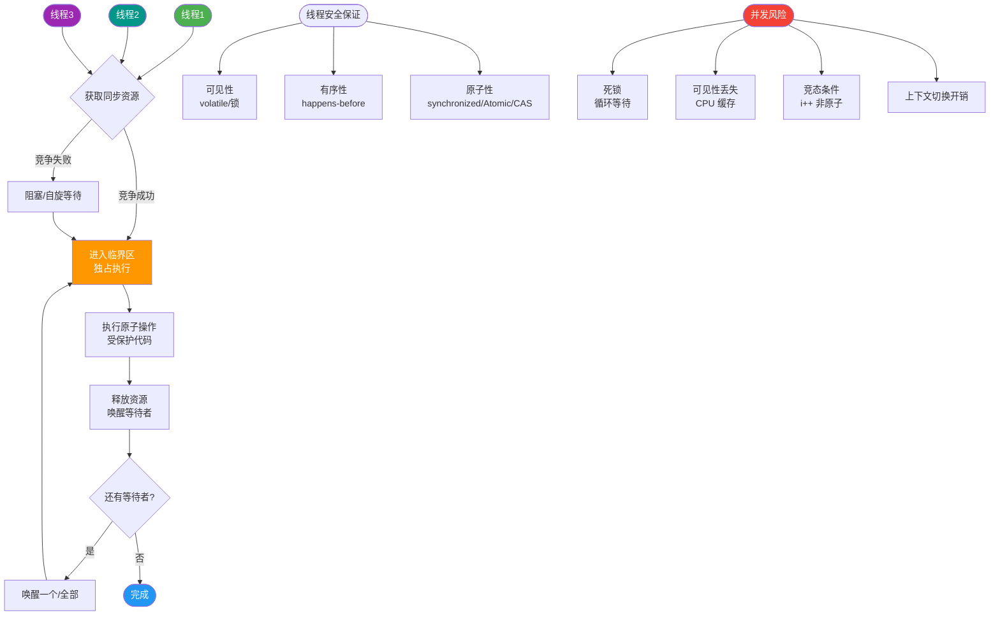
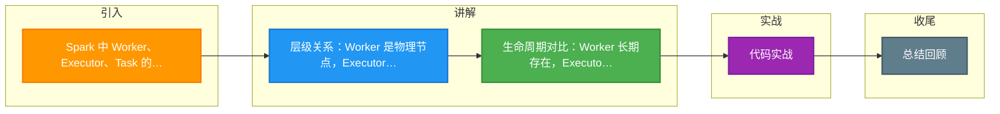

# Spark 中 Worker、Executor、Task 的关系是什么？

**题目修正**：本题答案主要描述的是 Storm 中的组件关系，而非 Spark。以下内容基于 **Spark** 模型优化。

**核心概念**
在 Spark 中，Application 提交后，集群资源分配给 Executor 进程。Driver 负责将作业划分为 Stage，进而划分为 Task。

1.  **Worker（节点/进程）**
    *   **物理/进程概念**：指集群中任何可以运行 Spark 代码的物理节点，或者在 Standalone 模式下指 `Worker` 进程。
    *   **职责**：Worker 节点上启动 `Executor` 进程。它本身不参与 Task 的直接计算，而是作为资源容器，向 Master 报告心跳和资源使用情况。

2.  **Executor（容器/进程）**
    *   **进程概念**：是一个运行在 Worker 节点上的 JVM 进程。
    *   **职责**：负责运行 Task，并将数据保持在内存或磁盘存储中（用于缓存或 Shuffle）。
    *   **资源隔离**：每个 Executor 拥有独立的线程池，其资源量（Cores, Memory）在应用启动时由 `spark.executor.cores` 和 `spark.executor.memory` 决定。
    *   **生命周期**：伴随着 Spark Application 的整个运行期间，除非 Application 结束或异常退出，否则 Executor 一直存在（不同于 Storm 的 Worker 对应 Topology 的部分）。

3.  **Task（线程/执行单元）**
    *   **最小执行单元**：对应 RDD 的一个 Partition 的数据处理逻辑。
    *   **执行方式**：Task 被发送到 Executor 上，作为 Executor 线程池中的一个独立线程运行。
    *   **数量**：总 Task 数 = 总 Partition 数。

**层级关系**：1 个 Application -> 多个 Worker 节点 -> 每个 Worker 上有多个 Executor 进程 -> 每个 Executor 内运行多个 Task 线程。

**实战案例**
在 ETL 任务中曾遇到任务极其缓慢，排查发现 `spark.executor.cores` 设置为 1，导致每个 Executor 只能串行执行 1 个 Task，大量 CPU 时间片浪费在线程上下文切换而非计算上。**调优**是将 Executor 调整为 5 Core，并增加 `spark.executor.memory`，利用并发计算能力将吞吐量提升了 4 倍。

**关键代码 (Spark Submit)**
```bash
# 生产环境常用配置：动态资源分配与合理并发度
spark-submit \
  --master yarn \
  --conf spark.dynamicAllocation.enabled=true \
  --conf spark.dynamicAllocation.maxExecutors=20 \
  --conf spark.executor.cores=5 \
  --conf spark.executor.memory=8g \
  --conf spark.default.parallelism=200 \
  --class com.example.MyETLApp my-app.jar
```

**对比表格：Worker vs Executor vs Task**

| 特性 | Worker (物理/节点) | Executor (进程/JVM) | Task (线程/计算单元) |
| :--- | :--- | :--- | :--- |
| **存在形式** | 物理服务器或 Slave 进程 | JVM 进程 | Java 线程 |
| **资源持有** | 拥有机器的全部硬件资源 (CPU, 内存, 磁盘) | 持有分配的堆内存和 CPU Core 数 | 仅持有执行代码所需的局部变量 |
| **生命周期** | 只要集群启动就运行 | 随 Spark Application 启动而创建，随 App 结束而销毁 | 极短，处理完一个 Partition 即结束 |
| **主要职责** | 资源汇报，通过心跳与 Master 通信 | 维护 BlockManager，运行 Task 线程，读写 Shuffle 数据 | 执行具体的算子逻辑 (map, filter, reduce 等) |
| **配置参数** | 部署配置文件 | `--executor-memory`, `--executor-cores` | 由 RDD Partition 数量决定，受 `spark.default.parallelism` 影响 |

**架构示意图**
```
+-------------------------------------------------------+
|                   Spark Cluster                       |
|                                                       |
|  +-------------------+       +-------------------+    |
|  |    Worker Node 1  |       |    Worker Node 2  |    |
|  |                   |       |                   |    |
|  |  +-------------+  |       |  +-------------+  |    |
|  |  | Executor 1  |  |       |  | Executor 2  |  |    |
|  |  | (JVM Proc)  |  |       |  | (JVM Proc)  |  |    |
|  |  |-------------|  |       |  |-------------|  |    |
|  |  | Thread: T1  |  |       |  | Thread: T3  |    |
|  |  | Thread: T2  |  |       |  | Thread: T4  |    |
|  |  +-------------+  |       |  +-------------+  |    |
|  +-------------------+       +-------------------+    |
+-------------------------------------------------------+
         |                            ^
         | Resources                   | Task Launch
         v                            |
```


## 核心流程图



## 记忆要点

- 层级关系：Worker 是物理节点，Executor 是其上的 JVM 进程，Task 是 Executor 线程池中的具体线程
- 生命周期对比：Worker 长期存在，Executor 随 Application 生灭，Task 处理完一个 Partition 即结束
- 数量关系：因为 Task 处理 Partition，所以总 Task 数总等于总 Partition 数
- 调优核心：因为 Cores=1 导致串行，所以配置多 Cores (如5核) 可充分利用线程池提升吞吐量

## 结构化回答


**30 秒电梯演讲：** 工厂(Worker)里有多个车间，车间有工人，工人负责具体流水线任务。

**展开框架：**
1. **Worker** — Worker是进程，负责隔离资源
2. **Executor** — Executor是线程，负责执行组件逻辑
3. **Task** — Task是执行单元

**收尾：** 这是我实战中的理解，您想深入哪一段？


## 视频脚本

> 预计时长：3 分钟 | 由浅入深

| 时间 | 画面/字幕 | 口播台词 | 讲解要点 |
|------|----------|----------|----------|
| 0:00 | 标题卡：Spark 中 Worker、Executor、Task 的关系是什么 | 今天这道题：Spark 中 Worker、Executor、Task 的关系是什么。30 秒先给你讲清楚。 | 开场钩子 |
| 0:20 | 核心概念动画/示意图 | 工厂(Worker)里有多个车间，车间有工人，工人负责具体流水线任务。 | 核心概念 |
| 0:40 | Worker示意图 | Worker是进程，负责隔离资源 | Worker |
| 1:10 | 总结卡 + 下期预告 | 记住今天这几个关键词，面试一定用得上。下期见。 | 收尾 |

### 视频流程图



