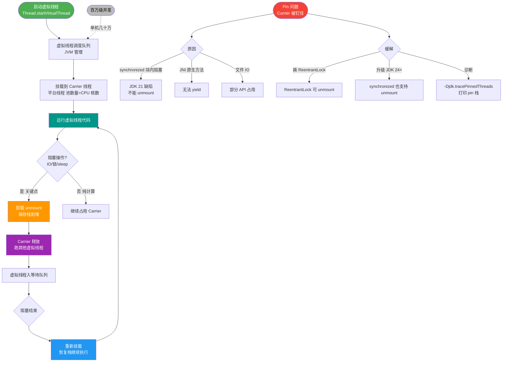

# 结构化并发在虚拟线程中是如何解决任务父子关系管理的？与传统Future.get()相比有什么优势？

结构化并发通过`StructuredTaskScope`将并发任务组织在作用域内，主线程自动等待所有子虚拟线程结束。一旦某个子任务失败，作用域会自动取消其余任务。相比`Future.get()`需手动管理线程集合和资源，它统一了代码结构与执行流，显著提升了异常处理的一致性和可读性。

## 技术原理

- **作用域统一管理**：`StructuredTaskScope`（JDK 21+ 预览，JEP 453/462/505）把一组并发子任务的生命周期绑定到一个代码块作用域内。主线程在作用域里 `fork` 出若干虚拟线程子任务，作用域结束时主线程自动等待所有子任务完成，子任务不可能"逃逸"出作用域继续运行——这就是"结构化"的含义：调用栈层级和并发任务层级一致。
- **自动等待与取消**：作用域提供 `ShutdownOnFailure` 和 `ShutdownOnSuccess` 两种策略。`ShutdownOnFailure` 在任一子任务失败时自动取消其余子任务（错误级联取消）；`ShutdownOnSuccess` 在任一子任务成功时取消其余（短路径求值）。取消通过 `Future.cancel()` 传播到子虚拟线程，无需手动管理线程集合。
- **结构清晰安全**：相比 `Future.get()` 散落各处、异常容易吞掉、取消难以传播，`StructuredTaskScope` 让并发代码的阅读顺序与执行结构对齐，作用域退出时所有子任务必然终结（成功/失败/取消），杜绝了线程泄漏和资源未关闭的问题。

## 代码示例

传统 `Future.get()` 写法（散乱、易泄漏）：

```java
// ExecutorService 的 Future 需手动管理，异常处理割裂
Future<String> user  = exec.submit(() -> fetchUser(id));
Future<Order>  order = exec.submit(() -> fetchOrder(id));
try {
    return buildView(user.get(), order.get());        // 一个失败另一个仍会跑完
} catch (ExecutionException e) {
    // 手动 cancel 另一个，容易漏
    order.cancel(true);
    throw e;
}
```

结构化并发写法（`StructuredTaskScope`，JDK 24 稳定版 API）：

```java
try (var scope = new StructuredTaskScope.ShutdownOnFailure()) {
    Subtask<String> user  = scope.fork(() -> fetchUser(id));   // fork 虚拟线程
    Subtask<Order>  order = scope.fork(() -> fetchOrder(id));
    scope.join();                              // 主线程等待所有子任务
    scope.throwIfFailed();                     // 任一失败则抛异常，其余已自动取消
    return buildView(user.get(), order.get()); // 此时必然都成功
}                                              // 作用域退出，子任务必终结
```

`ShutdownOnSuccess`（短路径：谁先成功就取消其余，适合多副本读）：

```java
try (var scope = new StructuredTaskScope.ShutdownOnSuccess<String>()) {
    for (String replica : replicas) {
        scope.fork(() -> queryReplica(replica));
    }
    scope.join();
    return scope.result();                     // 第一个成功的结果
}
```

## 对比/选型

| 维度 | Future.get() + ExecutorService | StructuredTaskScope |
|------|--------------------------------|---------------------|
| 任务层级 | 扁平、可逃逸 | 与调用栈绑定、不可逃逸 |
| 等待 | 手动逐个 get | 作用域 join 自动等待 |
| 取消传播 | 需手动 cancel | 失败/成功自动级联取消 |
| 异常处理 | 易吞、易漏 | throwIfFailed 统一 |
| 线程泄漏 | 可能（Future 未关） | 不可能（作用域保证终结） |
| 配套 | 平台线程为主 | 与虚拟线程天然契合 |

## 常见坑/注意事项

- **API 仍在演进**：`StructuredTaskScope` 经历多个预览版本（JDK 19-23），方法名/类位置在 JDK 24（JEP 499/505）才稳定，老代码升级需注意 API 差异。
- **不要在作用域外用 Subtask**：`fork` 返回的 `Subtask` 只在作用域内有效，`join()` 之前调用 `get()` 会抛异常；作用域关闭后子任务结果不可再用。
- **取消是协作式**：子任务需要在代码中响应中断（检查 `Thread.currentThread().isInterruptiated()` 或遇阻塞方法自动响应），纯 CPU 密集型任务若不检查中断，取消不会立即生效。
- **虚拟线程专属优势**：结构化并发与虚拟线程搭配最佳——`fork` 一次就建一个虚拟线程，成本极低；若在平台线程上大量 fork 仍受线程数限制。


## 核心流程图



## 记忆要点

- 结构化并发用作用域管理：主线程自动等待，子任务生命周期与父级强绑定。
- 最大优势是错误级联与取消：一子任务失败，作用域自动取消其余相关子任务。
- 对比 Future：Future 需手动管理线程集合，而 StructuredTaskScope 统一代码执行流。
- 价值定调：它不是单纯性能提升，而是通过代码结构显著提升了并发可读性与安全性。

## 结构化回答


**30 秒电梯演讲：** 像带学生春游，老师（主线程）在出口点名，只要有一个人走失（失败），立刻把其他人都叫回来（取消），而不是让每个学生自己乱跑。

**展开框架：**
1. **统一作用域管理** — 作用域统一管理
2. **自动等待与取消** — 自动等待与取消
3. **结构清晰安全** — 结构清晰安全

**收尾：** 这是我实战中的理解，您想深入哪一段？


## 视频脚本

> 预计时长：3 分钟 | 由浅入深

| 时间 | 画面/字幕 | 口播台词 | 讲解要点 |
|------|----------|----------|----------|
| 0:00 | 标题卡：结构化并发在虚拟线程中是如何解决任务父子关系管理的？与传统Future.get()相比有什么优势 | 今天这道题：结构化并发在虚拟线程中是如何解决任务父子关系管理的？与传统Future.get()相比有什么优势。30 秒先给你讲清楚。 | 开场钩子 |
| 0:20 | 核心概念动画/示意图 | 像带学生春游，老师（主线程）在出口点名，只要有一个人走失（失败），立刻把其他人都叫回来（取消），而不是让每个学生自己乱跑。 | 核心概念 |
| 0:40 | 作用域统一示意图 | 作用域统一管理 | 作用域统一 |
| 1:10 | 总结卡 + 下期预告 | 记住今天这几个关键词，面试一定用得上。下期见。 | 收尾 |
