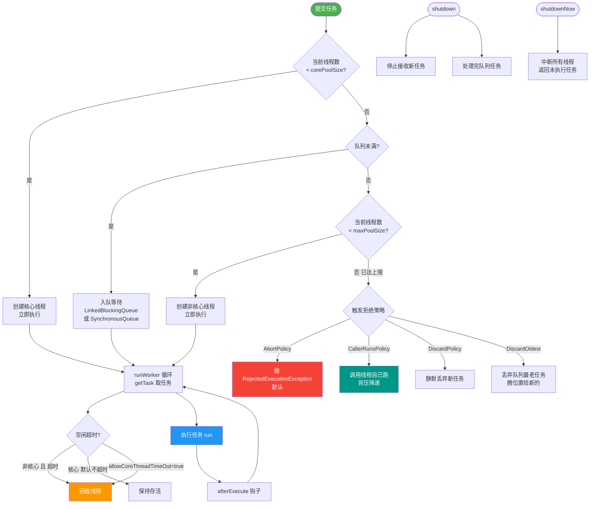

# ScheduledThreadPoolExecutor在处理大量短周期延时任务时为什么会成为性能瓶颈？JDK新引入的时间轮是如何解决的？

传统`ScheduledThreadPoolExecutor`基于PriorityQueue（堆）实现。每当有任务到期，或者新任务加入时，都需要进行堆调整，时间复杂度为O(logN)。如果存在海量的短周期（如每秒执行一次）延时任务，队列锁竞争激烈，且由于使用一个线程进行堆顶任务的扫描和等待，导致任务调度精度下降和CPU上下文切换频繁。JDK内部或第三方库（如Netty HashedWheelTimer）引入的时间轮算法，通过环形数组模拟时钟指针。添加任务的时间复杂度接近O(1)，只需要将任务放入对应的槽位。指针转动一格即可触发该槽位的所有任务。这种方式极大地减少了锁竞争和计算开销，非常适合高并发、低延迟的定时调度场景。

**实战案例**
在心跳检测场景中，若用 `ScheduledThreadPoolExecutor` 维护 10万个每 5秒 执行一次的心跳任务，CPU 会因频繁的堆调整和锁竞争飙升至 90% 以上，导致心跳超时。改用时间轮后，CPU 占用降至 5% 以下。

**代码示例**
```java
// Netty HashedWheelTimer 实例
HashedWheelTimer timer = new HashedWheelTimer(100, TimeUnit.MILLISECONDS, 512);
// 添加任务：O(1) 时间复杂度
timer.newTimeout(timeout -> {
    // 执行心跳逻辑
    System.out.println("Heartbeat send at " + System.currentTimeMillis());
}, 5, TimeUnit.SECONDS);
```

**对比表格**

| 特性 | ScheduledThreadPoolExecutor | 时间轮 |
| :--- | :--- | :--- |
| **数据结构** | PriorityQueue (二叉堆) | 环形数组 + 链表 |
| **插入复杂度** | O(log N) | O(1) |
| **取消复杂度** | O(log N) | O(1) (需维护映射表) |
| **适用场景** | 任务量少、对精度要求极高 | 海量短周期延时任务 |
| **内存消耗** | 较低 | 较高 (需预分配槽位) |
| **时间精度** | 纳秒级 (相对精确) | 受 tickDuration 影响 (如 100ms) |

## 技术原理

为什么堆在海量短周期任务下会成为瓶颈，而时间轮能做到 O(1)？根本原因是**数据结构决定复杂度**：

- **堆（PriorityQueue）的瓶颈**：`ScheduledThreadPoolExecutor` 用最小堆按到期时间排序。插入任务要做"上浮"调整 $O(\log N)$，取出堆顶到期任务要做"下沉"调整 $O(\log N)$。当 N=10 万个心跳任务时，每次插入/取出都要约 17 次比较和交换，且这些操作都在单线程的队列锁内完成——海量任务并发插入时锁竞争激烈，CPU 大量时间耗在堆调整和锁等待上，而非业务执行。
- **时间轮的 O(1) 原理**：用一个环形数组（如 512 个槽位），每个槽位挂一个任务链表。添加任务时，用 `任务延迟时间 % 槽位数` 算出该任务属于哪个槽，挂到链表尾部——这是 $O(1)$ 的哈希定位。一个指针按固定间隔（tickDuration，如 100ms）转动一格，转到某个槽就执行该槽所有到期任务。指针移动是 $O(1)$ 的。
- **长延迟任务的处理（多层时间轮）**：单层时间轮只能处理延迟 < 一圈的任务。对更长延迟，用**多层时间轮**（像时钟的秒针/分针/时针）——任务先挂在最内层轮，内层转一圈后把任务降级到外层对应槽。Kafka 就用多层时间轮管理海量消息延迟。
- **为什么适合海量短周期**：时间轮的添加/取消都是 $O(1)$，锁粒度小（只锁单个槽位的链表），海量任务下不会出现堆的全局锁竞争。代价是精度受 tickDuration 限制（如 100ms 一格则精度是 100ms）。

## 代码示例

Netty HashedWheelTimer 和简单时间轮实现：

```java
import io.netty.util.HashedWheelTimer;
import io.netty.util.Timer;
import java.util.concurrent.TimeUnit;

// Netty 的时间轮：适合海量短周期延时任务
Timer timer = new HashedWheelTimer(
    r -> new Thread(r, "wheel-timer"),  // 线程工厂
    100, TimeUnit.MILLISECONDS,          // tickDuration: 每 100ms 转一格
    512                                  // wheelSize: 512 个槽位
);

// 添加任务：O(1)，算出槽位挂链表即可
for (int i = 0; i < 100_000; i++) {
    timer.newTimeout(timeout -> {
        sendHeartbeat();   // 心跳逻辑
    }, 5, TimeUnit.SECONDS);
}
```

```java
// 手写时间轮的核心逻辑（便于面试白板）
class SimpleTimeWheel {
    private final Object[] slots;      // 环形数组，每个槽是一个任务链表
    private int wheelSize;
    private int currentSlot = 0;
    private long tickDurationMs;

    public SimpleTimeWheel(int wheelSize, long tickDurationMs) {
        this.wheelSize = wheelSize;
        this.tickDurationMs = tickDurationMs;
        this.slots = new Object[wheelSize];
    }

    // 添加任务：O(1) 哈希定位
    public void addTask(Runnable task, long delayMs) {
        int ticks = (int) (delayMs / tickDurationMs);
        int slot = (currentSlot + ticks) % wheelSize;   // 算槽位
        addToSlot(slot, task);                          // 挂链表尾部
    }

    // 指针转动：每 tickDurationMs 调用一次，执行当前槽任务
    public void tick() {
        runTasksInSlot(currentSlot);      // 执行当前槽所有任务
        currentSlot = (currentSlot + 1) % wheelSize;   // 指针前移一格
    }
}
```

## 注意事项

- **时间精度受 tickDuration 限制**：100ms 一格则任务最早在到期后 100ms 内执行，不适合纳秒级精度需求。精度和槽数要按业务权衡——槽数越多精度越高但内存越大。
- **单层时间轮有最大延迟上限**：一圈的时长 = wheelSize × tickDuration。超过这个延迟的任务需要用多层时间轮（降级机制），否则会立即触发（取模回绕）。
- **ScheduledThreadPool 仍有用武之地**：任务量少（<1000）、对精度要求极高（纳秒级）时，堆的 $O(\log N)$ 开销可忽略，且精度优于时间轮。别一刀切全换时间轮。
- **时间轮的任务取消要维护映射**：取消任务不是 $O(1)$ 除非维护"任务→槽位节点"的映射表，否则要在链表里线性查找。Caffeine 和 Netty 都维护了这个映射。


## 核心流程图



## 记忆要点

- 因为堆插入和删除是O(logN)，所以海量短任务会导致频繁锁竞争和CPU飙高
- 时间轮采用环形数组+链表，添加任务复杂度仅为O(1)，极大减少开销
- 对比适用场景：ScheduledThreadPool用于少任务高精度，时间轮用于海量短周期低延迟

## 结构化回答

**30 秒电梯演讲：** 像日历表查找特定日期，时间轮（钟表）直接拨指针到对应格子（O(1)）；传统堆排序像查字典，每次都要排序翻页（O(logN)），任务多了就卡。

**展开框架：**
1. **传统** — 传统使用堆结构，增删改查复杂度均为O(logN)且锁竞争严重
2. **海量短周期任务导致CPU** — 海量短周期任务导致CPU频繁上下文切换和堆调整
3. **时间轮** — 时间轮通过环形数组将复杂度降为O(1)，仅指针移动即可触发

**收尾：** 这块我踩过一些坑，您想深入聊哪一段——原理细节、实战案例还是常见踩坑？

## 视频脚本

> 预计时长：3 分钟 | 由浅入深

| 时间 | 画面/字幕 | 口播台词 | 讲解要点 |
|------|----------|----------|----------|
| 0:00 | 标题卡：ScheduledThreadPoolExecutor在处理大量短周期延时任务时为什么会成为性能瓶颈？JDK新引入的时间轮是如何解决的 | 今天这道题：ScheduledThreadPoolExecutor在处理大量短周期延时任务时为什么会成为性能瓶颈？JDK新引入的时间轮是如何解决的。30 秒先给你讲清楚。 | 开场钩子 |
| 0:20 | 核心概念动画/示意图 | 像日历表查找特定日期，时间轮（钟表）直接拨指针到对应格子（O(1)）；传统堆排序像查字典，每次都要排序翻页（O(logN)），任务多了就卡。 | 核心概念 |
| 0:40 | 传统示意图 | 传统使用堆结构，增删改查复杂度均为O(logN)且锁竞争严重 | 传统 |
| 1:10 | 总结卡 + 下期预告 | 记住今天这几个关键词，面试一定用得上。下期见。 | 收尾 |
