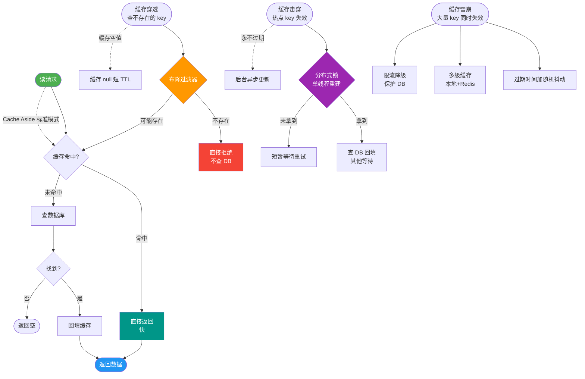
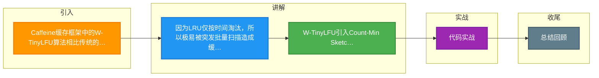

# Caffeine缓存框架中的W-TinyLFU算法相比传统的LRU有什么优势？它是如何平衡高频与突发热点数据的？

LRU（最近最少使用）算法存在'缓存污染'问题，即一次偶然的批量扫描操作会将真正的热点数据挤出缓存。Caffeine使用的W-TinyLFU（Window Tiny LRU）主要在以下方面进行了优化：

1. **访问频率统计**：引入Count-Min Sketch sketch结构，用极小的空间统计Key的访问频率，淘汰时优先淘汰低频数据，而不仅是最近未访问的数据。
2. **分级窗口设计**：将缓存分为Window（窗口）和Probation（缓刑）两个区域。新数据先进入Window区，当Window区满时，数据会被降级到Probation区。这种设计保护了Probation区中的高频数据不被突发的流量立即替换。
3. **动态调整**：W-TinyLFU能较好地适应访问模式的变换，既保留了传统的LRU时间局部性优势，又增加了频率统计，从而有效解决了偶发性稀疏数据淘汰热点数据的问题，命中率通常高于LRU。

**实战案例**：在电商大促场景中，推荐服务突然引入了一批冷门商品ID进行全量扫描，使用W-TinyLFU后，高频热门商品的缓存命中率依然保持在95%以上，未出现像LRU那样的“雪崩式”穿透。

**代码示例**（Java - Caffeine配置W-TinyLFU）：
```java
Cache<String, Object> cache = Caffeine.newBuilder()
    // 基于大小淘汰，内部使用W-TinyLFU策略
    .maximumSize(10_000)
    // 刷新机制（write-through）
    .refreshAfterWrite(1, TimeUnit.MINUTES)
    .build(key -> getValueFromDB(key));
```

**对比表格**：W-TinyLFU vs LRU
| 维度 | LRU (Least Recently Used) | W-TinyLFU (Window-TinyLFU) |
| :--- | :--- | :--- |
| **淘汰依据** | 仅依据访问时间（最近访问） | 结合访问频率与最近访问时间 |
| **抗污染能力** | 弱（扫描操作会挤出热点） | 强（Window区缓冲，保护Probation区热点） |
| **内存开销** | 低（仅需链表/指针） | 稍高（需维护Frequency Sketch） |
| **适用场景** | 数据分布均匀、无突发流量 | 存在突发流量、需兼顾高频与新数据 |

## 技术原理

LRU 的"缓存污染"问题的根源是**只看时间局部性，不看频率**——一次批量扫描会让一批冷数据"挤进"缓存，因为它们刚被访问过（时间上"最近"），把真正的高频热点挤出。W-TinyLFU 通过"频率统计 + 分级缓冲"两层机制解决：

- **Count-Min Sketch 频率统计**：用极小内存（几个 bit/Key）近似统计 Key 的访问频率。原理是 $d$ 个独立的哈希函数把每个 Key 映射到 $d$ 个计数器，访问时所有 $d$ 个计数器 +1，查询时取 $d$ 个计数器的最小值（min 抵消哈希冲突的过高估计）。相比用 HashMap 存精确计数，CMS 内存省几个数量级，代价是轻微过估（只高不低）。
- **老化机制（Aging）防历史热点霸占**：CMS 的计数会定期右移（除以 2），让历史频率随时间衰减。这样上周的热点不会因为历史累计计数高而永远占着缓存——只有近期仍高频的才能保持高分。
- **W-TinyLFU 的三区设计**：
  1. **Window 区（约 1% 容量）**：新数据先进这里，用纯 LRU 缓冲。目的是给"突发的新热点"一个机会——如果新数据在 Window 区被多次访问，说明它可能是新热点。
  2. **Probation 区（缓刑，约 20%）**：Window 区满后，数据降级到这里。
  3. **Protected 区（保护，约 80%）**：Probation 区中被再次访问的数据晋升到这里，受保护不被轻易淘汰。
  - 淘汰时：Protected 区用 LRU，Probation 区用 TinyLFU（结合频率）决定谁被淘汰。这样突发批量扫描的冷数据只会进 Window/Probation，很难挤进 Protected，热点被保护。

## 代码示例

Caffeine（W-TinyLFU 的工业实现）的配置与对比：

```java
import com.github.benmanes.caffeine.cache.Cache;
import com.github.benmanes.caffeine.cache.Caffeine;
import java.util.concurrent.TimeUnit;

// Caffeine 默认就是 W-TinyLFU，开箱即用
Cache<String, Product> cache = Caffeine.newBuilder()
    .maximumSize(10_000)                          // 基于大小淘汰，内部用 W-TinyLFU
    .expireAfterWrite(10, TimeUnit.MINUTES)       // 写后 10 分钟过期
    .refreshAfterWrite(1, TimeUnit.MINUTES)       // 异步刷新（防雪崩）
    .recordStats()                                // 开启命中率统计
    .build(key -> loadFromDB(key));               // 加载器

// 实战：电商大促，突发冷商品扫描不会挤掉热点
String hotKey = "product:iphone15";   // 高频热点
String coldBatch = "product:长尾商品"; // 批量扫描的冷数据
for (int i = 0; i < 1000; i++) {
    cache.get("product:cold" + i);    // 模拟冷数据批量扫描
}
cache.get(hotKey);   // 热点仍在缓存（Protected 区保护）
System.out.printf("命中率: %.2f%%%n",
    cache.stats().hitRate() * 100);   // 通常 >95%
```

```java
// Count-Min Sketch 的核心逻辑（手写便于理解）
class CountMinSketch {
    private final int[][] table;   // d 行 w 列的计数器
    private final int d, w;
    private final HashFunction[] hashes;

    public void add(String key) {
        for (int i = 0; i < d; i++) {
            int col = hashes[i].apply(key) % w;
            table[i][col]++;    // d 个计数器都 +1
        }
    }

    public int estimate(String key) {
        int min = Integer.MAX_VALUE;
        for (int i = 0; i < d; i++) {
            int col = hashes[i].apply(key) % w;
            min = Math.min(min, table[i][col]);   // 取最小值，抵消冲突高估
        }
        return min;
    }

    public void reset() {
        for (int[] row : table) for (int j = 0; j < row.length; j++) row[j] >>= 1; // 老化：除以 2
    }
}
```

## 注意事项

- **LRU 不是不能用，是怕突发扫描**：数据访问模式均匀、无批量扫描的场景（如稳定的用户画像查询），LRU 命中率与 W-TinyLFU 接近且开销更低。别盲目追求 W-TinyLFU。
- **W-TinyLFU 有内存开销**：Count-Min Sketch 的计数器和三区结构比纯 LRU 的链表多占用内存。对内存极度敏感的嵌入式场景要权衡。
- **过期策略要配合 W-TinyLFU**：仅靠 W-TinyLFU 管淘汰不够，还要配 `expireAfterWrite`（写后过期）或 `expireAfterAccess`（访问后过期）处理时效性数据，否则过期数据会占着缓存。
- **Caffeine 是 Java 生态首选**：相比 Guava Cache（LRU）和 ConcurrentHashMap（无淘汰），Caffeine 的 W-TinyLFU 在命中率上通常高 10~30%，且 API 兼容 Guava，迁移成本低。


## 核心流程图



## 记忆要点

- 因为LRU仅按时间淘汰，所以极易被突发批量扫描造成缓存污染
- W-TinyLFU引入Count-Min Sketch算法，用极小内存统计访问频率
- 分级设计：新数据进Window区缓冲，从而保护Probation区的高频热点

## 结构化回答

**30 秒电梯演讲：** 就像VIP通道，新人在隔离区(Window)试用，只有常客(Probation区高频)才坐稳位置，防止单次游客挤走忠实用户。

**展开框架：**
1. **引入Count-Min** — 引入Count-Min Sketch统计频率，而非仅看时间
2. **分级窗口设计(** — 分级窗口设计(Window/Probation)，新数据先试运行
3. **有效隔离突发流量** — 有效隔离突发流量，保护高频热点不被挤出

**收尾：** 这块我踩过一些坑，您想深入聊哪一段——原理细节、实战案例还是常见踩坑？

## 视频脚本

> 预计时长：3 分钟 | 由浅入深

| 时间 | 画面/字幕 | 口播台词 | 讲解要点 |
|------|----------|----------|----------|
| 0:00 | 标题卡：Caffeine缓存框架中的W-TinyLFU算法相比传统的LRU有什么优势？它是如何平衡高频与突发热点数据的 | 今天这道题：Caffeine缓存框架中的W-TinyLFU算法相比传统的LRU有什么优势？它是如何平衡高频与突发热点数据的。30 秒先给你讲清楚。 | 开场钩子 |
| 0:20 | 核心概念动画/示意图 | 就像VIP通道，新人在隔离区(Window)试用，只有常客(Probation区高频)才坐稳位置，防止单次游客挤走忠实用户。 | 核心概念 |
| 0:40 | 引入Count-Min示意图 | 引入Count-Min Sketch统计频率，而非仅看时间 | 引入Count-Min |
| 1:10 | 总结卡 + 下期预告 | 记住今天这几个关键词，面试一定用得上。下期见。 | 收尾 |

### 视频流程图



