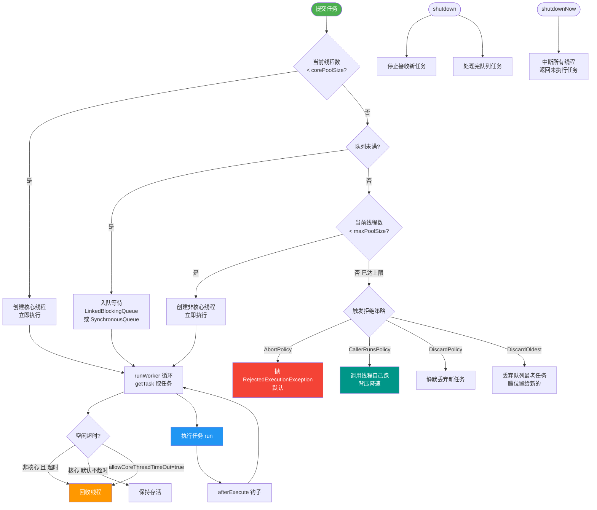
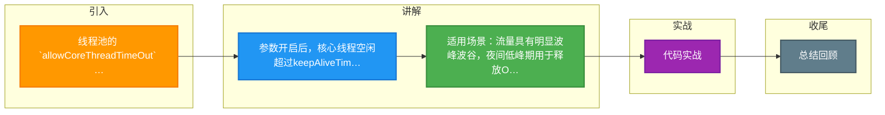

# 线程池的 `allowCoreThreadTimeOut` 参数设置为 true 后，对线程池的运行状态和资源回收有何具体影响？这在流量具有明显波峰波谷的业务场景下有何意义？

默认情况下，核心线程即使空闲也不会被回收（除非设置了 `allowCoreThreadTimeOut(true)`）。开启该参数后，核心线程的超时机制与非核心线程保持一致，即当线程空闲时间超过 `keepAliveTime` 时，核心线程也会被回收，直到线程数降为 0（除非队列非空）。在流量具有明显波峰波谷的场景（如夜间请求极少），开启此参数可以在线程空闲时释放底层 OS 线程资源，降低内存和 CPU 占用，避免“旱涝保收”的线程占用系统资源。但需要注意，在流量突发时，线程池需要重新创建线程，可能会有微小的预热延迟。

**底层机制细节**
*   **控制开关**：调用 `allowCoreThreadTimeOut(true)` 会设置内部 `allowCoreThreadTimeOut` 标志位为 true。
*   **超时逻辑**：线程池的工作线程在 `getTask()` 方法中阻塞获取任务。如果该标志为 true，工作线程在阻塞等待 `keepAliveTime` 时间后仍无任务，则会将 `workerCount` 减 1 并退出循环，线程对象被 GC 回收。
*   **最小值限制**：即便开启了此参数，线程池中的线程数量也不一定能完全降为 0。如果任务队列非空，必须保留至少一个线程来处理队列中的任务，防止生产的数据无人消费。

**适用场景与注意事项**
*   **资源敏感型应用**：适用于容器化环境或单机多实例部署，需要严格限制内存占用的场景。
*   **突发流量影响**：由于核心线程被回收，波谷后的波峰来了需要重新创建线程（调用 Thread.start()），涉及到系统调用和内存分配。如果对延迟极其敏感（Latency < 10ms），可能会产生毛刺。通常建议结合 `prestartAllCoreThreads()` 在波谷前预热，或者接受少量常驻核心线程的代价。
*   **KeepAliveTime 设置**：开启此参数后，建议配合合理的 `keepAliveTime`（如 60s），过于频繁的创建和销毁线程会增加 GC 压力。

**生命周期状态图**
```
状态: (allowCoreThreadTimeOut = false)
[Core Threads] (永久存活) <--- [Queue] <-- [New Tasks]
    ^
    | (create)
 [Non-Core Threads] (Idle > keepAliveTime -> Die)

状态: (allowCoreThreadTimeOut = true)
[All Threads] (Idle > keepAliveTime -> Die) ---+---> (Thread Count -> 0)
                                                  |
                                                  v
                                          [Queue] (Must keep >=1 Thread)
```

**实战案例**
在容器化部署的业务系统中，为了最大化利用资源应对白天流量，夜间低峰期开启 `allowCoreThreadTimeOut(true)` 配合 30s 超时，能将堆内内存占用减少约 20%-30%，显著降低云服务器成本。

**代码示例**
```java
ThreadPoolExecutor executor = new ThreadPoolExecutor(
    10, 100, 30, TimeUnit.SECONDS, new LinkedBlockingQueue<>());

// 开启核心线程超时回收
executor.allowCoreThreadTimeOut(true);

// 30秒无任务后，核心线程会从 10 逐渐减少至 0
```

## 常见考点
1.  **`allowCoreThreadTimeOut(true)` 会影响任务提交逻辑吗？**（答：不影响，核心线程数 `corePoolSize` 仍然是判断是否直接创建线程的阈值，只是影响线程的存活时间）
2.  **如果队列满了且核心线程都被回收了，会发生什么？**（答：新任务提交会根据 `maximumPoolSize` 创建新线程，如果达到最大值则执行拒绝策略）
3.  **如何实现线程池的“优雅停机”？**（答：设置此参数有助于空闲线程自动退出，但仍需调用 `shutdown()`，然后处理队列剩余任务）


## 核心流程图



## 记忆要点

- 参数开启后，核心线程空闲超过keepAliveTime也会被回收直至为0
- 适用场景：流量具有明显波峰波谷，夜间低峰期用于释放OS线程和内存
- 注意限制：若任务队列非空，必须保留至少1个线程防数据无人消费

## 结构化回答

**30 秒电梯演讲：** 默认核心线程是公司的‘带薪编制’员工，没活干也发工资；开启此参数后，全员变成‘临时工’，没活干超过规定时间就立马解散，省了开销但下次有活得重新招人。

**展开框架：**
1. **核心线程失去‘豁免权’** — 核心线程失去‘豁免权’，超时机制与非核心线程一致
2. **资源回收更彻底** — 资源回收更彻底，空闲时可降至0（除非队列非空）
3. **应对波峰波谷更省资源** — 应对波峰波谷更省资源，但突发流量需承担重新创建线程的启动延迟

**收尾：** 这块我踩过一些坑，您想深入聊哪一段——原理细节、实战案例还是常见踩坑？

## 视频脚本

> 预计时长：3 分钟 | 由浅入深

| 时间 | 画面/字幕 | 口播台词 | 讲解要点 |
|------|----------|----------|----------|
| 0:00 | 标题卡：线程池的 allowCoreThreadTimeOut 参数设置为 true 后，对线程池的运行状态和资源回收有何具体影响？这在流量具有明显波峰波谷的业务场景下有何意义 | 今天这道题：线程池的 allowCoreThreadTimeOut 参数设置为 true 后，对线程池的运行状态和资源回收有何具体影响？这在流量具有明显波峰波谷的业务场景下有何意义。30 秒先给你讲清楚。 | 开场钩子 |
| 0:20 | 核心概念动画/示意图 | 默认核心线程是公司的‘带薪编制’员工，没活干也发工资；开启此参数后，全员变成‘临时工’，没活干超过规定时间就立马解散，省了开销但下次有活得重新招人。 | 核心概念 |
| 0:40 | 核心线程失去‘豁免权’示意图 | 核心线程失去‘豁免权’，超时机制与非核心线程一致 | 核心线程失去‘豁免权’ |
| 1:10 | 总结卡 + 下期预告 | 记住今天这几个关键词，面试一定用得上。下期见。 | 收尾 |

### 视频流程图



