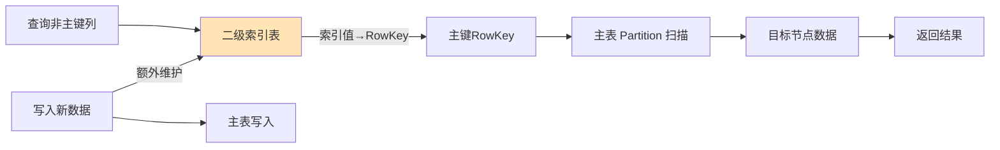

# 二级索引（对要索引的value摘要，生成RowKey）是什么？

### 题目 1：二级索引（对要索引的value摘要，生成RowKey）是什么？

本题答案主要涉及 Cassandra 的数据存储机制。关于二级索引，是指在 Cassandra 这种 NoSQL 数据库中，允许基于非主键列进行查询的机制。

**Cassandra 写流程与存储**
1.  **写入**：数据首先写入 CommitLog（顺序写，用于容灾恢复），然后写入 MemTable（内存结构，SkipList 实现）。
2.  **Flush**：当 MemTable 达到阈值，数据被不可变地刷入磁盘成为 SSTable (Sorted String Table)。
3.  **SSTable 结构**：不可变文件。包含 BloomFilter（快速判断 key 是否存在）、Partition Index（查找数据位置）和 Data（真实数据）。

**二级索引原理**
在 Cassandra 中，数据本质是 Wide-column Store（KV 存储的变体）。二级索引本质上是创建了一个“隐藏表”，存储索引列值到原数据 RowKey 的映射。
*   **原理**：索引表存储 `索引值 -> 原数据 RowKey` 的对应关系。这些索引数据也是分布存储在不同节点上的。
*   **查询流程**：
    1. Client 协调节点向所有节点请求“拥有该索引值”的 RowKey。
    2. 各节点查本地索引表，返回匹配的 RowKey。
    3. 协调节点收集 RowKey，再发起请求去原表中获取实际数据。
*   **代价**：写入时需要更新索引表（可能涉及跨节点写），性能开销较大；读取时需要查询多个节点（Read Repair 机制可能触发），不保证高性能（通常不推荐在高基数列上建二级索引）。

**实战案例**
在某用户画像系统中，曾尝试对“用户标签”这一高基数列建普通二级索引进行查询，结果导致一次简单的查询触发了全集群扫表，直接拖垮了线上写入流量。最终不得不下线索引，改用 ES 配合 Cassandra 双写方案解决。

**代码示例 (CQL)**
```cql
-- 创建原表
CREATE TABLE users (
    id UUID PRIMARY KEY,
    name text,
    age int
);

-- 创建二级索引 (坑点：高基数列 age)
CREATE INDEX ON users (age);

-- 查询虽然支持，但性能极差
SELECT * FROM users WHERE age = 25;
```

**方案对比**
| 特性 | 普通二级索引 | SASI 索引 | Solr/Elasticsearch 外部索引 |
| :--- | :--- | :--- | :--- |
| **适用场景** | 低基数列 (性别、状态) | 支持范围查询、高基数 (受限) | 复杂全文检索、模糊查询 |
| **查询性能** | 差 (可能涉及全节点扫描) | 中等 (依赖 SSTable 附加索引) | 高 (倒排索引优势) |
| **写入开销** | 中 (需维护本地索引表) | 低 (Flush 时构建) | 高 (网络传输/异步写入) |
| **数据一致性** | 强 (Cassandra 内部) | 强 (Cassandra 内部) | 最终一致性 (异步同步) |

## 常见考点
1.  **Cassandra 的二级索引有什么限制？为什么？
    不适合高基数的列（如用户ID、时间戳）。因为查询一个特定的索引值可能需要扫描几乎所有的节点，性能极差，甚至会拖垮集群。通常建议低基数列（如性别、状态）使用，或使用 SASI (SSTable Attached Secondary Index)。
2.  **什么是本地索引 vs 全局索引？
    在此语境下（Cassandra/HBase），传统的二级索引通常是“本地”的（索引与数据在同一Region/节点），虽然查询方便但效率受限。全局索引（如 Phoenix/HBase 的 Global Index）会单独构建一张索引表，数据按索引值分区，读取快但写入成本高（涉及分布式事务）。
3.  **SSTable 是不可变的，那更新和删除怎么做？
    更新和删除本质都是写入一个新的 SSTable。删除是写入一个“墓碑标记”。读取时，系统会合并多个 SSTable，根据时间戳取最新值或过滤掉带墓碑的数据。后台会有 Compaction 进程将多个 SSTable 合并并清理无效数据。


## 核心流程图



## 核心知识点图


## 记忆要点

- 本质是构建一张隐藏表，存储索引列值到原数据RowKey的映射
- 致命限制：不适合高基数列查询，会引发全集群扫描拖垮性能
- 高并发复杂检索建议弃用，改用Elasticsearch等外部倒排索引方案

## 结构化回答

**30 秒电梯演讲：** 非主键列的辅助查询结构，建立列值到RowKey的映射。打个比方，图书馆的书名检索卡，卡片记录书名对应的书架号。

**展开框架：**
1. **本质是构建一张隐藏表** — 存储索引列值到原数据RowKey的映射
2. **致命限制** — 不适合高基数列查询，会引发全集群扫描拖垮性能
3. **高并发复杂检索建议弃用** — 改用Elasticsearch等外部倒排索引方案

**收尾：** 我在项目里踩过坑——在某用户画像系统中，曾尝试对“用户标签”这一高基数列建普通二级索引进行查询，结果导致一次简单的查询触发了全集群扫表，直接拖垮了线上写入流量。您想深入聊哪一段：原理、避坑还是对比选型？

## 视频脚本

> 预计时长：2 分钟 | 由浅入深

| 时间 | 画面/字幕 | 口播台词 | 讲解要点 |
|------|----------|----------|----------|
| 0:00 | 标题卡：二级索引（对要索引的value摘要，… | "二级索引（对要索引的value摘要，生成RowKey）是什么？一句话——图书馆的书名检索卡，卡片记录书名对应的书架号。" | 开场钩子 |
| 0:40 | 概念动画/示意图 | "非主键列的辅助查询结构，建立列值到RowKey的映射——图书馆的书名检索卡，卡片记录书名对应的书架号" | 核心定义 |
| 1:20 | 本质是构建一张隐藏表示意 | "存储索引列值到原数据RowKey的映射" | 要点1 |
| 2:00 | 总结卡 | "记住这几条，面试不慌。下期讲进阶追问。" | 收尾 |
