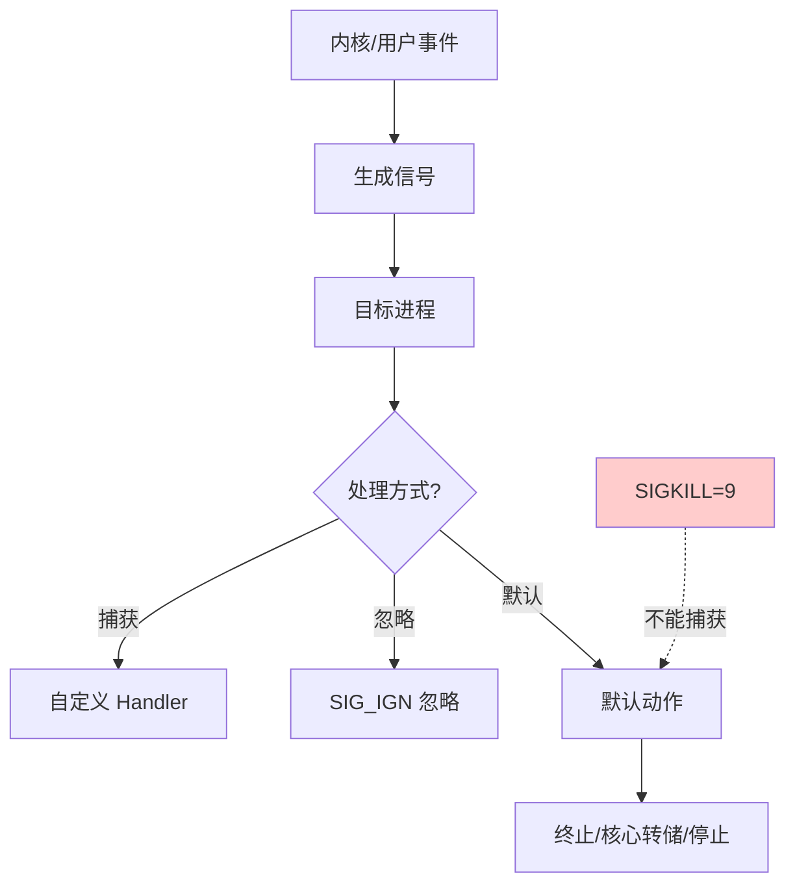

# 什么是Linux 信号？

### 题目 2：什么是Linux 信号？

**Linux 信号**

信号是一种用于在用户进程、内核和进程之间进行通信的机制。它被用来通知目标进程某个状态发生了改变或系统异常（如段错误、终止请求）。信号本质是软件中断。

**常见信号**
1.  **SIGHUP (1)**：通常由控制终端挂起或关闭时发送给进程，通知进程重新读取配置文件（如 Nginx reload 原理）。
2.  **SIGINT (2)**：用户按下 Ctrl+C 时发送，通常用于终止进程（可被捕获）。
3.  **SIGQUIT (3)**：用户按下 Ctrl+\ 时发送，通常终止进程并生成 Core Dump（用于调试）。
4.  **SIGKILL (9)**：强制终止信号。该信号不能被捕获、阻塞或忽略，由内核直接执行，用于立即杀死“无响应”的进程。
5.  **SIGTERM (15)**：终止信号（kill 命令默认）。程序可以捕获该信号并执行清理工作（如关闭文件、释放锁）后退出。
6.  **SIGPIPE (13)**：向读端已关闭的管道或 Socket 连接写数据时产生，通常导致进程意外退出（TCP 断连时的常见坑）。
7.  **SIGURG (23)**：Socket 连接上收到紧急数据（带外数据）时发送。
8.  **SIGCHLD (17)**：子进程状态改变（停止或退出）时通知父进程，常用于父进程回收僵尸进程（wait/waitpid）。

**处理方式**
进程可以对信号采取三种处理方式：
*   **默认操作**（Default）：如终止、忽略、停止、Core Dump。
*   **捕获并处理**（Catch/Handle）：注册信号处理函数，当信号到达时跳转到该函数执行。
*   **忽略**（Ignore）：除 SIGKILL 和 SIGSTOP 外，大多数信号可被忽略。

**实战案例**
在开发高并发 HTTP 服务时，若未处理 SIGPIPE 信号，当客户端异常断开连接而服务端继续尝试写入时，进程会直接崩溃退出。解决方法通常是在启动时显式忽略 SIGPIPE 或利用 `send` 函数的 `MSG_NOSIGNAL` 标志。

**代码示例 (C)**
```c
#include <signal.h>
#include <stdio.h>
#include <unistd.h>

void sigint_handler(int sig) {
    printf("Caught SIGINT, cleaning up...\n");
    _exit(0); // 注意：在信号处理函数中尽量使用 async-signal-safe 函数
}

int main() {
    signal(SIGINT, sigint_handler); // 注册信号处理函数
    signal(SIGPIPE, SIG_IGN);       // 实战：忽略管道破裂信号，防止进程崩溃
    while(1) {
        pause(); // 挂起进程，等待信号
    }
    return 0;
}
```

**信号机制对比**
| 特性 | 标准信号 (1-31) | 实时信号 (SIGRTMIN, 34-64) |
| :--- | :--- | :--- |
| **可靠性** | 不可靠 (可能丢失，不排队) | 可靠 (支持排队，保证不丢失) |
| **发送顺序** | 不保证顺序 | 保证发送顺序 |
| **携带数据** | 不携带额外信息 | 可携带整数或指针数据 |
| **主要用途** | 内核通知、进程控制 | 复杂应用程序间同步 |

## 常见考点
1.  **SIGKILL 和 SIGSTOP 为什么不能被捕获？
    这是内核保留的“终极手段”，为了保证系统管理员在任何情况下都能杀死或暂停一个失控的进程，赋予用户最高控制权。
2.  **什么是可靠信号与不可靠信号？
    早期 Unix 信号（如 1-31）可能丢失（如果多个相同信号排队，内核可能只处理一个）。实时信号（Real-time signals，如 SIGRTMIN，范围 34-64）是可靠的，支持排队，保证信号不丢失，且携带额外数据。
3.  **如何避免僵尸进程？
    父进程需要在子进程退出时调用 wait/waitpid 回收资源。常使用信号捕获：父进程捕获 SIGCHLD 信号，并在回调函数中调用 waitpid 循环回收所有已退出的子进程。
4.  **信号的发送和处理流程？
    发送：内核修改目标进程的 task_struct 中的 pending 位图。
    处理：当进程从内核态返回用户态时（如系统调用结束、中断返回），内核检查 pending 位图，如果有未阻塞的信号，则强制跳转到用户态注册的处理函数执行，执行完毕后通过特殊的 sigreturn 系统调用再次进入内核态，恢复上下文。


## 核心流程图




## 记忆要点

- 本质是内核通知进程状态改变的软件中断，可被捕获或忽略
- SIGKILL(9)不能被捕获，是内核直接执行的终极强杀手段
- 实战避坑：向断开的Socket写数据触发SIGPIPE致崩溃，服务端需显式忽略

## 结构化回答


**30 秒电梯演讲：** 电脑突然弹窗提醒你“电量低”或“系统错误”，强制你注意。

**展开框架：**
1. **用于** — 用于通知进程异常或状态变化
2. **SIGKILL** — SIGKILL(9)强制杀进程，SIGTERM(15)优雅退出
3. **信号** — 信号可被捕获、忽略或执行默认操作

**收尾：** 这是我实战中的理解，您想深入哪一段？


## 视频脚本

> 预计时长：2 分钟 | 由浅入深

| 时间 | 画面/字幕 | 口播台词 | 讲解要点 |
|------|----------|----------|----------|
| 0:00 | 标题卡：什么是Linux 信号 | "什么是Linux 信号？一句话——电脑突然弹窗提醒你“电量低”或“系统错误”，强制你注意。" | 开场钩子 |
| 0:40 | 概念动画/示意图 | "进程间异步通信的通知机制，类似软件中断——电脑突然弹窗提醒你“电量低”或“系统错误”，强制你注意" | 核心定义 |
| 1:20 | 要点1图解示意 | "可被捕获或忽略" | 要点1 |
| 2:00 | 总结卡 | "记住这几条，面试不慌。下期讲进阶追问。" | 收尾 |
