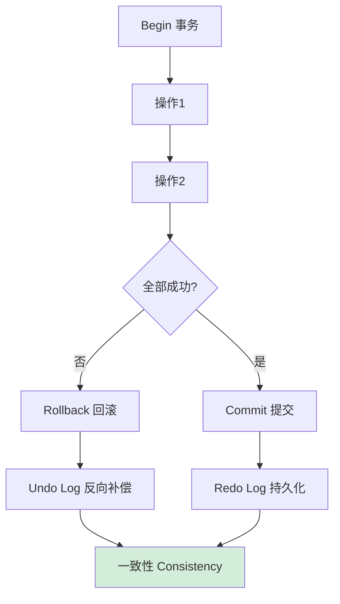

# 什么是事务的四大特性ACID？

### 题目 4：什么是事务的四大特性ACID？

### 事务的四大特性 ACID

ACID 指原子性、一致性、隔离性、持久性。

1.  **原子性**
    事务是一个不可分割的工作单元，要么完全执行，要么完全不执行。如果在事务执行过程中发生错误，系统会撤销事务中已经执行的操作，将数据库恢复到事务开始前的状态。原子性是通过 **Undo Log**（回滚日志）来保证的。当事务执行失败或调用 rollback 时，利用 Undo Log 中的逻辑逆操作将数据回滚。

2.  **一致性**
    事务执行前后，数据库的完整性约束没有被破坏，数据处于合法状态。例如：转账前后 A+B 的总金额不变；外键约束依然有效。一致性是事务追求的最终目标，依赖于原子性、隔离性和持久性，以及应用层的业务逻辑判断。

3.  **隔离性**
    一个事务的执行不应受其他并发事务的干扰。事务中间状态对其他事务不可见。隔离性通常通过 **锁** 和 **MVCC**（多版本并发控制）来实现。根据隔离级别不同，可能出现的并发问题包括：脏读、不可重复读、幻读。

4.  **持久性**
    一旦事务提交，对数据的修改就是永久性的，即使之后数据库发生故障（如宕机），数据也不会丢失。持久性是通过 **Redo Log**（重做日志）来保证的。Redo Log 采用 Write-Ahead Logging (WAL) 策略，数据先写入日志再落盘，确保持久化能力。

**实战案例**
在电商扣减库存场景中，若未正确设置事务隔离级别（如使用了 Read Uncommitted），可能出现“超卖”现象（读到未提交的脏数据回滚）。另外，若数据库宕机但 Redo Log 未落盘（innodb_flush_log_at_trx_commit 设置为 0），可能导致已提交订单丢失的严重生产事故。

**代码示例 (MySQL)**
```sql
-- 开启事务
START TRANSACTION;

-- 1. 检查余额 (利用 MVCC 快照读)
SELECT balance FROM accounts WHERE user_id = 1001;

-- 2. 扣减余额 (当前读，加锁)
UPDATE accounts SET balance = balance - 100 WHERE user_id = 1001;

-- 3. 记录日志
INSERT INTO logs (user_id, amount) VALUES (1001, 100);

-- 提交事务 (此时 Undo Log 删除，Redo Log 刷盘)
COMMIT;
-- 或 ROLLBACK;
```

**日志机制对比**
| 特性 | Undo Log (回滚日志) | Redo Log (重做日志) |
| :--- | :--- | :--- |
| **存储内容** | 修改前的数据 (用于回滚) | 修改后的数据 (用于恢复) |
| **主要作用** | 保证原子性 & MVCC | 保证持久性 & 崩溃恢复 |
| **写入时机** | 事务进行中 | 事务提交时 (WAL 机制) |
| **生命周期** | 事务提交/回滚后可清理 | 随 Checkpoint 循环覆盖利用 |

## 常见考点
1.  **原子性和一致性的区别是什么？
    原子性强调的是“动作”的不可分割，要么全做要么全不做（侧重于执行机制）；一致性强调的是“数据”状态的正确性，即业务规则和约束未被破坏（侧重于结果）。
2.  **Redo Log 和 Undo Log 的区别？
    *   **Redo Log**：记录数据修改后的值，用于提交后的崩溃恢复，确保持久性（前滚）。
    *   **Undo Log**：记录数据修改前的值，用于回滚事务或 MVCC 中构建旧版本数据，确保原子性（回滚）。
3.  **MySQL InnoDB 默认的隔离级别是什么？它是如何解决幻读的？
    默认是 **Repeatable Read (可重复读)**。它主要通过 MVCC（多版本并发控制）解决快照读下的幻读，通过 Next-Key Lock（临键锁 = Record Lock + Gap Lock）解决当前读下的幻读。


## 核心流程图



## 记忆要点

- 四字诀A-C-I-D：原子性、一致性、隔离性、持久性，一致性是最终目标
- 机制保底：原子性靠Undo Log回滚，持久性靠Redo Log前滚，隔离性靠锁与MVCC
- 概念对比：原子性强调动作不可分割，一致性强调结果与业务约束的合法

## 结构化回答

**30 秒电梯演讲：** 事务中的操作要么全成功，要么全失败。打个比方，转账要么成功双方余额变动，要么失败都不变，不能只扣钱不到账。

**展开框架：**
1. **四字诀A-C-I-D** — 原子性、一致性、隔离性、持久性，一致性是最终目标
2. **机制保底** — 原子性靠Undo Log回滚，持久性靠Redo Log前滚，隔离性靠锁与MVCC
3. **概念对比** — 原子性强调动作不可分割，一致性强调结果与业务约束的合法

**收尾：** 我在项目里踩过坑——在电商扣减库存场景中，若未正确设置事务隔离级别（如使用了 Read Uncommitted），可能出现“超卖”现象（读到未提交的脏数据回滚）。您想深入聊哪一段：原理、避坑还是对比选型？

## 视频脚本

> 预计时长：2 分钟 | 由浅入深

| 时间 | 画面/字幕 | 口播台词 | 讲解要点 |
|------|----------|----------|----------|
| 0:00 | 标题卡：什么是事务的四大特性ACID | "什么是事务的四大特性ACID？一句话——转账要么成功双方余额变动，要么失败都不变，不能只扣钱不到账。" | 开场钩子 |
| 0:40 | 概念动画/示意图 | "事务中的操作要么全成功，要么全失败——转账要么成功双方余额变动，要么失败都不变，不能只扣钱不到账" | 核心定义 |
| 1:20 | 四字诀A-C-I-示意 | "原子性、一致性、隔离性、持久性，一致性是最终目标" | 要点1 |
| 2:00 | 总结卡 | "记住这几条，面试不慌。下期讲进阶追问。" | 收尾 |
