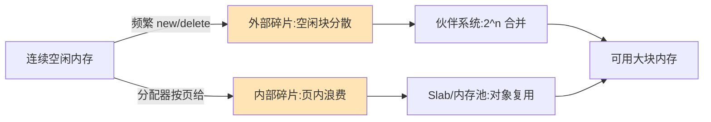

# 什么是内存碎片？

### 题目 5：什么是内存碎片？

### 内存碎片

**概念**：
内存碎片是指内存中存在大量无法被利用的空闲小块内存。这导致虽然物理内存总量足够，但无法分配给需要连续大内存空间的进程。

**分类**：

1.  **外部碎片**
    内存中存在大量空闲空间，但它们不连续，导致无法满足大内存块的分配请求。通常出现在频繁分配和释放不同大小内存块的场景中。

    *   **产生原因**：动态内存分配过程中，由于内存块的申请和释放顺序随机，导致空闲内存块被分散在内存的不同位置。
    *   **解决策略**：
        *   **分区分配**：将内存分为固定大小的块。
        *   **内存紧缩**：移动内存中的进程，将所有空闲块合并成一个大块（需要地址重定位支持，开销较大）。
        *   **伙伴系统**：Linux 内核采用的一种将内存分割为 2 的幂次方大小的块的管理方法，有效减少外部碎片。

2.  **内部碎片**
    分配给进程的内存块大于进程实际需要的内存量，多余的部分无法被利用。这通常是由内存管理机制（如固定分页）造成的，因为分配单位必须是页或块的整数倍。

    *   **产生原因**：内存分配机制通常以固定大小的单位（如页 Page，通常是 4KB）进行分配。如果进程请求 5KB 数据，系统可能分配两个页（8KB），剩余的 3KB 即为内部碎片。
    *   **边界条件**：内部碎片无法完全消除，只能通过减小页大小（如 HugePage 反向操作）来降低比例，但会增加页表大小和管理开销。

**内存状态示意图**：
```text
内存布局示例：
[ 已用进程 A ] [ 空闲 1KB ] [ 已用进程 B ] [ 空闲 2KB ] [ 已用进程 C ]

1. 外部碎片：虽然有 3KB 总空闲量，但如果进程 D 申请连续的 3KB，则分配失败。
   (空闲块不连续)

2. 内部碎片（假设页大小 4KB）：
   [ 进程 E (实际需要 1KB) | 无法利用的 3KB 空间 ]
   (这 3KB 属于进程 E 但没用，即内部碎片)
```

**实战案例**
在 C/C++ 高频网络服务中，如果频繁 new/delete 小对象（如 100B），会导致堆内存产生严重的外部碎片，最终引发 OOM (Out of Memory) 报错。实战中通常引入内存池技术（如 Google Tcmalloc 或 Jemalloc），预申请大块内存并进行内部管理来消除外部碎片。

**代码示例 (C 语言模拟内部碎片)**
```c
#include <stdlib.h>
#include <stdio.h>

void demonstrate_fragmentation() {
    // 假设系统页大小为 4KB
    // 申请 5KB 内存，系统实际分配 2页 (8KB)
    char *ptr = (char *)malloc(5 * 1024); 
    
    printf("Requested: 5KB\n");
    printf("Actually allocated (likely): 8KB (2 pages)\n");
    printf("Internal Fragmentation: ~3KB wasted\n");
    
    free(ptr);
}
```

**内存管理对比**
| 特性 | 伙伴系统 | Slab 分配器 | 内存池 |
| :--- | :--- | :--- | :--- |
| **管理层级** | 内核页级管理 | 内核小对象缓存 | 用户态/应用级管理 |
| **主要解决** | 外部碎片 | 内部碎片 & 速度 | 外部碎片 & 分配效率 |
| **分配效率** | 较慢 (需分裂/合并) | 极快 (对象复用) | 极快 (无锁/简单指针操作) |
| **典型场景** | Linux 物理页管理 | 内核数据结构 | Nginx, Redis 等高性能服务 |

## 常见考点
1.  **伙伴系统**：Linux 内核如何通过伙伴系统算法来减少外部碎片？（将内存按 2^n 分裂和合并）。
2.  **slab 分配器**：内核针对小对象分配如何解决碎片问题？（基于伙伴系统，针对内核小对象分配进行缓存，解决内部碎片）。
3.  **页大小的影响**：页大小越大，内部碎片越多，但页表越小；页大小越小，内部碎片越少，但页表越大。


## 核心流程图



## 核心知识点图


## 记忆要点

- 外碎散不入：空闲块不连续，无法满足大内存分配（如频繁new/delete小对象）
- 内碎碎一地：分配页大于所需(如要5K给8K)，剩余空间无法利用
- 对策反差：伙伴系统按2^n合并减外碎，Slab/内存池以对象复用提效

## 结构化回答

**30 秒电梯演讲：** 内存空间虽多但不连续，导致无法分配大块内存。打个比方，像行李箱空隙虽多但都很小，塞不进去大箱子。

**展开框架：**
1. **外碎散不入** — 空闲块不连续，无法满足大内存分配（如频繁new/delete小对象）
2. **内碎碎一地** — 分配页大于所需(如要5K给8K)，剩余空间无法利用
3. **对策反差** — 伙伴系统按2^n合并减外碎，Slab/内存池以对象复用提效

**收尾：** 我在项目里踩过坑——在 C/C++ 高频网络服务中，如果频繁 new/delete 小对象（如 100B），会导致堆内存产生严重的外部碎片，最终引发 OOM (Out of Memory) 报错。您想深入聊哪一段：原理、避坑还是对比选型？

## 视频脚本

> 预计时长：2 分钟 | 由浅入深

| 时间 | 画面/字幕 | 口播台词 | 讲解要点 |
|------|----------|----------|----------|
| 0:00 | 标题卡：什么是内存碎片 | "什么是内存碎片？一句话——像行李箱空隙虽多但都很小，塞不进去大箱子。" | 开场钩子 |
| 0:40 | 概念动画/示意图 | "内存空间虽多但不连续，导致无法分配大块内存——像行李箱空隙虽多但都很小，塞不进去大箱子" | 核心定义 |
| 1:20 | 外碎散不入示意 | "空闲块不连续，无法满足大内存分配（如频繁new/delete小对象）" | 要点1 |
| 2:00 | 总结卡 | "记住这几条，面试不慌。下期讲进阶追问。" | 收尾 |
