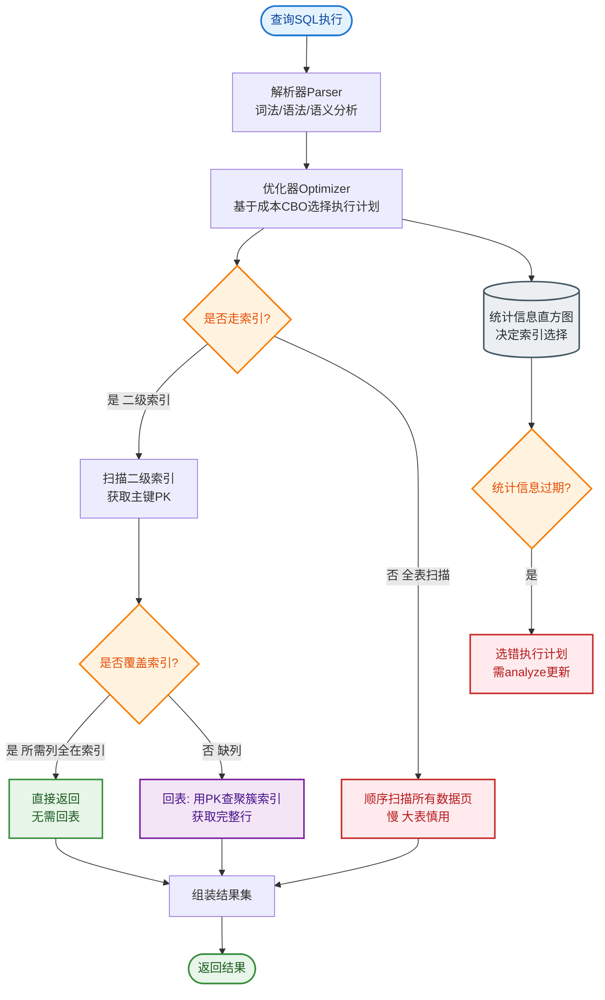

# 数据库三范式是什么？反范式设计的优缺点？

### 数据库三范式

**1. 第一范式（1NF）：原子性**
每个字段不可再分。
*   **反例**：地址字段存为 "北京市朝阳区xxx街道"，应拆分为 省、市、区、街道。

**2. 第二范式（2NF）：消除部分依赖**
在 1NF 基础上，非主键字段必须完全依赖于主键。
*   **核心**：针对复合主键。如果表中有联合主键 `(A, B)`，字段 C 仅依赖 A，则违反 2NF。
*   **拆分**：应拆分为 `(A, C)` 和 `(A, B, ...)` 两张表。

**3. 第三范式（3NF）：消除传递依赖**
在 2NF 基础上，非主键字段不能间接依赖主键（消除 A→B→C 的传递依赖）。
*   **反例**：订单表中包含 `用户ID` 和 `用户姓名`。`订单ID` -> `用户ID` -> `用户姓名`，`用户姓名` 传递依赖 `订单ID`。
*   **拆分**：将 `用户姓名` 移至用户表，订单表仅保留 `用户ID` 外键。

### 反范式设计

**优点**：
1.  **减少 JOIN**：通过适当的冗余，避免频繁的表连接操作，降低 CPU 和 IO 开销。
2.  **提高查询性能**：数据在一张表内，索引覆盖更有效，查询速度更快。

**缺点**：
1.  **数据冗余**：占用更多存储空间。
2.  **维护成本高**：更新数据时需要修改多处（如更新用户名需同步更新订单冗余字段），容易引发数据不一致。

**数据结构对比图**：
```text
范式化结构 (3NF):
[ 订单表 ]             [ 用户表 ]
OrderID (PK)  -----> UserID (PK)
UserID (FK)           UserName
TotalPrice

查询订单+用户需: JOIN 操作

------------------------

反范式化结构:
[ 订单表冗余版 ]
OrderID (PK)
UserID
UserName (冗余字段)
TotalPrice

查询订单+用户: 单表查询 (速度快，但修改 UserName 需更新多行)
```

**实战案例**：
在电商订单列表页展示时，需同时显示订单金额和用户昵称。若严格遵循 3NF 需频繁 JOIN 用户表。我们将 `user_nickname` 冗余存储在订单表（快照机制），避免了高并发下的 JOIN 查找，显著提升了列表页 QPS。

**对比表格：范式化 vs 反范式化**

| 特性 | 范式化设计 (3NF) | 反范式化设计 |
| :--- | :--- | :--- |
| **数据冗余度** | 低 (无重复) | 高 (存在冗余) |
| **写入性能** | 高 (只需更新一处) | 低 (可能需更新多处) |
| **读取性能** | 低 (通常需要 JOIN) | 高 (单表查询，索引友好) |
| **数据一致性** | 易于维护 | 需应用层保证或触发器同步 |
| **适用场景** | OLTP 事务型系统 | OLAP 分析型系统 / 高并发读场景 |

**关键代码示例**：
```sql
-- 反范式化操作：在订单表中冗余商品快照名称
-- 这样查询订单历史时，即使商品表改名了，历史记录显示依然正确
ALTER TABLE order_items ADD COLUMN product_snapshot_name VARCHAR(255);
-- 插入时写入冗余字段
INSERT INTO order_items (order_id, product_id, product_snapshot_name) 
VALUES (101, 505, (SELECT name FROM products WHERE id=505));
```

## 常见考点
1.  **范式与性能的权衡**：在实际高并发场景中，通常会通过反范式（如空间换时间）来优化性能，举例说明（如商品详情页缓存库存数量）。
2.  **BCNF（巴斯-科德范式）**：了解即可，它是 3NF 的修正版，处理主键内部的依赖关系。
3.  **范式化程度与并发写入**：范式化程度越高，写操作性能越好（更新数据少），但读操作越慢（JOIN 多）。


## 核心流程图


## 记忆要点

- 1NF字段不可分，2NF消部分依赖(针对联合主键)，3NF消传递依赖(A->B->C)
- 反范式优缺点：空间换时间，冗余字段减少JOIN加速读，但增删改成本高易不一致
- 场景口诀：OLTP增删改多要范式(保一致)，OLAP查多要反范式(提性能)

## 结构化回答

**30 秒电梯演讲：** 三范式减少数据冗余，反范式用空间换时间提升查询。打个比方，三范式是图书馆分类书，反范式是把常用的书放桌面上方便拿。

**展开框架：**
1. **1NF字段不可分** — 2NF消部分依赖(针对联合主键)，3NF消传递依赖(A->B->C)
2. **反范式优缺点** — 空间换时间，冗余字段减少JOIN加速读，但增删改成本高易不一致
3. **场景口诀** — OLTP增删改多要范式(保一致)，OLAP查多要反范式(提性能)

**收尾：** 我在项目里踩过坑——在电商订单列表页展示时，需同时显示订单金额和用户昵称。您想深入聊哪一段：原理、避坑还是对比选型？

## 视频脚本

> 预计时长：2 分钟 | 由浅入深

| 时间 | 画面/字幕 | 口播台词 | 讲解要点 |
|------|----------|----------|----------|
| 0:00 | 标题卡：数据库三范式是什么？反范式设计的优缺… | "数据库三范式是什么？反范式设计的优缺点？一句话——三范式是图书馆分类书，反范式是把常用的书放桌面上方便拿。" | 开场钩子 |
| 0:40 | 概念动画/示意图 | "三范式减少数据冗余，反范式用空间换时间提升查询——三范式是图书馆分类书，反范式是把常用的书放桌面上方便拿" | 核心定义 |
| 1:20 | 1NF字段不可分示意 | "2NF消部分依赖(针对联合主键)，3NF消传递依赖(A->B->C)" | 要点1 |
| 2:00 | 总结卡 | "记住这几条，面试不慌。下期讲进阶追问。" | 收尾 |
