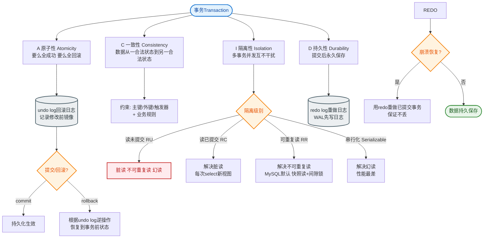
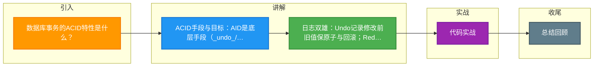

# 数据库事务的ACID特性是什么？

### 数据库事务的 ACID 特性

1.  **原子性**
    事务是不可分割的工作单元，要么全部成功提交，要么全部失败回滚。InnoDB 通过 **undo log**（回滚日志）实现。
    *   **原理**：事务执行前记录数据旧版本到 undo log，失败时利用 undo log 将数据回滚到修改前状态。

2.  **一致性**
    事务执行前后，数据库从一个合法状态转变到另一个合法状态（满足约束、触发器等）。一致性是事务的目标，A、I、D 是手段。
    *   **细节**：包括约束完整性（如外键约束唯一）、业务逻辑一致性（如转账前后总额不变）。

3.  **隔离性**
    并发事务之间互不干扰。InnoDB 通过 **锁机制 + MVCC**（多版本并发控制）实现，提供 4 种隔离级别（RU、RC、RR、Serializable）。
    *   **锁机制**：解决写-写冲突（共享锁/排他锁）。
    *   **MVCC**：解决读-写冲突，通过 Read View + undo log 实现非阻塞读。

4.  **持久性**
    事务一旦提交，对数据的修改就是永久性的，即使数据库崩溃也不会丢失。InnoDB 通过 **redo log**（重做日志）实现。
    *   **WAL 技术**：先写日志，再写数据页。MySQL 崩溃重启时，重放 redo log 恢复未落盘的数据。

**InnoDB 事务执行与日志流程图**：
```text
事务开始
   |
   v
[ 执行 SQL 语句 ]
   |
   +---> 1. 写 Undo Log (用于回滚)
   |
   +---> 2. 修改内存 Buffer Pool
   |
   +---> 3. 写 Redo Log (顺序写磁盘，WAL 机制)
   |
   v
用户发出 Commit
   |
   +---> Redo Log 持久化 (Prepare)
   +---> BinLog 持久化 (MySQL 二进制日志)
   +---> Redo Log 标记为 Commit
   |
   v
事务结束 (成功)

崩溃恢复:
若 Buffer Pool 数据未刷盘 -> 根据 Redo Log 重做
若事务未 Commit -> 根据 Undo Log 回滚
```

**实战案例**：
曾经遇到系统宕机重启后，发现部分订单状态显示“已支付”但库存未扣减。经排查是业务代码未正确处理事务边界，导致持久性逻辑与业务逻辑分离。修复后确保 `update_inventory` 和 `update_order_status` 在同一个 `@Transactional` 方法中，利用 ACID 保证数据最终一致。

**对比表格：Undo Log vs Redo Log**

| 特性 | Undo Log (回滚日志) | Redo Log (重做日志) |
| :--- | :--- | :--- |
| **作用** | 实现原子性和 MVCC，用于回滚 | 实现持久性，用于崩溃恢复 |
| **存储内容** | 逻辑日志（记录如何反向修改） | 物理日志（记录数据页的物理修改） |
| **写入时机** | 事务执行过程中 | 事务提交时 (WAL 机制) |
| **生命周期** | 事务提交后可能被 purge 清理 | 循环覆写，检查点后旧日志可覆盖 |

**关键代码示例**：
```java
// Java 伪代码：展示 ACID 在业务层的应用
@Transactional(isolation = Isolation.READ_COMMITTED) // 定义隔离级别
public void transfer(Long fromId, Long toId, BigDecimal amount) {
    // 原子性：以下操作要么全做，要么全不做
    accountDao.decrease(fromId, amount);
    if (checkError()) throw new RuntimeException(); // 触发回滚，利用 Undo Log
    accountDao.increase(toId, amount);
    // 持久性：方法结束时，受 Redo Log 保证数据已落盘
}
```

## 常见考点
1.  **并发问题**：脏读、不可重复读、幻读的区别是什么？（幻读侧重于插入/删除导致的数据量变化）。
2.  **隔离级别实现**：RR 级别如何通过 Next-Key Lock 解决幻读？（Record Lock + Gap Lock）。
3.  **Undo Log 与 Redo Log 区别**：Undo Log 是逻辑日志，用于回滚；Redo Log 是物理日志，用于前滚恢复。


## 核心流程图


## 记忆要点

- ACID手段与目标：AID是底层手段(_undo_/_redo_/_锁MVCC_)，C是业务结果的最终目标
- 日志双雄：Undo记录修改前旧值保原子与回滚；Redo记录物理修改保持久与崩溃前滚
- 隔离实现：靠锁解决写写冲突，靠MVCC(快照)解决读写冲突，默认RR级别防幻读

## 结构化回答

**30 秒电梯演讲：** 保证事务操作的可靠、一致、互不干扰且永久生效。打个比方，像银行转账，必须要么全转成功，要么失败，且转账过程不受其他人干扰。

**展开框架：**
1. **ACID手段与目标** — AID是底层手段(_undo_/_redo_/_锁MVCC_)，C是业务结果的最终目标
2. **日志双雄** — Undo记录修改前旧值保原子与回滚；Redo记录物理修改保持久与崩溃前滚
3. **隔离实现** — 靠锁解决写写冲突，靠MVCC(快照)解决读写冲突，默认RR级别防幻读

**收尾：** 我在项目里踩过坑——曾经遇到系统宕机重启后，发现部分订单状态显示“已支付”但库存未扣减。您想深入聊哪一段：原理、避坑还是对比选型？

## 视频脚本

> 预计时长：2 分钟 | 由浅入深

| 时间 | 画面/字幕 | 口播台词 | 讲解要点 |
|------|----------|----------|----------|
| 0:00 | 标题卡：数据库事务的ACID特性是什么 | "数据库事务的ACID特性是什么？一句话——像银行转账，必须要么全转成功，要么失败，且转账过程不受其他人干扰。" | 开场钩子 |
| 0:40 | 概念动画/示意图 | "保证事务操作的可靠、一致、互不干扰且永久生效——像银行转账，必须要么全转成功，要么失败，且转账过程不受其他人干扰" | 核心定义 |
| 1:20 | ACID手段与目标示意 | "AID是底层手段(_undo_/_redo_/_锁MVCC_)，C是业务结果的最终目标" | 要点1 |
| 2:00 | 总结卡 | "记住这几条，面试不慌。下期讲进阶追问。" | 收尾 |

### 视频流程图



