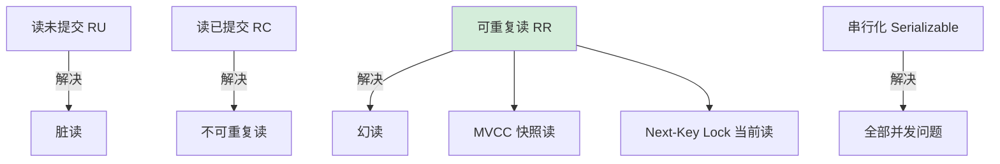

# 说一说事物隔离级别？

### 事务隔离级别

事务隔离级别定义了一个事务必须与其它事务隔离的程度。SQL 标准定义了四个隔离级别，隔离级别从低到高，并发安全性依次提高，但并发性能依次降低。

1.  **读未提交**
    *   **定义**：允许读取其他事务未提交的数据。
    *   **问题**：会导致“脏读”。如果其他事务回滚，当前事务读取的数据就是无效的。
    *   **场景**：极少使用，性能要求极高且可忍受脏数据的场景。

2.  **读已提交**
    *   **定义**：只能读取其他事务已经提交的数据。
    *   **问题**：解决了脏读，但可能出现“不可重复读”。即在同一事务内，两次读取同一数据可能得到不同结果（因为期间有其他事务提交了修改）。
    *   **场景**：Oracle、PostgreSQL 等数据库的默认级别，适用于大多数业务系统。

3.  **可重复读**
    *   **定义**：在一个事务内多次读取同一数据的结果是一致的。
    *   **问题**：解决了不可重复读，但理论上可能出现“幻读”。（InnoDB 默认级别，通过 MVCC 和 Next-Key Lock 在很大程度上解决了幻读）。
    *   **细节**：InnoDB 通过 **MVCC (多版本并发控制)** 实现快照读，通过 **Next-Key Lock (临键锁)** 实现当前读，防止幻读。

4.  **串行化**
    *   **定义**：强制事务串行执行，最高的隔离级别。
    *   **问题**：解决所有并发问题（脏读、不可重复读、幻读），但性能极低，会导致大量锁争用。
    *   **实现**：读写都会加锁，锁是基于表级别的或者非常严格的行锁，基本不冲突。


### 并发问题与隔离级别对应表

| 隔离级别 | 脏读 | 不可重复读 | 幻读 | 锁机制 |
| :--- | :---: | :---: | :---: | :--- |
| 读未提交 | 可能 | 可能 | 可能 | 无锁/短暂锁 |
| 读已提交 | 避免 | 可能 | 可能 | MVCC (每次查生成新ReadView) |
| 可重复读 | 避免 | 避免 | 可能 (InnoDB避免) | MVCC (事务初生成ReadView) + Next-Key Lock |
| 串行化 | 避免 | 避免 | 避免 | 表级读锁/写锁 |

**实战案例**：
在处理金融账户余额查询时，我们采用了 `READ COMMITTED` 级别以获取最新的余额。但在生成对账单报表时，为了确保报表期间数据不被变动影响，必须将事务提升至 `REPEATABLE READ`，否则在长事务运行过程中，其他事务的提交会导致报表数据前后不一致。

**关键代码示例**：
```java
// MySQL 设置事务隔离级别为 RC
@Transactional(isolation = Isolation.READ_COMMITTED)
public void updateInventory(Long productId, int count) {
    // 此时只能读到已提交的数据，避免了脏读
    Integer stock = productDao.getStock(productId);
    // ... 更新逻辑
}

// 查看当前全局/会话隔离级别 (SQL)
SELECT @@GLOBAL.tx_isolation, @@SESSION.tx_isolation;
-- 设置会话级别
SET SESSION TRANSACTION ISOLATION LEVEL READ COMMITTED;
```

## 常见考点

1.  **InnoDB 默认隔离级别下如何解决幻读？**
    面试官常问：既然 RR 级别理论上不能防止幻读，InnoDB 是如何做到的？
    答案核心：快照读（普通 select）依赖 MVCC（Read View），当前读（select for update/insert/delete）依赖 Next-Key Lock（记录锁+间隙锁），从而锁住插入间隙。

2.  **MVCC (多版本并发控制) 的实现原理？**
    答案核心：利用 Undo Log 回滚日志版本链和 Read View（可见性算法）。Read View 包含了 min_trx_id 和 max_trx_id，判断事务版本是否对当前事务可见。

3.  **什么是 RC 和 RR 级别的本质区别？**
    答案核心：在于 **生成 Read View 的时机不同**。RC 是每次执行 select 语句都生成一个新的 Read View；RR 是只在事务开启时（第一次 select）生成一个 Read View，后续复用。


## 核心流程图




## 记忆要点

- 四大级别：读未提交、读已提交、可重复读、串行化（并发性能依次降低）。
- 并发问题：脏读、不可重复读、幻读（隔离级别越高解决的问题越多）。
- MySQL默认：InnoDB默认为可重复读（RR）。
- 防幻读核心：RR级别下，快照读依赖MVCC，当前读依赖Next-Key Lock。
- RC与RR对比：核心差异在于生成Read View的时机不同（RR仅在首次查询生成并复用）。

## 结构化回答

**30 秒电梯演讲：** 规定事务之间互相“看不见”的程度，防止并发冲突。打个比方，隔板从纸换成木头，再到墙壁，隔离性越来越强。

**展开框架：**
1. **四大级别** — 读未提交、读已提交、可重复读、串行化（并发性能依次降低）。
2. **并发问题** — 脏读、不可重复读、幻读（隔离级别越高解决的问题越多）。
3. **MySQL默认** — InnoDB默认为可重复读（RR）。

**收尾：** 我在项目里踩过坑——在处理金融账户余额查询时，我们采用了 `READ COMMITTED` 级别以获取最新的余额。您想深入聊哪一段：原理、避坑还是对比选型？

## 视频脚本

> 预计时长：2 分钟 | 由浅入深

| 时间 | 画面/字幕 | 口播台词 | 讲解要点 |
|------|----------|----------|----------|
| 0:00 | 标题卡：说一说事物隔离级别 | "说一说事物隔离级别？一句话——隔板从纸换成木头，再到墙壁，隔离性越来越强。" | 开场钩子 |
| 0:40 | 概念动画/示意图 | "规定事务之间互相“看不见”的程度，防止并发冲突——隔板从纸换成木头，再到墙壁，隔离性越来越强" | 核心定义 |
| 1:20 | 四大级别示意 | "读未提交、读已提交、可重复读、串行化（并发性能依次降低）。" | 要点1 |
| 2:00 | 总结卡 | "记住这几条，面试不慌。下期讲进阶追问。" | 收尾 |
