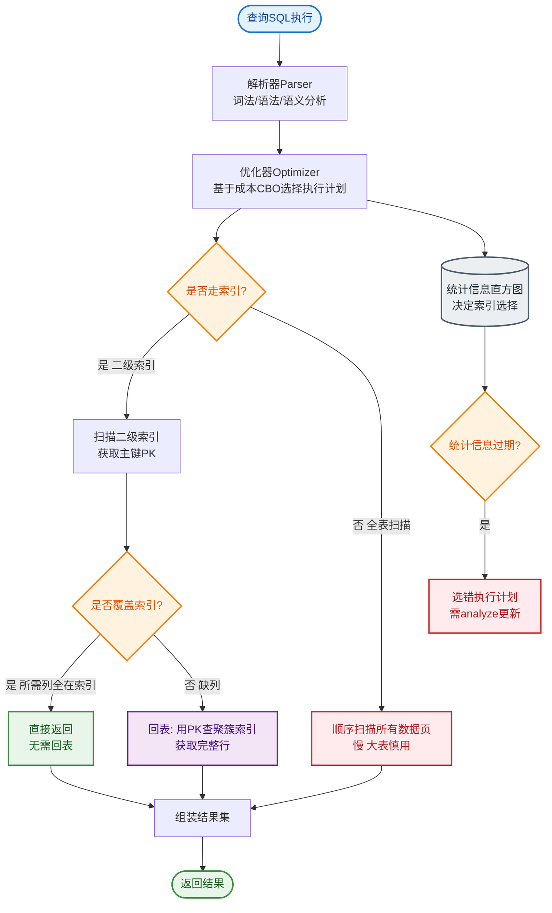

# 为什么MySQL索引使用B+树？

### 为什么 MySQL 索引使用 B+ 树？

**1. 减少磁盘 I/O 次数**
B+ 树的非叶子节点不存储数据，只存储索引，因此单个节点能容纳更多的索引项（扇出 Fanout 高）。这使得 B+ 树更加“矮胖”，在查询数据时，需要访问的磁盘层级更少（通常 3 层即可支撑千万级数据），从而大幅减少 I/O 次数。

**2. 范围查询性能强**
B+ 树的所有叶子节点使用双向链表连接。在执行范围查询（如 `WHERE id > 100`）或排序时，只需要遍历叶子节点的链表即可，效率极高，无需回表或中序遍历。

**3. 查询性能稳定**
B+ 树的所有数据都存储在叶子节点，无论查询哪个数据，查询路径长度都是从根到叶，树的高度固定，查询耗时非常稳定。

**ASCII B+ 树结构图**：

```text
      【非叶子节点 (仅索引)】
+--------------------------+
|  10  |  20  |  30  |  40 |
+----+---+---+---+---+----+
     |       |       |
     v       v       v     (更高扇出，树更低)
+--------+ +--------+ +--------+
| ...    | | ...    | | ...    |
+----+---+ +----+---+ +----+---+
     |           |           |
     v           v           v

  【叶子节点 (数据+双向链表)】
+--------------------------+ <==> +--------------------------+ <==> +--------------------------+
| 1, 5 | 7, 9 | 11, 15| ... |     | 21, 25| 27, 29| 31, 35| ... |     | 41, 45| ... | NULL |    |
+--------------------------+      +--------------------------+      +--------------------------+

   (范围查询只需沿着叶子节点链表横向遍历)
```

**实战案例**：
某日志查询系统最初使用 Hash 索引加速唯一 ID 查找，但在后期需要支持“按时间范围导出日志”时，Hash 索引完全无法利用，只能全表扫描，导致导出超时。改造为 B+ 树索引后，范围查询直接利用叶子节点链表顺序读取，响应时间从分钟级降至毫秒级。

**索引选型对比表**：

| 特性 | B+ 树 | Hash 索引 | B 树 |
| :--- | :--- | :--- | :--- |
| **查询类型** | 支持 =, >, <, >=, <=, BETWEEN, LIKE 前缀 | 仅支持 =, IN | 支持 =, >, < 等，但范围效率低 |
| **范围查询** | **优秀** (叶子节点链表顺序读) | **不支持** (需全表扫描) | 差 (需在树节点间反复跳转) |
| **排序/ORDER BY** | 支持 (直接利用索引有序性) | 不支持 | 较弱 |
| **I/O 次数** | **少** (树矮胖，非叶子节点不存数据) | O(1) (通常 1 次) | 多 (树相对高，非叶子节点存数据) |
| **存储利用率** | 高 (非叶子节点纯索引) | 视负载而定 | 低 (节点包含数据，扇出小) |
| **场景** | 数据库主索引，大多数场景 | 内存数据库 (如 Redis Key) | 文件系统等特定场景 |

## 常见考点

1.  **既然 Hash 索引查询更快 (O(1))，为什么不用？
    答案核心：数据库不仅仅是点查。Hash 索引无法处理 `> < >= <=` 等范围查询，无法利用索引进行排序（ORDER BY），遇到 Hash 冲突时效率不稳定，且不支持联合索引的最左前缀匹配规则。

2.  **B+ 树的高度一般是多少？
    答案核心：假设一行数据 1KB，一个页 16KB，非叶子节点存主键（假设 8B+指针）可存约 1000 个指针。3 层高度 = 1000 * 1000 * 1000 = 10 亿行数据。所以通常 B+ 树高度为 2-4 层，这意味着查询一次数据只需 1-3 次磁盘 I/O。

3.  **什么是聚簇索引和非聚簇索引（二级索引）？
    答案核心：
    - **聚簇索引**：B+ 树的叶子节点就是完整的数据行（主键索引）。一张表只能有一个。
    - **非聚簇索引**：叶子节点存储的是主键值。查询时需要先查二级索引拿到主键，再回表去聚簇索引查完整数据（回表）。


## 核心流程图


## 记忆要点

- 降低磁盘IO：非叶子节点不存数据，单个节点扇出更高，树体矮胖（通常3层支撑千万级数据）。
- 范围查询极快：因为所有叶子节点间用双向链表有序相连，十分利于范围查询和排序。
- 查询性能稳定：无论查什么数据，路径长度固定为根到叶，查询耗时非常一致。
- 对比Hash索引：Hash仅支持等值查询且不支持排序，而B+树全能。

## 结构化回答

**30 秒电梯演讲：** B+树矮胖且叶子链表互联，减少IO且利于范围查询。打个比方，像只有最底层有书的超级矮书架，找书层数少，且找完一本能顺藤摸瓜找到下一本。

**展开框架：**
1. **降低磁盘IO** — 非叶子节点不存数据，单个节点扇出更高，树体矮胖（通常3层支撑千万级数据）。
2. **范围查询极快** — 因为所有叶子节点间用双向链表有序相连，十分利于范围查询和排序。
3. **查询性能稳定** — 无论查什么数据，路径长度固定为根到叶，查询耗时非常一致。

**收尾：** 我在项目里踩过坑——某日志查询系统最初使用 Hash 索引加速唯一 ID 查找，但在后期需要支持“按时间范围导出日志”时，Hash 索引完全无法利用，只能全表扫描，导致导出超时。您想深入聊哪一段：原理、避坑还是对比选型？

## 视频脚本

> 预计时长：2 分钟 | 由浅入深

| 时间 | 画面/字幕 | 口播台词 | 讲解要点 |
|------|----------|----------|----------|
| 0:00 | 标题卡：为什么MySQL索引使用B+树 | "为什么MySQL索引使用B+树？一句话——像只有最底层有书的超级矮书架，找书层数少，且找完一本能顺藤摸瓜找到下一本。" | 开场钩子 |
| 0:40 | 概念动画/示意图 | "B+树矮胖且叶子链表互联，减少IO且利于范围查询——像只有最底层有书的超级矮书架，找书层数少，且找完一本能顺藤摸瓜找到下一本" | 核心定义 |
| 1:20 | 降低磁盘示意 | "非叶子节点不存数据，单个节点扇出更高，树体矮胖（通常3层支撑千万级数据）。" | 要点1 |
| 2:00 | 总结卡 | "记住这几条，面试不慌。下期讲进阶追问。" | 收尾 |

---

## 延伸：B树和B+树的区别是什么？

> 合并自 `db-035`（相似度 74%）

B 树和 B+ 树的区别：

**B 树（B-Tree）：**
- 每个节点（包括非叶子）都存 key **和 data**（实际数据）。
- 查询可能在非叶子节点就命中并返回，不一定到叶子。
- 节点大小固定（如一页），存了 data 导致单节点能放的 key 变少 → 树更高 → IO 更多。

**B+ 树（B+ Tree，MySQL InnoDB 索引结构）：**
- **非叶子节点只存 key（索引），不存 data**，所有 data 都在叶子节点。
- 单节点能放更多 key → 树更矮（3 层可存千万级）→ IO 更少。
- **叶子节点之间用双向链表连接**，范围查询极高效（找到起点后沿链表遍历）。
- 每次查询都到叶子（查询性能稳定，时间复杂度恒定）。

- **实战案例**：在电商订单表查询中，使用 B+ 树结构在执行 `WHERE create_time BETWEEN '2023-10-01' AND '2023-10-31'` 时，只需遍历叶子节点链表，无需回表（如果覆盖索引），性能比 Hash 索引快百倍。

**核心区别：**
| | B 树 | B+ 树 |
|---|---|---|
| 非叶子存 data | 是 | 否（只存索引） |
| 树高 | 较高 | 较矮 |
| 范围查询 | 慢（中序遍历） | 快（叶子链表） |
| 查询稳定性 | 不稳定（可能非叶子命中） | 稳定（都到叶子） |

**为什么 MySQL 用 B+ 树不用 B 树/红黑树？**
- 比 B 树矮、范围查询快。
- 比红黑树（二叉）矮得多，IO 次数少（红黑树 1000 万数据需约 24 层，B+ 树只需 3 层）。
- 比 Hash 索引多了范围查询和排序能力。

### B+ 树结构示意图
```text
             ┌───┐
             │ 5 │
         ┌───┴─┬─┴───┐
         ▼     ▼     ▼
      ┌─────┐ ┌─────┐ ┌─────┐
      │ 1 3 │ │ 5 7 │ │ 9 10│  <- 非叶子节点：仅存 Key，不存 Data
      └─────┘ └─────┘ └─────┘
        │       │       │
        ▼       ▼       ▼
     ┌─────┐ ┌─────┐ ┌─────┐
     │Data │ │Data │ │Data │  <- 叶子节点：存储所有 Data
     │Data │ │Data │ │Data │     且通过双向链表连接 (⇄)
     └─────┘ └─────┘ └─────┘
```

### ## 常见考点
1. **为什么 B+ 树的叶子节点要通过链表连接？**
   - 为了优化**范围查询**和**排序**。如果是 B 树，范围查询需要中序遍历，在节点间频繁跳跃；B+ 树只需找到起点，然后遍历链表即可，这对数据库的 `ORDER BY` 和 `> <` 操作至关重要。
2. **聚簇索引和辅助索引在 B+ 树结构上有什么区别？**
   - **聚簇索引**：B+ 树的叶子节点直接存储整行数据。
   - **辅助索引**：B+ 树的叶子节点存储的是主键值（回表指针）。查询时先查辅助树拿到主键，再去聚簇树查完整数据（回表）。
3. **千万级数据 B+ 树一般几层？**
   - 通常 3 层左右。假设 InnoDB 页大小 16KB，主键 BigInt (8B) + 指针 (6B)，一个节点可存约 1170 个 Key，三层即可存 1170 * 1170 * 1170 ≈ 16 亿条记录。

## 记忆要点

- 非叶子节点：B树存Data+Key，B+树仅存Key，因此B+树单节点能放更多Key导致树更矮
- 数据存储：B+树所有真实数据只存在叶子节点，查询性能更稳定（必定命中叶子）
- 范围查询：B+树叶子节点通过双向链表相连，区间扫描极快，这是MySQL选它的根本原因
- 容量推导：InnoDB一页16KB，3层B+树约可存储两千万级数据，极大地减少了磁盘IO

## 结构化回答

**30 秒电梯演讲：** B+树非叶不存数据、叶子连链表，实现树矮、IO少且利于范围查询。打个比方，B+树像那种只有楼层索引（非叶）和具体住户信息（叶）的高楼，且住户间有走廊相连；B树则每层都住人，显得拥挤。

**展开框架：**
1. **非叶子节点** — B树存Data+Key，B+树仅存Key，因此B+树单节点能放更多Key导致树更矮
2. **数据存储** — B+树所有真实数据只存在叶子节点，查询性能更稳定（必定命中叶子）
3. **范围查询** — B+树叶子节点通过双向链表相连，区间扫描极快，这是MySQL选它的根本原因

**收尾：** 这三点都能配合实战聊。您想深入聊原理、对比还是避坑？

## 视频脚本

> 预计时长：3 分钟 | 由浅入深

| 时间 | 画面/字幕 | 口播台词 | 讲解要点 |
|------|----------|----------|----------|
| 0:00 | 标题卡：B树和B+树的区别是什么 | "B树和B+树的区别是什么？一句话——B+树像那种只有楼层索引（非叶）和具体住户信息（叶）的高楼，且住户间有走廊相连；B树则每层都住人，显得拥挤。" | 开场钩子 |
| 0:45 | 概念动画/示意图 | "B+树非叶不存数据、叶子连链表，实现树矮、IO少且利于范围查询——B+树像那种只有楼层索引（非叶）和具体住户信息（叶）的高楼，且住户间有走廊相连；B树则每层都住人，显得拥挤" | 核心定义 |
| 1:30 | 非叶子节点示意 | "B树存Data+Key，B+树仅存Key，因此B+树单节点能放更多Key导致树更矮" | 要点1 |
| 2:15 | 数据存储示意 | "B+树所有真实数据只存在叶子节点，查询性能更稳定（必定命中叶子）" | 要点2 |
| 3:00 | 总结卡 | "记住这几条，面试不慌。下期讲进阶追问。" | 收尾 |
