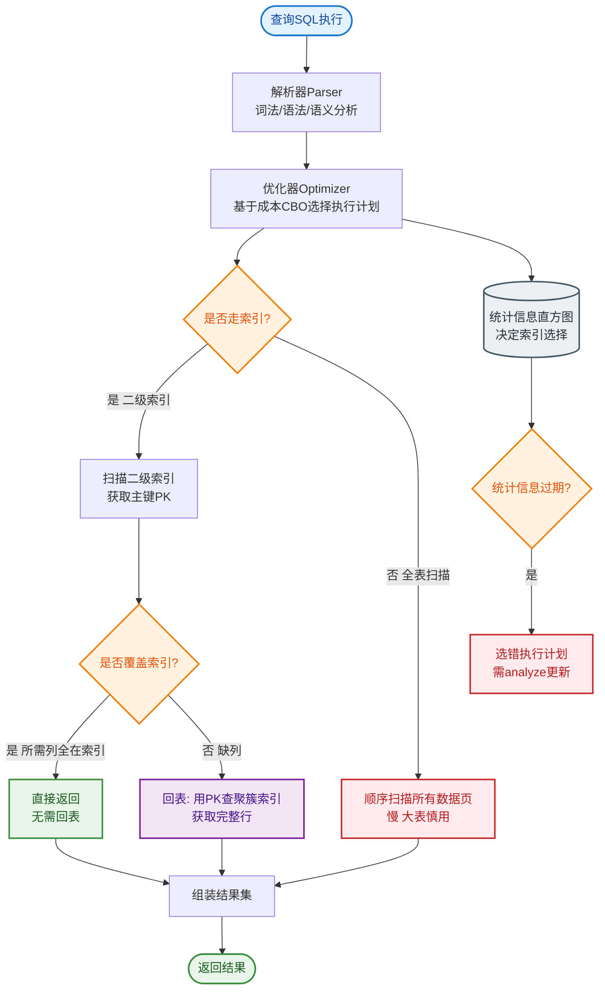

# 什么是MySQL表连接？

MySQL表连接

连接和笛卡尔积

连接：
将各个表中的记录都取出来进行依次匹配，将匹配后的结果发给客户端
笛卡尔积：
连接查询的结果中包含一个表的每一条记录与另一个表中每一条记录的组合，这样的查询结果就是笛卡尔积
比如表a有5条记录；表b有6条记录；a和b的笛卡尔积就是30

连接过程

1、确定第一个需要查询的表，此表为驱动表
2、从驱动表中取每一条符合搜索条件的记录，到接下来的表中查找匹配的记录；驱动表之后的那个表就叫被驱动表
只需要访问驱动表一次，可能会多次访问被驱动表
每获得一条满足条件的驱动表记录，马上到被驱动表中寻找匹配的记录

内/外连接

内连接
驱动表中的记录在被驱动表中找不到匹配的记录，那么驱动表的这条记录不会加⼊到最后的结果中
外连接：
驱动表中的记录在被驱动表中找不到匹配的记录，也仍需要加⼊到最后结果中
左外连接：语句左侧的表为驱动表
右外连接：语句右侧的表为驱动表
对于内连接，驱动表和被驱动表的顺序可以更换；对于外连接，这个顺序不能随意更换

select * from 驱动表, 被驱动表;
select * from 驱动表 join 被驱动表;
select * from 驱动表 inner join 被驱动表;
select * from 驱动表 cross join 被驱动表;
select * from 驱动表 left join 被驱动表 on 连接条件;
select * from 被驱动表 right join 驱动表 on 连接条件;

### 补充关键细节

**1. 驱动表的选择原则**
- 通常优化器会选择**小表**作为驱动表。因为驱动表是全表扫描（或根据索引范围扫描），而被驱动表如果是通过索引查找，那么驱动表行数越少，被驱动表的索引查找次数就越少。
- **Join Buffer（Join 缓冲区）**：
  - 当被驱动表无法有效利用索引（例如全表扫描）时，MySQL 优化器可能会使用 `Block Nested Loop` 算法。
  - MySQL 会将驱动表中相关的列（`join_buffer_size`）读入内存缓冲区。
  - 然后批量扫描被驱动表，将每行与 Buffer 中的数据进行匹配。
  - 这减少了对被驱动表的 IO 次数（从“驱动表行数次”降低到“分块次数”）。

**2. 常见算法对比**
| 算法 | 全称 | 适用场景 | 性能特点 |
| :--- | :--- | :--- | :--- |
| **SNLJ** | Simple Nested Loop Join | 通用（极少使用） | 性能最差，复杂度 O(M*N) |
| **INLJ** | Index Nested Loop Join | **被驱动表有索引** | 性能好，复杂度 O(M*logN) 或 O(M) |
| **BNLJ** | Block Nested Loop Join | 被驱动表无索引 | 消耗内存，比 SNLJ 快，但不如 INLJ |

### 架构流程图

```text
MySQL Join 流程 (Index Nested-Loop Join 示例)

┌───────────────────────┐
│      驱动表 Table A    │
│ (筛选条件后结果集)      │
└───────────┬───────────┘
            │ 逐行读取
            ▼
┌───────────────────────┐     (利用索引)     ┌───────────────────────┐
│       驱动行 Row a     │ ────────────────> │       被驱动表 B       │
│       (id = 100)      │                   │   (查找 index_col)     │
└───────────┬───────────┘                   └───────────┬───────────┘
            │                                           │
            │         ┌─────────────────────────────────┘
            │         │ 匹配到
            ▼         ▼
┌───────────────────────┐
│      组装结果集        │
│ (Row a + Row b)       │
└───────────────────────┘
```

## 常见考点

1. **如何查看谁的执行计划是驱动表？**
   - 使用 `EXPLAIN` 命令，第一行的表即为驱动表。

---

### 深化补充

**实战案例**：
在用户行为分析报表中，将百万级的“点击流表”（大表）与“用户元数据表”（小表）进行关联。最初写法将大表放左边，查询耗时 30s。调整 SQL 顺序，强制优化器使用小表作为驱动表后，耗时降至 200ms。

**关键代码 (SQL)**：
```sql
-- 假设 users 表数据量小（驱动表），orders 表数据量大且 (user_id) 有索引
-- 优化器通常会自动选择，但复杂查询可使用 STRAIGHT_JOIN 强制顺序

-- 推荐：利用索引的 Nested Loop Join
EXPLAIN SELECT * FROM users u JOIN orders o ON u.id = o.user_id;
-- Extra 中会显示 "Using index"，表示使用了 INLJ

-- 踩坑：如果 orders 表上 user_id 没索引，会退化成 BNLJ
-- 解决方案：添加索引
ALTER TABLE orders ADD INDEX idx_user_id (user_id);

-- 监控 Join Buffer 使用情况
SHOW STATUS LIKE 'Select_scan%';
```


## 核心流程图


## 记忆要点

- 核心概念：驱动表只访问一次，被驱动表可能多次访问；优化器通常选择小表作驱动表。
- 内外连接对比：内连接舍弃驱动表不匹配记录，外连接保留；左连接左侧为驱动表。
- 三大算法对比：无索引退化BNLJ用Join Buffer，有索引走INLJ性能最佳，杜绝SNLJ。
- 优化核心：被驱动表的关联字段务必建索引，避免嵌套循环全表扫描。

## 结构化回答

**30 秒电梯演讲：** 多表数据按条件组合，驱动表逐行去被驱动表匹配。打个比方，找对象，拿着照片（驱动表）去人群（被驱动表）里一个一个比对。

**展开框架：**
1. **核心概念** — 驱动表只访问一次，被驱动表可能多次访问；优化器通常选择小表作驱动表。
2. **内外连接对比** — 内连接舍弃驱动表不匹配记录，外连接保留；左连接左侧为驱动表。
3. **三大算法对比** — 无索引退化BNLJ用Join Buffer，有索引走INLJ性能最佳，杜绝SNLJ。

**收尾：** 我在项目里踩过坑——在用户行为分析报表中，将百万级的“点击流表”（大表）与“用户元数据表”（小表）进行关联。您想深入聊哪一段：原理、避坑还是对比选型？

## 视频脚本

> 预计时长：2 分钟 | 由浅入深

| 时间 | 画面/字幕 | 口播台词 | 讲解要点 |
|------|----------|----------|----------|
| 0:00 | 标题卡：什么是MySQL表连接 | "什么是MySQL表连接？一句话——找对象，拿着照片（驱动表）去人群（被驱动表）里一个一个比对。" | 开场钩子 |
| 0:40 | 概念动画/示意图 | "多表数据按条件组合，驱动表逐行去被驱动表匹配——找对象，拿着照片（驱动表）去人群（被驱动表）里一个一个比对" | 核心定义 |
| 1:20 | 核心概念示意 | "驱动表只访问一次，被驱动表可能多次访问；优化器通常选择小表作驱动表。" | 要点1 |
| 2:00 | 总结卡 | "记住这几条，面试不慌。下期讲进阶追问。" | 收尾 |
