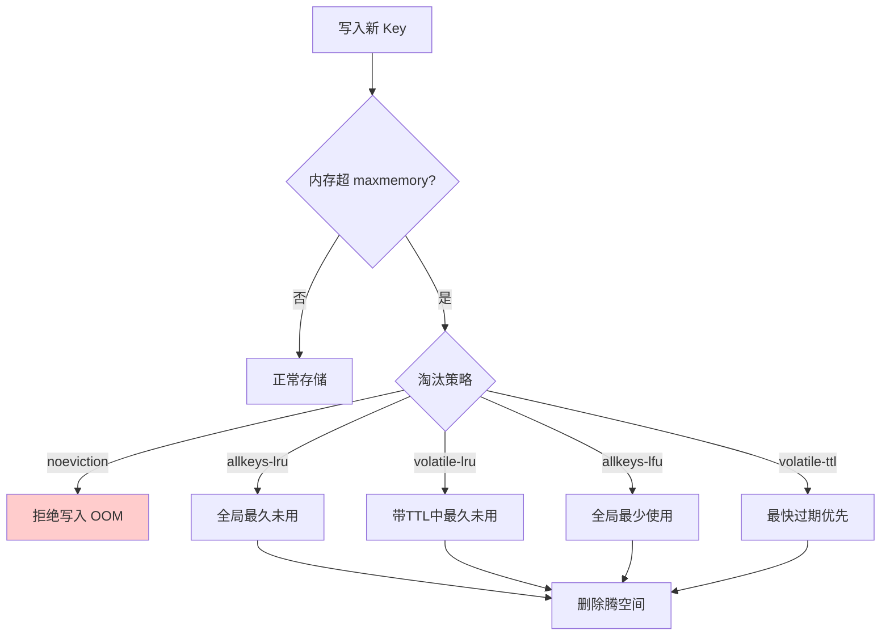

# 什么是Redis内存淘汰？

Redis 内存淘汰：当 Redis 占用内存达到 maxmemory 上限时，按淘汰策略删除部分 key 以腾出空间写入新数据。

**8 种淘汰策略（Redis 4.0+）：**
| 策略 | 分类 | 核心逻辑 | 适用场景 |
| :--- | :--- | :--- | :--- |
| **noeviction** | 不淘汰 | 写入报错（OOM） | 缓存不允许丢失，集群通信场景 |
| **allkeys-lru** | 全局 | 淘汰最久未使用 | **通用缓存场景**（推荐） |
| **allkeys-lfu** | 全局 | 淘汰最少使用 | 热点数据突出的场景 |
| **allkeys-random** | 全局 | 随机淘汰 | 对数据分布无要求的简单场景 |
| **volatile-lru** | 带TTL | 过期键中淘汰最久未使用 | 只希望淘汰过期数据的场景 |
| **volatile-lfu** | 带TTL | 过期键中淘汰最少使用 | 热点数据且有过期时间 |
| **volatile-random** | 带TTL | 过期键中随机淘汰 | 简单的 TTL 键淘汰 |
| **volatile-ttl** | 带TTL | 淘汰 TTL 最短的 | 希望 Redis 尽可能保留存活时间长的 key |

**LRU vs LFU：**
- LRU（Least Recently Used）：淘汰最久未访问，实现简单（链表+哈希）。Redis 用近似 LRU（随机采样 5 个，淘汰最旧的）。
- LFU（Least Frequently Used，4.0+）：淘汰访问频率最低，更适合「热点数据」场景（避免偶发访问的冷数据占用）。

**配置：** `config set maxmemory 4gb` + `config set maxmemory-policy allkeys-lru`。

### 补充关键细节

**1. 近似 LRU 的实现细节**
- 标准 LRU 需要维护庞大的链表，消耗大量内存。Redis 为了节省内存，采用**近似 LRU** 算法。
- Redis 默认配置 `maxmemory-samples 5`。它随机抽取 5 个 key，从中选出一个最久未使用的进行淘汰。
- Redis 3.0 后优化了算法，通过维护一个「候选池」来提高命中率，使得近似 LRU 的效果非常接近真实 LRU。

**2. LFU 的实现细节**
- LFU 使用 `Morris Count`（近似计数）算法来记录访问频率，只用 8 bit (255) 存储计数，极大节省空间。
- 它使用两部分信息：
  - **高 5 位**：逻辑对数计数，表示大致的访问次数。
  - **低 8 位**：衰减时间，表示上次访问的时间。
- 随着时间推移，计数会衰减（旧数据即使以前访问频繁，如果最近不访问，优先级也会降低），防止历史热门数据霸占内存。

**3. 淘汰执行时机**
- 每次执行命令（如 `set`, `incr` 等）处理完业务逻辑后，会检查 `used_memory` 是否超过 `maxmemory`。
- 如果超过，则根据策略执行相应的淘汰逻辑，直到内存降至限制以下。

## 常见考点

1. **生产环境建议使用哪种策略？**
   - 如果是纯缓存场景（数据可丢失）：推荐 `allkeys-lru` 或 `allkeys-lfu`。
   - 如果需要区分热点和非热点：`allkeys-lfu`。
   - 如果只有部分 key 能过期（如 session）：`volatile-lru`。
2. **为什么不用真正的 LRU？**
   - 内存开销太大，且性能开销随数据量线性增长，无法满足 Redis 高性能要求。
3. **LRU 和 LFU 在什么场景下表现差异大？**
   - **LFU** 更适合于「偶发读取」较少的场景（例如推荐系统的冷启动）；**LRU** 容易因为一次扫描操作将冷数据误判为热点。

---

### 深化补充

**实战案例**：
某新闻客户端使用 `volatile-lru` 策略，大量新闻缓存未设置 TTL。导致内存达到上限后，不仅无法写入新新闻，且因为全是不过期的 key，触发 `noeviction` 逻辑（配置错误时）或导致系统卡顿。修复策略为全量清理并改为 `allkeys-lru`，对所有数据一视同仁进行淘汰。

**关键代码 (Redis CLI)**：
```bash
# 1. 动态调整内存限制和策略（无需重启）
redis-cli CONFIG SET maxmemory 2gb
redis-cli CONFIG SET maxmemory-policy allkeys-lfu

# 2. 调整 LRU/LFU 采样精度以提高准确度（默认5，最大10）
# 越大越精确，但消耗更多 CPU
redis-cli CONFIG SET maxmemory-samples 10

# 3. 模拟内存满载写入测试
code # (Python pseudo code)
import redis
r = redis.StrictRedis(host='localhost', port=6379)
for i in range(100000):
    try:
        r.set(f'key:{i}', 'value' * 100)  # 写入大对象
    except redis.ResponseError as e:
        if str(e) == 'OOM command not allowed when used memory > 'maxmemory'.':
            print(f"Memory full at key {i}, eviction triggered")
```


## 核心流程图




## 记忆要点

- 触发时机：因为Redis达到maxmemory上限，所以按配置策略删除Key以腾空间。
- 策略对比：allkeys-*针对全库，volatile-*仅限带过期时间的键；纯缓存推荐allkeys-lru。
- LRU与LFU对比：LRU淘汰最久未访问，LFU(4.0+)淘汰最少使用，更适合防冷数据霸占。
- 底层实现：为省内存不用真实LRU链表，而是采用随机抽样(默认5个)的近似LRU算法。

## 结构化回答

**30 秒电梯演讲：** 内存满时按策略腾出空间，平衡读写性能与数据留存。打个比方，书架满了，必须扔掉一些旧书才能放新书。

**展开框架：**
1. **触发时机** — 因为Redis达到maxmemory上限，所以按配置策略删除Key以腾空间。
2. **策略对比** — allkeys-*针对全库，volatile-*仅限带过期时间的键；纯缓存推荐allkeys-lru。
3. **LRU与LFU对比** — LRU淘汰最久未访问，LFU(4.0+)淘汰最少使用，更适合防冷数据霸占。

**收尾：** 我在项目里踩过坑——某新闻客户端使用 `volatile-lru` 策略，大量新闻缓存未设置 TTL。您想深入聊哪一段：原理、避坑还是对比选型？

## 视频脚本

> 预计时长：2 分钟 | 由浅入深

| 时间 | 画面/字幕 | 口播台词 | 讲解要点 |
|------|----------|----------|----------|
| 0:00 | 标题卡：什么是Redis内存淘汰 | "什么是Redis内存淘汰？一句话——书架满了，必须扔掉一些旧书才能放新书。" | 开场钩子 |
| 0:40 | 概念动画/示意图 | "内存满时按策略腾出空间，平衡读写性能与数据留存——书架满了，必须扔掉一些旧书才能放新书" | 核心定义 |
| 1:20 | 触发时机示意 | "因为Redis达到maxmemory上限，所以按配置策略删除Key以腾空间。" | 要点1 |
| 2:00 | 总结卡 | "记住这几条，面试不慌。下期讲进阶追问。" | 收尾 |
