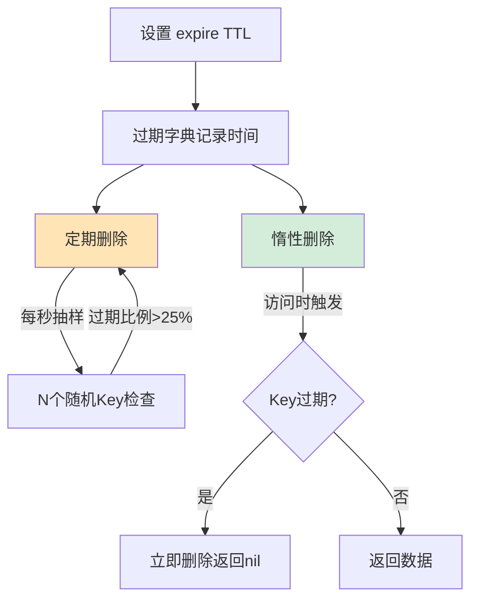
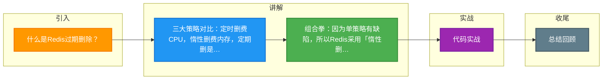

# 什么是Redis过期删除？

Redis设置了过期时间的Key，在到达时间点后被自动清理的机制。分为三种策略：定时删除（到期立即删，费CPU）、惰性删除（访问时才删，费内存）、定期删除（隔段时间抽查删，折中方案）。Redis实际采用惰性删除+定期删除的组合策略。

---

### 深化补充

**实战案例**：
业务报错显示内存使用率 100%，但很多 Key 实际上已过期未被删除。原因是定期删除的频率设置过低，且这些冷数据后续再也没有被访问过（未触发惰性删除），导致内存泄漏。解决方案是定期扫描并手动清理，或调整 Redis 的 `hz` 参数提高删除频率。

**关键代码 (Python Redis)**：
```python
import redis
import time

r = redis.StrictRedis(host='localhost', port=6379, db=0)

# 设置 Key 并带过期时间（单位：秒）
r.setex('session:user:1001', 3600, 'token_data')

# 模拟惰性删除：只有访问时才会检查是否过期
val = r.get('session:user:1001') 
if val is None:
    print("Key 不存在或已过期（被惰性删除）")

# 模拟定期删除配置调整（Redis 服务端配置）
# CONFIG SET hz 20 (默认10，提高hz可加快过期Key的回收速度)
```

| 策略 | 优点 | 缺点 | Redis 中的角色 |
| :--- | :--- | :--- | :--- |
| **定时删除** | 内存利用率最高，过期即释放 | CPU 压力极大，影响吞吐量 | 不采用 |
| **惰性删除** | CPU 开销最小，仅操作时检查 | 内存泄漏风险（冷数据永不删） | **辅助采用** |
| **定期删除** | 折中方案，平衡 CPU 和内存 | 难以确定完美的删除频率和时长 | **核心采用** |

## 技术原理

Redis 的过期删除不是单一机制，而是"惰性删除 + 定期删除"的组合拳，再加内存淘汰策略兜底，三层协作清理过期数据：

- **过期字典的存储原理**：Redis 把所有设了 TTL 的 key 存在一个独立的 `expires` 字典里（key→过期时间戳 absTTL）。这样判断过期时无需扫描全部数据，只需查 expires 字典。主 dict 存真实数据，expires 存过期时间，两者分离。
- **惰性删除的触发时机**：每次执行 `GET`/`SET` 等命令访问 key 时，`expireIfNeeded()` 函数先查 expires 字典，若已过期则同步删除并返回 nil。优点是 CPU 零额外开销（只在访问时顺带检查），缺点是冷数据（设了过期但再也不访问）永远不会被清理，造成"逻辑过期但物理占用内存"的泄漏。
- **定期删除的抽样算法**：Redis 的定时任务（serverCron，由 `hz` 控制频率，默认 10 次/秒）每次随机抽取 20 个设了 TTL 的 key 检查过期，若过期比例 > 25% 则再抽 20 个，循环直到比例下降或耗时超阈值。这是"概率性清理"——不保证所有过期 key 立即删除，但能在 CPU 和内存间找平衡。
- **内存淘汰策略兜底**：即使惰性 + 定期都没清掉的过期冷数据，当内存达到 `maxmemory` 上限时，触发淘汰策略（LRU/LFU/random/TTL）强制驱逐。其中 `volatile-ttl` 优先淘汰 TTL 最短的，间接清理了过期数据。

## 注意事项

1. **冷数据内存泄漏**：大量设了过期但不再被访问的冷数据，惰性和定期删除都可能漏，需监控 `used_memory` 并配合淘汰策略，或手动 `SCAN` 清理。
2. **hz 参数权衡**：调高 `hz`（如 20）加快过期回收，但增加 CPU 开销；调低则回收慢。读多写少场景可适当调高。
3. **大 key 过期会阻塞**：删除一个大 key（如百万元素的 hash）是同步操作，会阻塞主线程，应改用 `UNLINK` 异步删除。
4. **过期不等于立即删除**：业务别假设 TTL 到了 key 一定立刻不存在，可能还在内存里（定期删除未扫到），访问时才会触发惰性删除。

## 代码示例

```bash
# Redis 服务端：调整定期删除频率
CONFIG SET hz 20                    # 默认 10，调高加快过期回收（增加 CPU 开销）
CONFIG SET maxmemory-policy volatile-ttl  # 内存满时优先淘汰 TTL 最短的 key

# 查看过期 key 统计（排查内存泄漏）
INFO stats | grep expired           # expired_keys: 累计被惰性+定期删除的过期 key 数
DBSIZE                              # 当前 key 总数
MEMORY USAGE mykey                  # 查单个 key 占用内存
```

```python
# 应用层：批量扫描并清理"逻辑过期但物理未删"的冷数据
import redis
r = redis.StrictRedis(host='localhost', port=6379)

# 用 SCAN（非 KEYS，不阻塞）遍历所有 key，检查 TTL
cursor = 0
cleaned = 0
while True:
    cursor, keys = r.scan(cursor=cursor, count=100)
    for key in keys:
        ttl = r.ttl(key)
        # ttl == -1: 无过期时间；ttl == -2: key 不存在
        if ttl == -1:                # 设了过期但已逻辑过期（未被定期删除扫到）
            r.delete(key)
            cleaned += 1
    if cursor == 0:
        break
print(f"cleaned {cleaned} leaked keys")
```


## 核心流程图




## 记忆要点

- 三大策略对比：定时删费CPU，惰性删费内存，定期删是折中。
- 组合拳：因为单策略有缺陷，所以Redis采用「惰性删除+定期删除」双管齐下。
- 惰性删除：在每次访问Key时触发检查，过期则删，防范冷数据常驻。
- 定期删除：周期性随机抽查(默认20个)，按过期比例决定是否继续抽，平衡CPU与内存。

## 结构化回答

**30 秒电梯演讲：** 定期抽查与访问时检查相结合，兼顾内存清理与CPU性能。打个比方，垃圾既不天天上门收（省事），也不等用户投诉才清（保洁），定期巡逻+随手清理。

**展开框架：**
1. **三大策略对比** — 定时删费CPU，惰性删费内存，定期删是折中。
2. **组合拳** — 因为单策略有缺陷，所以Redis采用「惰性删除+定期删除」双管齐下。
3. **惰性删除** — 在每次访问Key时触发检查，过期则删，防范冷数据常驻。

**收尾：** 我在项目里踩过坑——业务报错显示内存使用率 100%，但很多 Key 实际上已过期未被删除。您想深入聊哪一段：原理、避坑还是对比选型？

## 视频脚本

> 预计时长：2 分钟 | 由浅入深

| 时间 | 画面/字幕 | 口播台词 | 讲解要点 |
|------|----------|----------|----------|
| 0:00 | 标题卡：什么是Redis过期删除 | "什么是Redis过期删除？一句话——垃圾既不天天上门收（省事），也不等用户投诉才清（保洁），定期巡逻+随手清理。" | 开场钩子 |
| 0:40 | 概念动画/示意图 | "定期抽查与访问时检查相结合，兼顾内存清理与CPU性能——垃圾既不天天上门收（省事），也不等用户投诉才清（保洁），定期巡逻+随手清理" | 核心定义 |
| 1:20 | 三大策略对比示意 | "定时删费CPU，惰性删费内存，定期删是折中。" | 要点1 |
| 2:00 | 总结卡 | "记住这几条，面试不慌。下期讲进阶追问。" | 收尾 |

### 视频流程图



