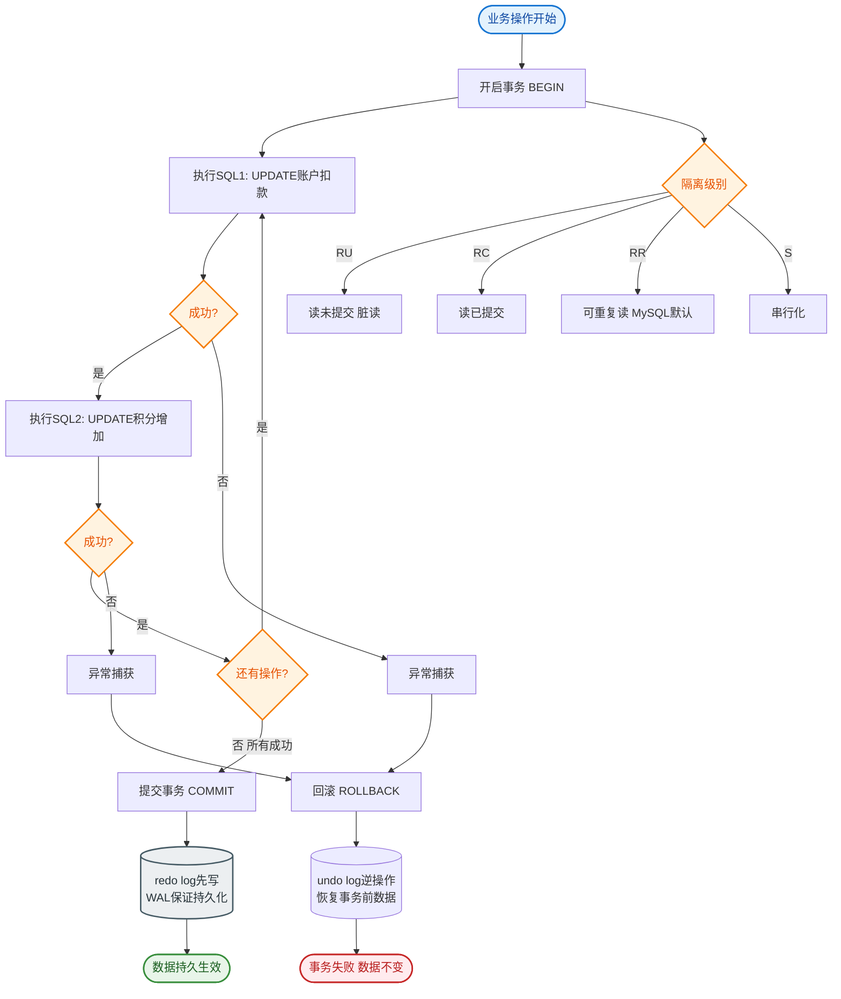

# 什么是事务的启动方式？

事务启动主要有两种方式：1. 显式启动：使用 begin 或 start transaction 语句，需手动 commit 或 rollback 结束。2. 隐式启动：设置 set autocommit=0，即关闭自动提交，执行的第一条SQL语句即开启事务，直到显式提交或断开连接。建议显式控制以避免长事务。

### 补充关键细节

**1. 一致性读与锁机制的区别**
- **启动事务时**：MySQL 并不会立即为所有行加锁，而是生成一个 `Read View`（用于 MVCC）。只有当执行到第一条 `SELECT` 语句（如果是快照读）或者 `UPDATE/DELETE/INSERT` 语句（当前读）时，才会涉及具体的版本读取或加锁。
- **长事务的危害**：
  - 持有的锁时间过长，阻塞其他事务。
  - 回滚段占用空间巨大（Undo log 无法清理），可能导致表空间爆满。
  - 主从延迟（如果开启了并行复制，长事务会导致其后的事务在从库排队）。

**2. `start transaction read only`**
- 这是一个优化手段。声明事务为只读后，InnoDB 引擎知道不需要修改数据，可以优化某些内部流程（例如无需分配事务 ID 用于 Undo Log 的回滚段）。
- 在从库复制线程中，默认使用 `read only` 模式启动事务。

**3. `commit chain` / `commit and chain`**
- 使用 `COMMIT AND CHAIN` 可以在提交当前事务后立即开启一个新事务，并继承当前事务的隔离级别，减少建立新事务的开销。

### 流程状态图

```text
MySQL 事务生命周期状态流转

  (客户端开始)
      │
      ▼
┌─────────────────────┐
│     BEGIN / START    │  ◄─── 显式开启
│   TRANSACTION        │
└──────────┬───────────┘
           │
           ▼
┌─────────────────────┐
│    活动状态 (ACTIVE) │ ◄── 执行 SQL 语句
│   (Read View生成)    │     (增删改查)
└──────────┬───────────┘
           │
     ┌─────┴─────┐
     ▼           ▼
┌─────────┐  ┌─────────┐
│ COMMIT  │  │ROLLBACK │
└────┬────┘  └────┬────┘
     │            │
     ▼            ▼
┌─────────────────────┐
│    非活动状态 (IDLE) │
└─────────────────────┘
```

## 常见考点

1. **`set autocommit=0` 的隐患是什么？**
   - 容易产生忘记提交的长事务，导致连接长时间占用和锁冲突。
2. **如何查找当前的长事务？**
   - 查询 `information_schema.innodb_trx` 表，查看 `trx_started` 时间较早的事务。
3. **MySQL 默认 autocommit 是多少？**
   - 默认是 1（开启），即每条 SQL 就是一个独立的事务。

---

### 深化补充

**实战案例**：
某业务代码在配置 `autocommit=0` 的连接中执行了一个查询，随后因异常分支未执行 `commit` 或 `rollback`。导致该连接被归还连接池后，依然持有事务锁。后续复用该连接的线程执行更新操作时，意外延续了旧事务，造成数据逻辑混乱且难以排查。后来强制规范：所有业务必须显式使用 `START TRANSACTION` 并配合 `try-catch` 块控制提交回滚。

**关键代码 (Java JDBC)**：
```java
Connection conn = dataSource.getConnection();
try {
    // 1. 显式开启事务（推荐）
    // conn.setAutoCommit(false); // 不推荐，容易忘记提交
    
    // 2. 更好的方式：利用 Statement 或 JDBC 4.0+ 的显式控制
    // 这里模拟手动控制
    conn.setAutoCommit(false); 
    
    // 执行业务 SQL
    PreparedStatement ps = conn.prepareStatement("UPDATE account SET balance = balance - ? WHERE id = ?");
    ps.setInt(1, 100);
    ps.setInt(2, 1);
    ps.executeUpdate();
    
    // 3. 显式提交
    conn.commit();
} catch (SQLException e) {
    // 4. 异常必须回滚
    if (conn != null) {
        try { conn.rollback(); } catch (SQLException ex) { ex.printStackTrace(); }
    }
} finally {
    // 5. 恢复自动提交模式（避免连接池复用时出错）或直接关闭连接
    if (conn != null) {
        try { conn.setAutoCommit(true); conn.close(); } catch (SQLException e) {}
    }
}
```


## 核心流程图


## 记忆要点

- 两种启动方式：显式使用BEGIN/START TRANSACTION开启，隐式依赖autocommit=0。
- 长事务危害：因为事务开启过久未提交，所以会导致锁阻塞及Undo Log无法回收爆满。
- MVCC特性：事务开启时并不立即生成Read View，而是首次执行快照读时才生成。
- 最佳实践：优先显式开启并配合try-catch及时提交或回滚，避免忘记提交导致长事务。

## 结构化回答

**30 秒电梯演讲：** 显式声明或关闭自动提交，将一组操作绑定为一个执行单元。打个比方，记账时，要么说“开始记账”，要么设置成“每笔都要确认”，否则一笔账没结清后面都没法算。

**展开框架：**
1. **两种启动方式** — 显式使用BEGIN/START TRANSACTION开启，隐式依赖autocommit=0。
2. **长事务危害** — 因为事务开启过久未提交，所以会导致锁阻塞及Undo Log无法回收爆满。
3. **MVCC特性** — 事务开启时并不立即生成Read View，而是首次执行快照读时才生成。

**收尾：** 我在项目里踩过坑——某业务代码在配置 `autocommit=0` 的连接中执行了一个查询，随后因异常分支未执行 `commit` 或 `rollback`。您想深入聊哪一段：原理、避坑还是对比选型？

## 视频脚本

> 预计时长：2 分钟 | 由浅入深

| 时间 | 画面/字幕 | 口播台词 | 讲解要点 |
|------|----------|----------|----------|
| 0:00 | 标题卡：什么是事务的启动方式 | "什么是事务的启动方式？一句话——记账时，要么说“开始记账”，要么设置成“每笔都要确认”，否则一笔账没结清后面都没法算。" | 开场钩子 |
| 0:40 | 概念动画/示意图 | "显式声明或关闭自动提交，将一组操作绑定为一个执行单元——记账时，要么说“开始记账”，要么设置成“每笔都要确认”，否则一笔账没结清后面都没法算" | 核心定义 |
| 1:20 | 两种启动方式示意 | "显式使用BEGIN/START TRANSACTION开启，隐式依赖autocommit=0。" | 要点1 |
| 2:00 | 总结卡 | "记住这几条，面试不慌。下期讲进阶追问。" | 收尾 |
