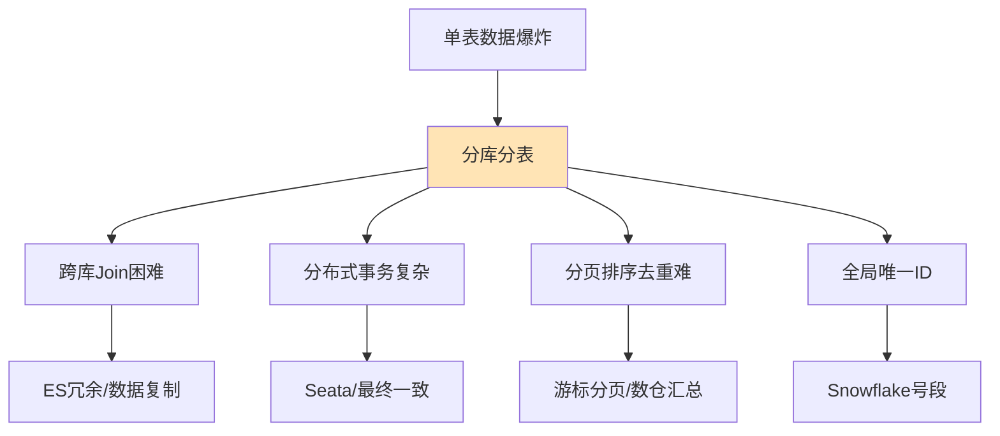

# 什么是分库分表的问题？

### 分库分表带来的主要挑战
分库分表虽然解决了性能瓶颈，但引入了分布式系统的复杂度。以下是核心问题及解决思路：

#### 1. 跨库 Join（关联查询）问题
- **现象**：数据分散在不同节点，无法直接使用 SQL Join。
- **解决方案**：
  - **字段冗余**：将关联表常用的字段（如用户名）冗余到主表（订单表），实现单表查询。
  - **应用层组装**：分两次查询，在 Java 代码中组装数据（List 查询 -> 提取 IDs -> 查询关联表 -> 组装）。
  - **全局表**：数据量较小的字典表，在每个节点都存一份。
  - **ES 宽表**：将关联数据同步到 Elasticsearch，通过 ES 解决复杂关联查询。

#### 2. 分布式事务问题
- **现象**：业务操作涉及多个库，本地事务失效。
- **解决方案**：
  - **柔性事务（最终一致性）**：
    - **可靠消息最终一致性**：基于 MQ 的本地消息表。
    - **TCC (Try-Confirm-Cancel)**：预留资源、确认操作、取消操作。
  - **强一致性方案**：
    - **Seata AT 模式**：基于 Undo Log 的无侵入式事务（性能有损耗）。

#### 3. 分页与排序问题
- **现象**：`LIMIT 100000, 10` 在分片场景下极难执行（需要每个分片查 100010 条再合并排序）。
- **解决方案**：
  - **禁止深分页**：限制翻页页数，改为“上一页/下一页”或滚动加载。
  - **二次查询法**：先查出各分片的 Offset，再定位。
  - **搜索引擎**：利用 ES 进行分页查询。

#### 4. 全局主键问题
- **现象**：分库分表后，自增 ID 冲突。
- **解决方案**：
  - **UUID**：太长，无序，影响 B+ 树索引性能（不推荐）。
  - **Snowflake 雪花算法**：生成 64bit Long 型 ID，有序，性能高（需解决时钟回拨）。
  - **数据库步长**：设置不同库的 `auto_increment_increment` 和 `auto_increment_offset`（扩容麻烦）。
  - **号段模式**（Redis/DB 批量发号）。

#### 5. 二次扩容（数据迁移）问题
- **现象**：初期分 2 个库，现在不够了，要扩到 4 个库，涉及大量数据迁移。
- **解决方案**：
  - **倍增扩容法**：
    - 原配置：`mod 2`
    - 扩容：增加节点，配置变为 `mod 4`。
    - 原理：数据 0/1/2/3，其中 0/2 原本在节点 0，现在 0 留在节点 0，2 迁移到节点 2。只需迁移 50% 数据。
  - **双写迁移**：老库新库双写，数据校验一致后切换。

## 常见考点
1. **如何解决分库后的分页问题？**（重点考察是否了解 ES 替代方案或限制深分页）
2. **分布式事务你们用的什么方案？为什么不用 2PC/XA？**（考察对性能和一致性的权衡）
3. **如果非要跨库 Join，怎么优化？**（考察冗余设计或 ES 宽表思路）
4. **热点数据怎么处理？**（考察是否能想到单独拆分热点库或增加二级缓存）

## 核心流程图

## 记忆要点

- 跨库Join解决：字段冗余避免关联，应用层组装数据，或借助ES宽表处理复杂查询。
- 全局ID生成：拒绝无序UUID，推荐雪花算法(Snowflake)或数据库/Redis号段模式。
- 深分页难题：LIMIT offset过大会导致全分片扫描，禁止跨库深分页或改用ES搜索。
- 二次扩容：采用倍增扩容法(如2变4)仅迁移半数数据，或使用双写同步平滑迁移。

## 结构化回答

**30 秒电梯演讲：** 分布式架构下引入的复杂度，需解决数据关联与一致性问题。打个比方，把原本一大家子人分居各地后，很难再聚在一起吃顿饭（跨库Join），转账也麻烦（分布式事务）。

**展开框架：**
1. **跨库Join解决** — 字段冗余避免关联，应用层组装数据，或借助ES宽表处理复杂查询。
2. **全局ID生成** — 拒绝无序UUID，推荐雪花算法(Snowflake)或数据库/Redis号段模式。
3. **深分页难题** — LIMIT offset过大会导致全分片扫描，禁止跨库深分页或改用ES搜索。

**收尾：** 这三点都能配合实战聊。您想深入聊原理、对比还是避坑？

## 视频脚本

> 预计时长：2 分钟 | 由浅入深

| 时间 | 画面/字幕 | 口播台词 | 讲解要点 |
|------|----------|----------|----------|
| 0:00 | 标题卡：什么是分库分表的问题 | "什么是分库分表的问题？一句话——把原本一大家子人分居各地后，很难再聚在一起吃顿饭（跨库Join），转账也麻烦（分布式事务）。" | 开场钩子 |
| 0:40 | 概念动画/示意图 | "分布式架构下引入的复杂度，需解决数据关联与一致性问题——把原本一大家子人分居各地后，很难再聚在一起吃顿饭（跨库Join），转账也麻烦（分布式事务）" | 核心定义 |
| 1:20 | 跨库Join解决示意 | "字段冗余避免关联，应用层组装数据，或借助ES宽表处理复杂查询。" | 要点1 |
| 2:00 | 总结卡 | "记住这几条，面试不慌。下期讲进阶追问。" | 收尾 |
