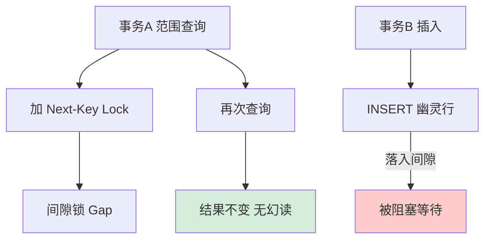
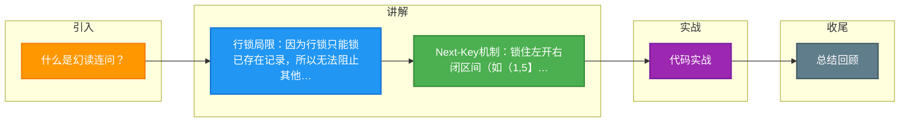

# 什么是幻读连问？

### 1. 什么是幻读？
在同一个事务内，前后两次查询同一范围的数据，第二次查询看到了第一次查询没看到的新增行。

### 2. 幻读带来的问题？
1. **破坏数据一致性**：例如统计工资总额，插入了新员工工资，导致前后统计不一致。
2. **破坏锁语义**：如果只锁住存在的行，其他事务依然可以插入新行，导致当前事务的业务逻辑失效（如确保库存扣减唯一性）。

### 3. 为什么行锁无法解决幻读？
行锁只能锁住**已存在的记录**（索引记录）。对于新插入的行，在插入前并不存在对应的索引记录，因此行锁无法锁定“空隙”。

### 4. 间隙锁 是如何解决幻读的？
- **定义**：锁定索引记录之间的间隙，但不包含索引记录本身。
- **作用**：禁止其他事务向该间隙中插入新记录，从而防止幻读。
- **副作用**：
  - **死锁**：如 A 事务持有间隙 (1,5)，想插入 3；B 事务持有间隙 (5,10)，想插入 7，如果双方操作交叉可能导致死锁。
  - **并发度降低**：锁住间隙意味着更严格的互斥。

### 5. Next-Key Lock (临键锁)
- **组成**：Next-Key Lock = Record Lock + Gap Lock。
- **锁定范围**：左开右闭区间，如 `(1, 5]`。
- **RR 级别默认算法**：InnoDB 默认使用 Next-Key Lock 进行查找和锁定。

### 加锁规则与优化（面试高频）
**原则**：
1. **加锁基本单位**是 Next-Key Lock（前开后闭）。
2. **查找过程中访问到的对象**才会加锁（优化点）。

**优化场景**：
1. **唯一索引等值查询**：
   - **命中记录**：Next-Key Lock 退化为 **Record Lock**（行锁）。因为唯一索引保证唯一性，不可能有重复值插入间隙。
   - **未命中记录**：Next-Key Lock 退化为 **Gap Lock**（间隙锁）。
2. **非唯一索引等值查询**：
   - 向右遍历直到第一个不满足条件的值，会对该不满足条件的值加 Gap Lock。

### 6. 为什么间隙锁之间不冲突？
- 间隙锁的目的是“防止插入”，而不是“防止读取”。
- 两个事务同时持有同一个间隙的 Gap Lock，都表示“我不让别人插入”，但它们自己都不插入，因此可以共存。
- 但是，**插入操作**与**间隙锁**是互斥的。

## 常见考点
1. **RR 隔离级别下，如果 SQL 没命中索引，会加什么锁？**（答案：全表扫描，每一行记录的 Next-Key Lock，后果是所有插入被阻塞，性能极差）
2. **什么情况下会产生死锁？**（考察对间隙锁互斥特性的理解，如两个事务分别持有相邻间隙并试图插入对方锁定的位置）
3. **如何查看死锁日志？**（答案：`SHOW ENGINE INNODB STATUS`）

## 核心流程图

## 记忆要点

- 行锁局限：因为行锁只能锁已存在记录，所以无法阻止其他事务在空隙中插入新行。
- Next-Key机制：锁住左开右闭区间(如(1,5])，同时禁止外部修改已有行与在间隙插入新行。
- 共存特性：因为间隙锁目的是防插入而非互斥，所以两个事务可以同时持有同一个间隙锁。
- 致命隐患：若更新条件未命中任何索引，会退化为全表Next-Key Lock，严重阻塞并发甚至引发死锁。

## 结构化回答

**30 秒电梯演讲：** 通过锁住记录间的空隙防止插入，解决读出“幽灵行”的问题。打个比方，电影院选座锁了中间的排，防止别人再往中间挤进来。

**展开框架：**
1. **行锁局限** — 因为行锁只能锁已存在记录，所以无法阻止其他事务在空隙中插入新行。
2. **Next-Key机制** — 锁住左开右闭区间(如(1,5])，同时禁止外部修改已有行与在间隙插入新行。
3. **共存特性** — 因为间隙锁目的是防插入而非互斥，所以两个事务可以同时持有同一个间隙锁。

**收尾：** 这三点都能配合实战聊。您想深入聊原理、对比还是避坑？

## 视频脚本

> 预计时长：2 分钟 | 由浅入深

| 时间 | 画面/字幕 | 口播台词 | 讲解要点 |
|------|----------|----------|----------|
| 0:00 | 标题卡：什么是幻读连问 | "什么是幻读连问？一句话——电影院选座锁了中间的排，防止别人再往中间挤进来。" | 开场钩子 |
| 0:40 | 概念动画/示意图 | "通过锁住记录间的空隙防止插入，解决读出“幽灵行”的问题——电影院选座锁了中间的排，防止别人再往中间挤进来" | 核心定义 |
| 1:20 | 行锁局限示意 | "因为行锁只能锁已存在记录，所以无法阻止其他事务在空隙中插入新行。" | 要点1 |
| 2:00 | 总结卡 | "记住这几条，面试不慌。下期讲进阶追问。" | 收尾 |

### 视频流程图

