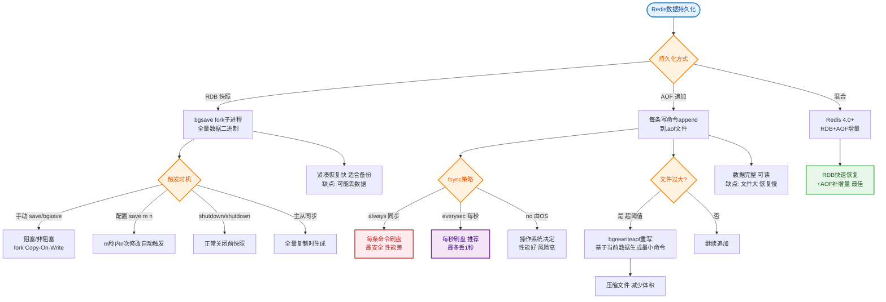

# 什么是混合持久化？

### Redis 持久化背景
Redis 是内存数据库，断电后数据会丢失。持久化机制用于将内存数据保存到磁盘。

### 1. RDB (Redis Database)
- **原理**：在指定的时间间隔内，生成数据集的时间点快照。
- **执行方式**：
  - `save`：主线程执行，**阻塞**所有客户端请求，生产环境禁用。
  - `bgsave`：fork 一个子进程执行，主线程继续处理请求，**非阻塞**（但 fork 时有瞬间阻塞）。
- **优点**：文件紧凑，恢复速度快；适合备份。
- **缺点**：
  - 耐久性差：如果 Redis 宕机，会丢失最后一次快照之后的所有修改。
  - fork 时内存拷贝开销大（数据量大时可能导致主线程阻塞毫秒级甚至秒级）。

### 2. AOF (Append Only File)
- **原理**：记录服务器接收到的每一个写命令，重启时重新执行这些命令来恢复数据。
- **配置**：
  - `appendfsync always`：每条写命令都同步写盘（最安全，最慢）。
  - `appendfsync everysec`（默认）：每秒同步一次（折中）。
  - `appendfsync no`：由操作系统决定何时写盘（最快，不安全）。
- **AOF 重写**：
  - **目的**：解决 AOF 文件过大的问题。
  - **机制**：fork 子进程，将内存中的数据转换成一条新的写命令，写入临时文件，覆盖旧文件。
  - **注意**：重写期间，主线程持续将新命令追加到 **AOF 重写缓冲区**，重写结束后合并到新文件。
- **优点**：数据安全性高（通常只丢失 1 秒数据）。
- **缺点**：文件体积大，恢复速度慢（需要执行大量写命令）。

### 3. 混合持久化
Redis 4.0+ 推出的特性，结合了 RDB 和 AOF 的优点。

- **触发时机**：AOF 重写时。
- **工作流程**：
  1. Redis fork 子进程进行 AOF 重写。
  2. 子进程首先将内存中的全量数据以 **RDB 格式**写入 AOF 文件的开头。
  3. 主进程将重写期间接收到的增量命令以 **AOF 格式**追加到文件末尾。

- **文件结构图示**：
```text
┌──────────────────────────────────────┐
│         Redis AOF File (Mixed)        │
├──────────────────────────────────────┤
│  [ RDB Binary Data (Full Snapshot) ] │  <-- 恢复快：直接加载 RDB
├──────────────────────────────────────┤
│  [ AOF Command 1 ]                    │
│  [ AOF Command 2 ]                    │  <-- 数据全：包含增量数据
│  [ AOF Command 3 ]                    │
│  ...                                  │
└──────────────────────────────────────┘
```

- **优点**：
  1. **恢复速度快**：加载 RDB 部分比加载纯 AOF 快很多。
  2. **数据安全性高**：保留了重写期间的增量数据。
- **缺点**：
  1. 文件格式是二进制+文本混合，可读性变差。
  2. 兼容性：4.0 之前的版本无法识别此文件。

#### 实战案例
某电商大促期间，Redis 节点（主库 16GB 内存）因流量洪峰触发频繁写操作，开启纯 AOF 导致重启恢复耗时超过 20 分钟，严重阻断服务。开启混合持久化后，RDB 基础数据加载仅需 2-3 分钟，随后回放少量增量 AOF 日志，总恢复时间降至 5 分钟以内，大幅降低 RTO（恢复时间目标）。

#### 关键配置
```conf
# redis.conf
aof-use-rdb-preamble yes   # 开启混合持久化（Redis 4.0+）
appendonly yes             # 必须开启 AOF
appendfsync everysec       # 推荐每秒刷盘
```

#### 对比表格
| 特性 | RDB | AOF | 混合持久化 (4.0+)
| :--- | :--- | :--- | :--- |
| **恢复速度** | 快 (直接加载) | 慢 (逐条执行命令) | 快 (RDB部分) + 微增量 |
| **数据完整性** | 低 (丢失快照后数据) | 高 (通常仅丢1秒) | 高 (同 AOF) |
| **文件体积** | 小 (二进制压缩) | 大 (文本日志) | 较小 (RDB压缩+少量AOF) |
| **可读性** | 差 (二进制) | 好 (文本命令) | 差 (混合格式) |
| **Fork 开销** | 大 (数据量大时) | 大 (重写时) | 大 (重写时) |

## 常见考点
1. **RDB 做 fork 时，为什么主线程会阻塞？阻塞多久？**（答案：fork 需要拷贝页表，与内存大小正相关，与数据量无关，但在大内存下依然耗时）
2. **AOF 重写也是 fork，会阻塞吗？**（答案：fork 时瞬间阻塞，重写过程由子进程完成，不阻塞主线程，但会有 CPU 和内存开销）
3. **Redis 4.0 之后推荐开启混合持久化吗？**（答案：通常推荐开启，兼顾性能和数据安全）


## 核心流程图


## 记忆要点

- 触发时机：AOF 重写时。子进程把全量数据以 RDB 写入文件头，主进程增量 AOF 命令追加到尾部
- 核心优势：兼具 RDB 的快速恢复与 AOF 的数据安全，大幅降低重启 RTO
- 文件结构：RDB（二进制全量快照）+ AOF（文本增量命令）的拼接组合
- 背景版本：Redis 4.0+ 推出，配置项为 aof-use-rdb-preamble yes

## 结构化回答

**30 秒电梯演讲：** 结合RDB的快照速度和AOF的日志完整性，实现快速且安全的数据恢复。打个比方，做备份时，先拍张全盘快照（快），后面只记操作日志（准），恢复时先载入快照再 replay 日志。

**展开框架：**
1. **触发时机** — AOF 重写时。子进程把全量数据以 RDB 写入文件头，主进程增量 AOF 命令追加到尾部
2. **核心优势** — 兼具 RDB 的快速恢复与 AOF 的数据安全，大幅降低重启 RTO
3. **文件结构** — RDB（二进制全量快照）+ AOF（文本增量命令）的拼接组合

**收尾：** 我在项目里踩过坑——某电商大促期间，Redis 节点（主库 16GB 内存）因流量洪峰触发频繁写操作，开启纯 AOF 导致重启恢复耗时超过 20 分钟，严重阻断服务。您想深入聊哪一段：原理、避坑还是对比选型？

## 视频脚本

> 预计时长：2 分钟 | 由浅入深

| 时间 | 画面/字幕 | 口播台词 | 讲解要点 |
|------|----------|----------|----------|
| 0:00 | 标题卡：什么是混合持久化 | "什么是混合持久化？一句话——做备份时，先拍张全盘快照（快），后面只记操作日志（准），恢复时先载入快照再 replay 日志。" | 开场钩子 |
| 0:40 | 概念动画/示意图 | "结合RDB的快照速度和AOF的日志完整性，实现快速且安全的数据恢复——做备份时，先拍张全盘快照（快），后面只记操作日志（准），恢复时先载入快照再 replay 日志" | 核心定义 |
| 1:20 | 触发时机示意 | "AOF 重写时。子进程把全量数据以 RDB 写入文件头，主进程增量 AOF 命令追加到尾部" | 要点1 |
| 2:00 | 总结卡 | "记住这几条，面试不慌。下期讲进阶追问。" | 收尾 |
