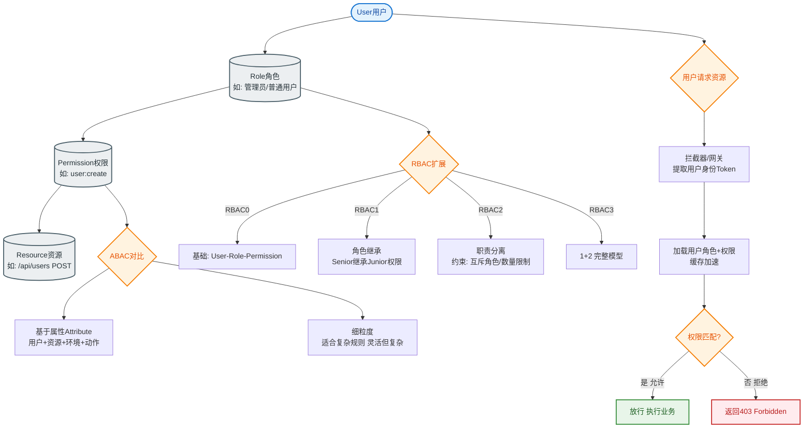

# 什么是用户权限控制？

### 用户账号管理

**1. 重命名用户**
语法：`RENAME USER old_user TO new_user;`
例如：将 `zhangsan` 改为 `lisi`。

**2. 修改用户密码**
语法：
- `SET PASSWORD FOR 'username'@'host' = PASSWORD('new_password');` (MySQL 5.7及以前)
- `ALTER USER 'username'@'host' IDENTIFIED BY 'new_password';` (MySQL 8.0 推荐语法)
- 或不指定用户名修改当前登录用户密码：`SET PASSWORD = PASSWORD('new_password');`

**3. 删除用户**
语法：`DROP USER 'username'@'host';`
注意：MySQL 5.0 之前需先 `REVOKE` 权限，5.0 及以后可直接删除。

### 用户权限控制

**1. 查看权限**
语法：`SHOW GRANTS FOR 'username'@'host';`
例如：`SHOW GRANTS FOR 'ls'@'%';` 其中 `USAGE` 代表无权限（仅能登录）。

**2. 用户授权**
语法：`GRANT [privileges] ON [db].[table] TO 'user'@'host' [WITH GRANT OPTION];`
- **privileges**: 权限列表（如 `SELECT, INSERT, UPDATE`，或 `ALL PRIVILEGES`）。
- **db.table**: 目标对象。`*.*` 表示所有库所有表，`db_name.*` 表示某库所有表。
- **WITH GRANT OPTION**: 允许该用户将拥有的权限授权给其他用户。

例如：给用户 `ls` 授予查询权限：
`GRANT SELECT ON database.table TO 'ls'@'%';`

**3. 撤销授权**
语法：`REVOKE [privileges] ON [db].[table] FROM 'user'@'host';`
例如：收回 `ls` 的查询权限：
`REVOKE SELECT ON database.table FROM 'ls'@'%';`

**4. 刷新权限**
执行权限修改后，内存中的权限表会自动更新。但如果直接修改 `mysql` 系统表（不推荐），需手动执行：
`FLUSH PRIVILEGES;`

### 权限生效流程图

```text
+-------------------+      1. Connect      +----------------+
|   Client Request  | --------------------> |  Server Layer  |
+-------------------+                       +--------+-------+
                                                     |
                                          2. Check User/Host
                                                     v
                                          +--------+-------+
                                          |  Access Check  |
                                          | (Grant Tables) |
                                          +----------------+
```

#### 实战案例
某公司在进行数据库审计时发现，开发环境的应用账号使用了 `GRANT ALL PRIVILEGES ON *.* TO 'app'@'%'`，导致开发人员误删了系统表数据。整改方案将权限收紧为最小化原则：`GRANT SELECT, INSERT, UPDATE, DELETE ON `business_db`.* TO 'app'@'192.168.1.%'`，并禁用了 `DROP` 和 `ALTER` 权限，避免了后续的误操作风险。

#### 关键代码 (MySQL 8.0)
```sql
-- 1. 创建用户并指定密码插件
CREATE USER 'readonly_user'@'%' IDENTIFIED WITH mysql_native_password BY 'StrongPassword123!';

-- 2. 授予特定库的只读权限
GRANT SELECT ON `app_production`.* TO 'readonly_user'@'%';

-- 3. 限制最大连接数（防止单个用户耗尽连接池）
ALTER USER 'readonly_user'@'%' WITH MAX_USER_CONNECTIONS 10;

-- 4. 立即生效（通常无需 FLUSH，除非改表）
FLUSH PRIVILEGES;
```

#### 对比表格
| 特性 | MySQL 5.7 | MySQL 8.0 |
| :--- | :--- | :--- |
| **创建用户** | `GRANT` 可自动创建用户 | 必须先 `CREATE USER` 再 `GRANT` （分离角色） |
| **密码管理** | `password()` 函数 | `ALTER USER` 语法，支持密码过期策略 |
| **认证插件** | 默认 `mysql_native_password` | 默认 `caching_sha2_password` (更安全) |
| **权限管理** | 基于权限列表 | 支持 **ROLES** (角色管理) |
| **主机匹配** | 简单字符串匹配 | 支持 X.509 证书认证等复杂方式 |

## 常见考点
1. **`user@host` 的含义**：`'zhangsan'@'%'` 和 `'zhangsan'@'localhost'` 是两个不同的用户，优先匹配更具体的主机名（如 localhost）。
2. **权限范围**：权限不仅限于表，还有数据库级（`DATABASE`）、管理级（如 `SUPER`, `RELOAD`）。
3. **GRANT 和 CREATE USER 的区别**：MySQL 8.0 之前 `GRANT` 若用户不存在会自动创建，8.0 后必须先 `CREATE USER` 再授权。


## 核心流程图


## 记忆要点

- 核心语法口诀：查 SHOW GRANTS，授 GRANT...TO，撤 REVOKE...FROM
- 授权范围匹配：*.* 代表全局权限，db.* 代表库级权限，需精准控制
- 进阶权限控制：WITH GRANT OPTION 允许用户将自己的权限授权给他人
- 版本差异对比：MySQL 8.0 必须先 CREATE USER 再 GRANT，不能一步到位

## 结构化回答

**30 秒电梯演讲：** 通过GRANT授权、REVOKE回收和DROP删除，管理数据库的访问安全边界。打个比方，像门禁系统，给不同的人发不同级别的门卡，也能随时收回卡片。

**展开框架：**
1. **核心语法口诀** — 查 SHOW GRANTS，授 GRANT...TO，撤 REVOKE...FROM
2. **授权范围匹配** — *.* 代表全局权限，db.* 代表库级权限，需精准控制
3. **进阶权限控制** — WITH GRANT OPTION 允许用户将自己的权限授权给他人

**收尾：** 这三点都能配合实战聊。您想深入聊原理、对比还是避坑？

## 视频脚本

> 预计时长：2 分钟 | 由浅入深

| 时间 | 画面/字幕 | 口播台词 | 讲解要点 |
|------|----------|----------|----------|
| 0:00 | 标题卡：什么是用户权限控制 | "什么是用户权限控制？一句话——像门禁系统，给不同的人发不同级别的门卡，也能随时收回卡片。" | 开场钩子 |
| 0:40 | 概念动画/示意图 | "通过GRANT授权、REVOKE回收和DROP删除，管理数据库的访问安全边界——像门禁系统，给不同的人发不同级别的门卡，也能随时收回卡片" | 核心定义 |
| 1:20 | 核心语法口诀示意 | "查 SHOW GRANTS，授 GRANT...TO，撤 REVOKE...FROM" | 要点1 |
| 2:00 | 总结卡 | "记住这几条，面试不慌。下期讲进阶追问。" | 收尾 |
