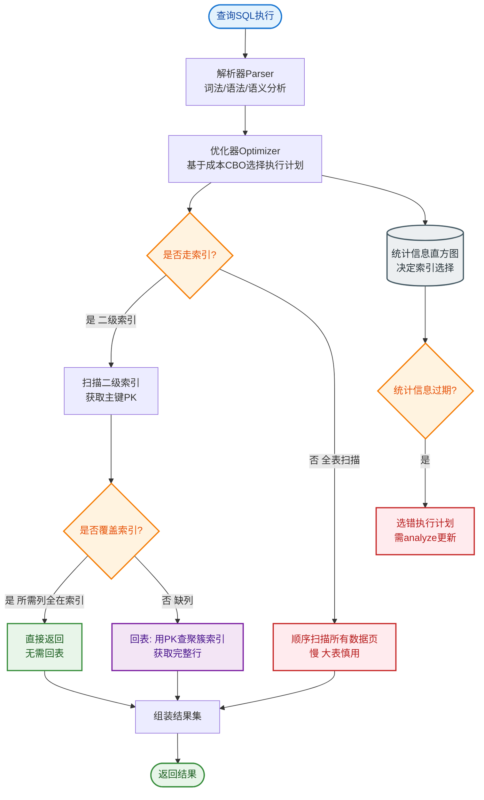

# 什么是索引下推？

### 按字段个数分类

1. **单列索引**：建立在单列上的索引（如主键索引）。
2. **联合索引**：由多个列组合而成，适用于多列查询条件。

### 最左匹配原则

使用联合索引时，查询必须从索引的最左边列开始匹配，且不能跳过中间列。

- 有效：`WHERE col1 = 1` 或 `WHERE col1 = 1 AND col2 = 2`
- 无效：`WHERE col2 = 2`（跳过了最左列）
- **范围查询截断**：遇到范围查询（`>`, `<`, `BETWEEN`）后，其右边的列索引失效（但 `=`、`IN` 在某些版本不影响后续索引使用，需注意 `IN` 实际上是多个等值）。

### 索引下推 (Index Condition Pushdown, ICP)

**场景**：当查询条件无法完全利用索引（如 `LIKE '张%'` 或范围查询）时，MySQL 5.6 之前必须回表查询所有匹配的行来过滤剩余条件。

**优化**：
MySQL 5.6 引入 ICP，将 `WHERE` 中部分过滤条件下推到存储引擎层。在遍历联合索引时，直接对索引中包含的字段进行判断，过滤掉不满足条件的记录，**减少回表次数**。

**示例**：
假设表 `tuser` 有联合索引 `(name, age, ismale)`。
SQL: `SELECT * FROM tuser WHERE name LIKE '张%' AND age=10 AND ismale=1;`

**执行流程对比**：

```text
无 ICP (MySQL 5.5):
Server 层: 发送(name LIKE '张%') 指令
     |
     v
Engine 层: 扫描索引，找到所有 '张' 开头记录
     |
     +-----> 回表查询整行数据 (多次 I/O)
            |
            v
     Server 层: 判断 age=10 AND ismale=1 (过滤)

有 ICP (MySQL 5.6+):
Server 层: 发送(name LIKE '张%' AND age=10) 指令
     |
     v
Engine 层: 扫描索引，判断 name 和 age
     |
     +---> 不满足 age=10? 直接丢弃 (不回表)
     |
     v
满足条件? -----> 回表查询整行数据 (大幅减少 I/O)
     |
     v
Server 层: 判断 ismale=1
```

### 常见考点
1. **ICP 的适用范围**：仅适用于 `SELECT` 语句，且必须从 `range`、`ref`、`ref_or_null`、`eq_ref` 等索引访问方法中访问表。InnoDB 和 MyISAM 都支持。
2. **ICP 与 Covering Index 的区别**：ICP 是减少回表次数，但最终还是可能要回表；覆盖索引是索引包含所有查询字段，完全不需要回表。
3. **如何开启/关闭**：通过 `optimizer_switch` 控制：`SET optimizer_switch='index_condition_pushdown=on';`（默认开启）。

### 实战深化

**实战案例**：
在处理亿级用户表的模糊查询时（如 `SELECT * FROM users WHERE last_name LIKE 'Zhang%' AND city = 'Beijing' AND age > 20`），若仅建立 `(last_name, city)` 联合索引，MySQL 5.6 以前会回表大量数据再过滤 `age`。开启 ICP 后，存储引擎在索引层直接过滤 `city`，使得 QPS 性能提升约 40%。

**代码示例**：
```sql
-- 查看执行计划验证是否使用了 ICP
EXPLAIN SELECT * FROM tuser WHERE name LIKE '张%' AND age=10;
-- 注意 Extra 字段中的 'Using index condition' 即表示使用了 ICP
```

**方案对比**：

| 特性 | 无 ICP (MySQL < 5.6) | 有 ICP (MySQL >= 5.6) |
| :--- | :--- | :--- |
| **过滤层级** | 仅 Server 层过滤 | Engine 层 + Server 层过滤 |
| **回表次数** | 所有索引扫描到的行都要回表 | 仅通过索引条件过滤的行才回表 |
| **I/O 开销** | 高（大量随机 I/O） | 低（减少随机 I/O） |
| **CPU 开销** | Server 层 CPU 负载高 | Engine 层分担部分 CPU 负载 |
| **适用场景** | 基础查询 | 联合索引中部分列无法利用索引时 |


## 核心流程图


## 记忆要点

- 一句话定义：MySQL 5.6 引入，将 WHERE 部分条件下推到存储引擎层进行过滤
- 核心目的：在引擎层直接过滤掉不满足条件的记录，从而大幅减少回表次数
- 触发场景：联合索引中存在 LIKE '%xx' 等模糊匹配或范围查询导致部分条件无法用到索引时
- 怎么查是否命中：EXPLAIN 查看 Extra 字段，显示 Using index condition 即代表启用

## 结构化回答

**30 秒电梯演讲：** 把Server层的部分筛选工作下放到存储引擎层，在索引遍历时直接过滤，减少回表。打个比方，查快递时，快递员在仓库（索引层）就直接把坏的或地址不对的件挑出来，不往网点（回表）送。

**展开框架：**
1. **一句话定义** — MySQL 5.6 引入，将 WHERE 部分条件下推到存储引擎层进行过滤
2. **核心目的** — 在引擎层直接过滤掉不满足条件的记录，从而大幅减少回表次数
3. **触发场景** — 联合索引中存在 LIKE '%xx' 等模糊匹配或范围查询导致部分条件无法用到索引时

**收尾：** 这三点都能配合实战聊。您想深入聊原理、对比还是避坑？

## 视频脚本

> 预计时长：2 分钟 | 由浅入深

| 时间 | 画面/字幕 | 口播台词 | 讲解要点 |
|------|----------|----------|----------|
| 0:00 | 标题卡：什么是索引下推 | "什么是索引下推？一句话——查快递时，快递员在仓库（索引层）就直接把坏的或地址不对的件挑出来，不往网点（回表）送。" | 开场钩子 |
| 0:40 | 概念动画/示意图 | "把Server层的部分筛选工作下放到存储引擎层，在索引遍历时直接过滤，减少回表——查快递时，快递员在仓库（索引层）就直接把坏的或地址不对的件挑出来，不往网点（回表）送" | 核心定义 |
| 1:20 | 一句话定义示意 | "MySQL 5.6 引入，将 WHERE 部分条件下推到存储引擎层进行过滤" | 要点1 |
| 2:00 | 总结卡 | "记住这几条，面试不慌。下期讲进阶追问。" | 收尾 |
