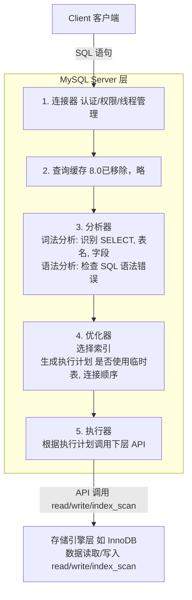

# 执行一次 select 语句，发生了什么是什么？

### 连接与架构
MySQL 架构分为 Server 层（连接、分析、执行 SQL）和存储引擎层（数据存储提取，如 InnoDB）。

**执行流程**：
1. **连接器**：建立连接、获取权限。长连接可减少开销，但需定期断开或重置（`mysql_reset_connection`）防止内存占用过大。
2. **查询缓存**：执行前先查缓存（8.0 版本已移除）。命中直接返回，未命中继续执行。
3. **分析器**：词法分析（识别字段）和语法分析（检查语法错误）。
4. **优化器**：生成执行计划，选择索引。
5. **执行器**：根据计划调用存储引擎 API。

### 语句执行细节

**WHERE vs ON**：
- `WHERE`：过滤所有不符合条件的记录（内外连接通用）。
- `ON`：内连接中等价于 WHERE；外连接中，驱动表记录不匹配时仍保留，字段填充 NULL。

**嵌套循环连接**：
多表连接时，表 1 和表 2 连接结果作为驱动表，再与表 3 连接。

### 执行流程架构图


### 实战深化

**实战案例**：
排查慢查询时发现，一个看似简单的 `SELECT * FROM order WHERE user_id = 101 AND status = 1` 语句耗时极长。通过 `EXPLAIN` 发现优化器竟然走了 `status` 索引而不是区分度更高的 `user_id` 索引。这是因为统计信息过期导致优化器估算错误。使用 `ANALYZE TABLE order` 更新统计信息后，执行计划恢复正常，查询耗时从 2s 降至 10ms。

**代码示例**：
```sql
-- 查看 SQL 执行计划，关注 type、key、rows、Extra 字段
EXPLAIN SELECT * FROM users WHERE name = 'Alice';

-- 查看优化器追踪路径（仅分析用，不要在生产开启）
SET OPTIMIZER_TRACE="enabled=on";
SELECT * FROM users WHERE name = 'Alice';
SELECT * FROM information_schema.OPTIMIZER_TRACE;
```

**流程阶段对比**：

| 阶段 | 核心职责 | 可能遇到的问题/坑 | 常用调试命令 |
| :--- | :--- | :--- | :--- |
| **连接器** | 鉴权、建立 TCP 连接 | 连接数满、连接积压 | `SHOW PROCESSLIST` |
| **分析器** | 词法/语法解析 | SQL 语法报错、字段不存在 | (报错信息直接反馈) |
| **优化器** | 生成执行计划、选索引 | 选错索引、全表扫描 | `EXPLAIN`, `ANALYZE TABLE` |
| **执行器** | 调用 API、逐行操作 | 锁等待、IO 瓶颈 | `SHOW PROFILE`, 慢查询日志 |
| **存储引擎** | 数据读取、写入 | 页缺失、死锁 | `SHOW ENGINE INNODB STATUS` |


## 记忆要点

- Server层核心四步：连接器 -> 分析器 -> 优化器 -> 执行器，8.0起彻底废弃查询缓存
- 分析器作用：负责词法分析（识别字段表名）与语法分析（检查报错）
- 优化器作用：生成执行计划，选择成本最低的索引，决定多表 JOIN 的先后顺序
- 执行器作用：负责调用底层存储引擎（如 InnoDB）接口真正执行并返回结果

## 结构化回答

**30 秒电梯演讲：** SQL执行是从连接建立到分析优化、再到引擎调用的链路处理过程。打个比方，去餐厅吃饭：先排队（连接），看菜单（分析），厨师决定做法（优化），最后做菜上桌（执行）。

**展开框架：**
1. **Server层核心四步** — 连接器 -> 分析器 -> 优化器 -> 执行器，8.0起彻底废弃查询缓存
2. **分析器作用** — 负责词法分析（识别字段表名）与语法分析（检查报错）
3. **优化器作用** — 生成执行计划，选择成本最低的索引，决定多表 JOIN 的先后顺序

**收尾：** 这三点都能配合实战聊。您想深入聊原理、对比还是避坑？

## 视频脚本

> 预计时长：2 分钟 | 由浅入深

| 时间 | 画面/字幕 | 口播台词 | 讲解要点 |
|------|----------|----------|----------|
| 0:00 | 标题卡：执行一次 select 语句，发生了… | "执行一次 select 语句，发生了什么是什么？一句话——去餐厅吃饭：先排队（连接），看菜单（分析），厨师决定做法（优化），最后做菜上桌（执行）。" | 开场钩子 |
| 0:40 | 概念动画/示意图 | "SQL执行是从连接建立到分析优化、再到引擎调用的链路处理过程——去餐厅吃饭：先排队（连接），看菜单（分析），厨师决定做法（优化），最后做菜上桌（执行）" | 核心定义 |
| 1:20 | Server层核心四步示意 | "连接器 -> 分析器 -> 优化器 -> 执行器，8.0起彻底废弃查询缓存" | 要点1 |
| 2:00 | 总结卡 | "记住这几条，面试不慌。下期讲进阶追问。" | 收尾 |
