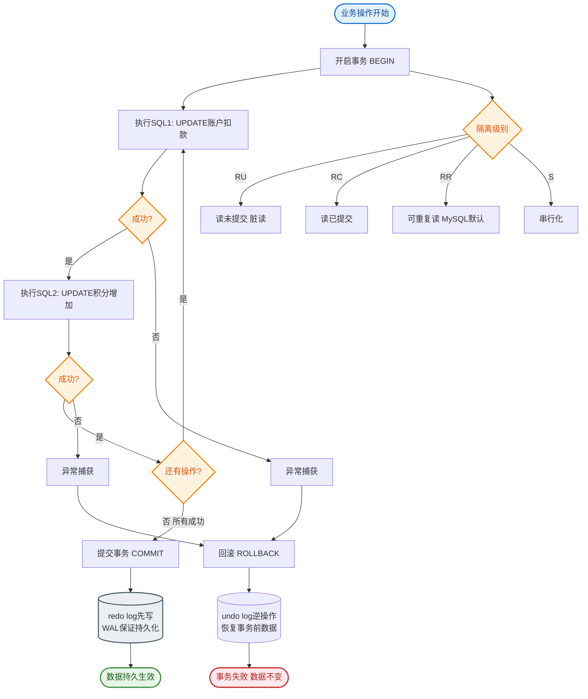

# MySQL有哪些锁？作用是什么？

MySQL 的锁主要分为全局锁、表级锁和行级锁三类：

### 1. 全局锁
**作用**：对整个数据库实例加锁，使其处于只读状态。
**场景**：主要用于全库逻辑备份，确保备份期间数据一致，防止出现备份文件数据与预期不符的情况。

### 2. 表级锁
- **元数据锁（MDL）**：
  - 保证读写的正确性。当对表执行 CRUD 时，会对表加 MDL 读锁；当对表结构做变更（DDL）时，加 MDL 写锁。
  - 避免在事务执行期间，其他线程修改表结构导致数据不一致。
- **意向锁**：
  - 在加行级锁（共享/独占）之前，会先在表级别自动加上意向共享锁（IS）或意向独占（IX）。
  - 目的是为了快速判断表中是否有行被加锁，避免全表扫描检查行锁，提高表级锁的兼容性检查效率。
- **AUTO-INC 锁**：
  - 专门为主键自增设计。在插入数据时加表级锁，分配完自增 ID 后释放。
  - 保证自增 ID 在批量插入和混合插入时的连续性和唯一性。

### 3. 行锁（InnoDB 支持）
- **记录锁**：锁定单条索引记录，防止其他事务修改或删除该行。
- **间隙锁**：锁定索引记录之间的间隙（不包含记录本身），用于防止幻读。
- **Next-Key Lock**：记录锁 + 间隙锁的组合。锁定记录本身以及前面的间隙，是 RR 隔离级别下默认的行锁形式，用于解决幻读问题。
- **插入意向锁**：一种特殊的间隙锁。在执行 INSERT 操作时，若检测到间隙冲突，会生成插入意向锁并等待，表明有插入意图。

- **实战案例**：在库存扣减场景中，使用 `SELECT * FROM stock WHERE id = 1 FOR UPDATE` 排他锁，防止超卖。但在 RR 隔离级别下，若 `id` 不存在（如 `id=999`），间隙锁会阻塞该范围内的插入，曾导致批量插入订单时死锁，后改用 RC 隔离级别规避。

- **代码示例**：
```sql
-- 演示 Next-Key Lock 锁定范围
-- 假设表 t 有索引值 1, 5, 10
BEGIN;
-- 会对 (1, 5] 加 Next-Key Lock，对 (5, 10) 加间隙锁
SELECT * FROM t WHERE id = 5 FOR UPDATE; 
-- 另一个会话执行插入 6 会被阻塞
INSERT INTO t VALUES(6, 'data'); 
COMMIT;
```

### 锁的兼容性矩阵（意向锁）
意向锁之间不互斥，但与表级共享/排他锁互斥：
```text
      | IS  | IX  | S   | X  
-----------------------------
  IS  | 兼容| 兼容| 兼容| 互斥 
  IX  | 兼容| 兼容| 互斥| 互斥 
  S   | 兼容| 互斥| 兼容| 互斥 
  X   | 互斥| 互斥| 互斥| 互斥 
```
*注：IS (意向共享), IX (意向排他), S (共享锁), X (排他锁)*

### Next-Key Lock 示意图
假设索引有值 1, 5, 10。`SELECT * FROM t WHERE id = 5 FOR UPDATE`;
```text
   (-∞, 1]    (1, 5)    [5]    (5, 10)    [10, +∞)
      │          │        │        │          │
      └──────────┴────────┴────────┴──────────┘
                   Next-Key Lock (锁定 1~5 区间)
``` 
注：实际 SQL 会锁定包含 5 的 Next-Key Lock，但在某些情况下（如唯一索引等值查询）会退化为 Record Lock。

### ## 常见考点
1. **什么是临键锁？它解决了什么问题？**
   - Next-Key Lock 是 **Record Lock** 和 **Gap Lock** 的组合。它锁定索引记录以及记录之前的间隙。
   - 主要用于解决 **RR（可重复读）隔离级别下的幻读** 问题，防止其他事务向该间隙插入新记录。
2. **RC 和 RR 隔离级别在锁机制上的主要区别是什么？**
   - **RR**：默认使用 Next-Key Lock，解决了幻读。
   - **RC**：只使用 Record Lock，不使用 Gap Lock，因此允许幻读发生，但并发性能通常略高（锁范围小）。
3. **为什么需要意向锁？**
   - 为了快速判断**表锁**和**行锁**的冲突。如果没有意向锁，当某事务对表加行锁时，另一个事务要对表加表锁，必须遍历表中所有行看是否有行锁，效率极低。有了意向锁，只需检查表级意向锁即可。


## 核心流程图


## 记忆要点

- 宏观分类：全局锁（备份用）、表级锁（MDL/意向锁/AUTO-INC）、行级锁（记录/间隙/临键）
- 意向锁意义：表级标记，目的是快速判断表锁与行锁是否冲突，避免全表遍历检查行锁
- Next-Key Lock：RR级别默认行锁，Record+Gap组合，锁住记录及前面间隙，专门解决幻读
- 隔离级别对比：RR用临键锁解决幻读，RC只有记录锁无间隙锁，并发更好但允许幻读

## 结构化回答

**30 秒电梯演讲：** 通过粒度不同的锁机制平衡并发与数据一致性。打个比方，就像上厕所，锁大楼（全局）、锁楼层（表锁）、还是锁隔间（行锁）。

**展开框架：**
1. **宏观分类** — 全局锁（备份用）、表级锁（MDL/意向锁/AUTO-INC）、行级锁（记录/间隙/临键）
2. **意向锁意义** — 表级标记，目的是快速判断表锁与行锁是否冲突，避免全表遍历检查行锁
3. **Next-Key Lock** — RR级别默认行锁，Record+Gap组合，锁住记录及前面间隙，专门解决幻读

**收尾：** 我在项目里踩过坑——演示 Next-Key Lock 锁定范围。您想深入聊哪一段：原理、避坑还是对比选型？

## 视频脚本

> 预计时长：3 分钟 | 由浅入深

| 时间 | 画面/字幕 | 口播台词 | 讲解要点 |
|------|----------|----------|----------|
| 0:00 | 标题卡：MySQL有哪些锁？作用是什么 | "MySQL有哪些锁？作用是什么？一句话——就像上厕所，锁大楼（全局）、锁楼层（表锁）、还是锁隔间（行锁）。" | 开场钩子 |
| 0:45 | 概念动画/示意图 | "通过粒度不同的锁机制平衡并发与数据一致性——就像上厕所，锁大楼（全局）、锁楼层（表锁）、还是锁隔间（行锁）" | 核心定义 |
| 1:30 | 宏观分类示意 | "全局锁（备份用）、表级锁（MDL/意向锁/AUTO-INC）、行级锁（记录/间隙/临键）" | 要点1 |
| 2:15 | 意向锁意义示意 | "表级标记，目的是快速判断表锁与行锁是否冲突，避免全表遍历检查行锁" | 要点2 |
| 3:00 | 总结卡 | "记住这几条，面试不慌。下期讲进阶追问。" | 收尾 |

---

## 延伸：MySQL的锁有哪些类型？

> 合并自 `db-080`（相似度 67%）

按锁的粒度分类：
1. **全局锁**：锁定整个数据库实例。命令 `Flush tables with read lock (FTWRL)`。常用于全库逻辑备份。此时数据库处于只读状态，DML和DDL语句都会被阻塞。
2. **表级锁**：
   - **表锁**：`lock tables ... read/write`。除了当前线程，其他线程的读写都会被阻塞（视锁类型而定）。开销小，并发度低。
   - **MDL（元数据锁）**：MySQL 5.5引入。当对一个表做增删改查时，加MDL读锁；对表结构变更时，加MDL写锁。读锁不阻塞读，但阻塞写；写锁阻塞读和写。
3. **行级锁**：InnoDB支持，针对索引记录加锁，并发度最高。
   - **Record Lock（记录锁）**：锁住索引记录的一行。
   - **Gap Lock（间隙锁）**：锁住两个索引记录之间的间隙（不包含记录本身），防止幻读。
   - **Next-Key Lock（临键锁）**：Record Lock + Gap Lock 的组合，锁定记录及前面的间隙。
4. **意向锁**：表级锁，由InnoDB自动添加，无需用户干预。
   - **IS（意向共享锁）**：事务准备给数据行加共享锁（S锁）前，需先获取表的IS锁。
   - **IX（意向排他锁）**：事务准备给数据行加排他锁（X锁）前，需先获取表的IX锁。
   - 作用：如果有一个事务拿到了行锁，另一个事务想申请表锁，可以直接判断表上的意向锁是否有冲突，而无需扫描每一行记录。

按锁的类型/模式分类：
- **共享锁（S锁）**：又称读锁。允许其他事务也加S锁，但阻止X锁。语句：`SELECT ... LOCK IN SHARE MODE` 或 `SELECT ... FOR SHARE` (MySQL 8.0)。
- **排他锁（X锁）**：又称写锁。允许其他事务既不加S也不加X。语句：`SELECT ... FOR UPDATE`，以及标准的 `UPDATE` / `DELETE` / `INSERT`。

**关键细节**：
InnoDB的行锁是加在**索引**上的。如果SQL语句没有走索引（全表扫描），InnoDB会将行锁升级为**表锁**，这会严重影响并发性能。这是因为InnoDB找不到具体的索引记录来锁定，只能锁定整个表。

```text
InnoDB 锁兼容性矩阵
       | 意向共享(IS) | 意向排他(IX) | 共享(S) | 排他(X)
-------|-------------|-------------|---------|---------
意向共享(IS) | 兼容       | 兼容        | 兼容    | 冲突
意向排他(IX) | 兼容       | 兼容        | 冲突    | 冲突
共享(S)     | 兼容       | 冲突        | 兼容    | 冲突
排他(X)     | 冲突       | 冲突        | 冲突    | 冲突

Next-Key Lock 示意图
索引值: 10, 20, 30
Next-Key Lock (20) -> 锁定 (10, 20] (间隙10-20 + 记录20)
Gap Lock (20)       -> 锁定 (10, 20) (仅间隙)
```

## 常见考点
1. **乐观锁与悲观锁的实现**：悲观锁利用数据库的锁机制（如SELECT FOR UPDATE）；乐观锁通常使用版本号字段（CAS思想），UPDATE时检查版本号。
2. **间隙锁的作用与死锁**：间隙锁之间是兼容的（如两个事务分别持有(10,20)和(20,30)的间隙锁），但如果一个事务持有间隙锁，另一个尝试插入该间隙的记录会被阻塞，可能导致死锁。
3. **RC（读已提交）和RR（可重复读）隔离级别的锁区别**：RC隔离级别下，一般没有间隙锁（除了外键约束检测），因此无法完全避免幻读；RR隔离级别下默认使用Next-Key Lock，解决幻读问题。

## 记忆要点

- 粒度分类：全局锁（全库备份）、表锁（含MDL和意向锁）、行锁（并发最高）。
- 行锁细分：Record锁单行、Gap锁间隙防幻读、Next-Key锁（前间隙+记录）。
- 模式分类：共享锁(S锁/读锁)与排他锁(X锁/写锁)，写锁阻塞一切读写。
- 意向锁：表级标记锁，快速判断表锁与行锁是否冲突，无需全表扫描。
- 致命细节：行锁加在索引上，不走索引查询会导致行锁退化为致命的表锁！

## 结构化回答

**30 秒电梯演讲：** 锁的粒度与类型管理并发。打个比方，上厕所锁隔间（行锁）还是锁整层楼（表锁）。

**展开框架：**
1. **粒度分类** — 全局锁（全库备份）、表锁（含MDL和意向锁）、行锁（并发最高）。
2. **行锁细分** — Record锁单行、Gap锁间隙防幻读、Next-Key锁（前间隙+记录）。
3. **模式分类** — 共享锁(S锁/读锁)与排他锁(X锁/写锁)，写锁阻塞一切读写。

**收尾：** 这三点都能配合实战聊。您想深入聊原理、对比还是避坑？

## 视频脚本

> 预计时长：2 分钟 | 由浅入深

| 时间 | 画面/字幕 | 口播台词 | 讲解要点 |
|------|----------|----------|----------|
| 0:00 | 标题卡：MySQL的锁有哪些类型 | "MySQL的锁有哪些类型？一句话——上厕所锁隔间（行锁）还是锁整层楼（表锁）。" | 开场钩子 |
| 0:40 | 概念动画/示意图 | "锁的粒度与类型管理并发——上厕所锁隔间（行锁）还是锁整层楼（表锁）" | 核心定义 |
| 1:20 | 粒度分类示意 | "全局锁（全库备份）、表锁（含MDL和意向锁）、行锁（并发最高）。" | 要点1 |
| 2:00 | 总结卡 | "记住这几条，面试不慌。下期讲进阶追问。" | 收尾 |
