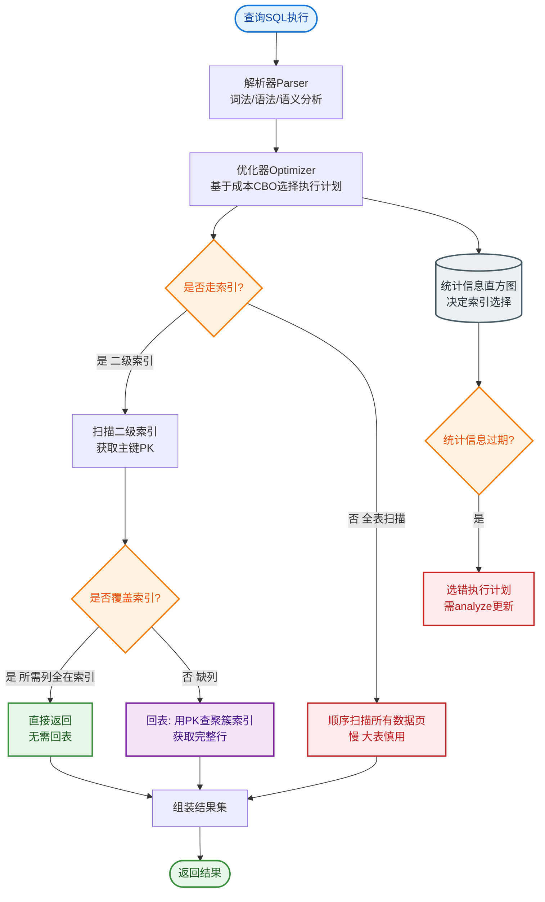

# MySQL的存储引擎有哪些？InnoDB和MyISAM的区别？

MySQL 主要存储引擎对比：

| 特性 | InnoDB | MyISAM | Memory |
|------|--------|--------|--------|
| 事务 | ✅ 支持 | ❌ | ❌ |
| 锁粒度 | 行锁（默认） | 表锁 | 表锁 |
| 外键 | ✅ | ❌ | ❌ |
| 索引 | B+树（聚簇） | B+树（非聚簇） | Hash/B+树 |
| 全文索引 | ✅（5.6+） | ✅ | ❌ |
| 崩溃恢复 | ✅（redo log） | ❌（易损坏） | ❌（内存丢失） |
| 适用 | OLTP（默认） | 只读/计数（已废弃） | 临时表/缓存 |

**InnoDB vs MyISAM 核心区别：**
1. **事务**：InnoDB 支持 ACID 事务，MyISAM 不支持。
2. **锁**：InnoDB 行锁（并发高），MyISAM 表锁（写并发低）。
3. **索引结构**：InnoDB 聚簇索引（主键即数据），MyISAM 非聚簇（索引和数据分离）。
4. **外键**：只有 InnoDB 支持。
5. **崩溃恢复**：InnoDB 用 redo log 保证 crash-safe，MyISAM 崩溃易损坏需修复。

- **实战案例**：曾遇到老系统日志表使用 MyISAM，执行大查询时导致整个表被锁住，阻塞了前台业务写操作。将该表迁移至 InnoDB 后，读写并发能力显著提升，不再出现锁表阻塞。

- **代码示例**：
```sql
-- 建表时指定引擎（MySQL 5.5+ 默认 InnoDB）
CREATE TABLE user (
    id INT PRIMARY KEY,
    name VARCHAR(20)
) ENGINE=InnoDB; -- 推荐使用 InnoDB 以支持事务和行锁

-- 查看当前表引擎
SHOW TABLE STATUS WHERE Name = 'user';
```

MySQL 5.5+ 默认 InnoDB，MyISAM 已基本不用。

### 索引结构对比 ASCII 图

**MyISAM（非聚簇索引）**：索引文件和数据文件分离。
```text
索引文件 (MYI)                  数据文件 (MYD)
┌─────┐      ┌─────┐          ┌──────────────┐
│索引1│ ────▶ │ Row │ ────────▶│ 实际数据行1  │
└─────┘      │ Ptr │          └──────────────┘
             └─────┘
┌─────┐      ┌─────┐          ┌──────────────┐
│索引2│ ────▶ │ Row │ ────────▶│ 实际数据行2  │
└─────┘      │ Ptr │          └──────────────┘
             └─────┘
```

**InnoDB（聚簇索引）**：主键索引叶子节点直接存数据。
```text
   主键索引 (聚簇)                   辅助索引
┌───────────────┐               ┌───────────────┐
│ Key 1 ────────┼───▶ Data Row │               │ Key 1 ──▶ 主键ID1 │
├───────────────┤               └───────────────┘
│ Key 2 ────────┼───▶ Data Row │
├───────────────┤               ┌───────────────┐
│ Key 3 ────────┼───▶ Data Row │               │ Key 3 ──▶ 主键ID3 │
└───────────────┘               └───────────────┘
```
*注：MyISAM 所有索引都指向物理地址；InnoDB 辅助索引指向主键值，需要“回表”。*

### ## 常见考点
1. **什么是聚簇索引和非聚簇索引？**
   - **聚簇索引**：索引结构的叶子节点直接存储了整行数据（InnoDB 主键索引）。一个表只能有一个聚簇索引。
   - **非聚簇索引**：叶子节点存储的是数据的物理地址（MyISAM）或者主键值（InnoDB 辅助索引），数据与索引分开存储。
2. **InnoDB 为什么建议使用自增主键？**
   - **页分裂**：自增主键是顺序插入的，数据追加在当前页的末尾，页满了直接申请新页，性能高。如果使用非顺序（如 UUID）主键，插入可能导致频繁的页分裂（挪动数据），产生大量碎片，降低写入性能。
3. **MyISAM 的 count(*) 为什么比 InnoDB 快？**
   - **MyISAM**：内部维护了一个计数器，直接读取计数器即可，O(1) 复杂度，但不支持 `WHERE` 条件的高效统计。
   - **InnoDB**：由于支持多版本并发控制（MVCC），不同事务看到的行数可能不同，无法维护全局计数器，必须逐行扫描索引进行统计，O(N) 复杂度。


## 核心流程图


## 记忆要点

- 核心区别：InnoDB支持事务、行锁与外键，MyISAM不支持且仅表锁
- 索引结构：InnoDB是聚簇索引(主键即数据)，MyISAM是非聚簇(索引数据分离)
- 崩溃恢复：因为InnoDB有redo log，所以crash-safe，而MyISAM易损坏
- 默认引擎：MySQL 5.5+ 默认InnoDB，MyISAM已基本废弃
- 拓展记忆：MyISAM全局计数器让count(*)极快，但InnoDB必须扫表
- 拓展记忆：InnoDB辅助索引存主键需回表，MyISAM所有索引平权存物理地址

## 结构化回答

**30 秒电梯演讲：** InnoDB是事务安全的默认引擎，MyISAM是只读优化的旧引擎。打个比方，InnoDB像带保险箱的账本（事务安全），MyISAM像贴满便签的墙（速度快但易丢失）。

**展开框架：**
1. **核心区别** — InnoDB支持事务、行锁与外键，MyISAM不支持且仅表锁
2. **索引结构** — InnoDB是聚簇索引(主键即数据)，MyISAM是非聚簇(索引数据分离)
3. **崩溃恢复** — 因为InnoDB有redo log，所以crash-safe，而MyISAM易损坏

**收尾：** 我在项目里踩过坑——建表时指定引擎（MySQL 5.5+ 默认 InnoDB）。您想深入聊哪一段：原理、避坑还是对比选型？

## 视频脚本

> 预计时长：3 分钟 | 由浅入深

| 时间 | 画面/字幕 | 口播台词 | 讲解要点 |
|------|----------|----------|----------|
| 0:00 | 标题卡：MySQL的存储引擎有哪些？Inno… | "MySQL的存储引擎有哪些？InnoDB和MyISAM的区别？一句话——InnoDB像带保险箱的账本（事务安全），MyISAM像贴满便签的墙（速度快但易丢失）。" | 开场钩子 |
| 0:45 | 概念动画/示意图 | "InnoDB是事务安全的默认引擎，MyISAM是只读优化的旧引擎——InnoDB像带保险箱的账本（事务安全），MyISAM像贴满便签的墙（速度快但易丢失）" | 核心定义 |
| 1:30 | 核心区别示意 | "InnoDB支持事务、行锁与外键，MyISAM不支持且仅表锁" | 要点1 |
| 2:15 | 索引结构示意 | "InnoDB是聚簇索引(主键即数据)，MyISAM是非聚簇(索引数据分离)" | 要点2 |
| 3:00 | 总结卡 | "记住这几条，面试不慌。下期讲进阶追问。" | 收尾 |
