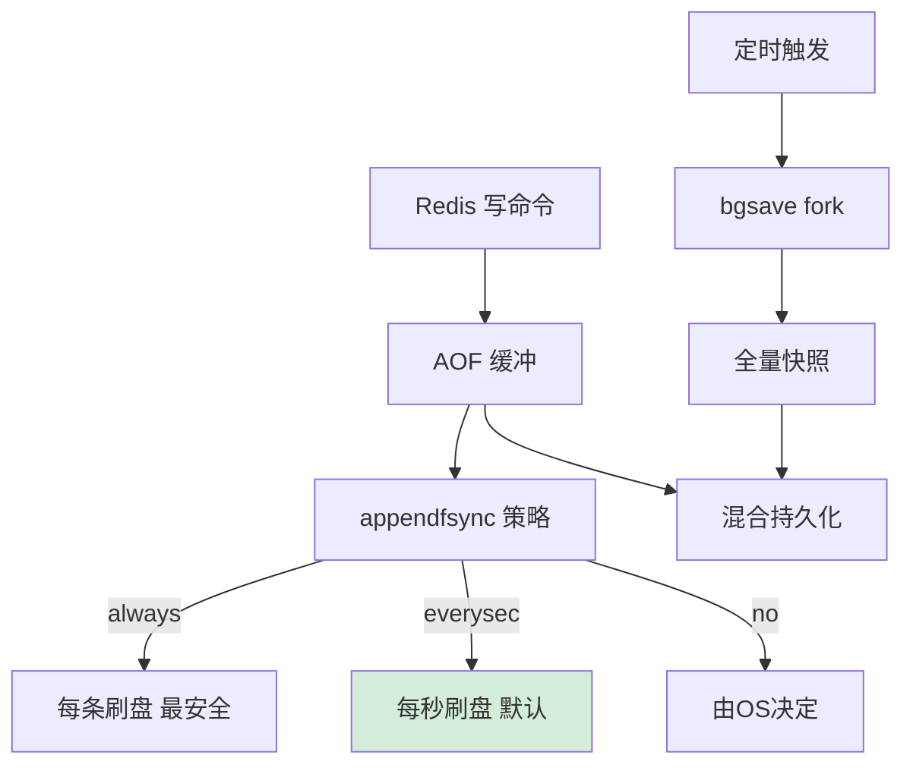

# Redis如何实现数据不丢失是什么？

Redis 通过两种持久化机制保证数据不丢失：

**1. RDB（Redis Database）：**
- 把内存数据快照写入磁盘。
- 触发：save（同步阻塞）、bgsave（后台 fork 子进程）、配置自动触发（如 `save 900 1`）。
- **原理细节**：利用 Linux 的 `fork()` 创建子进程，父子进程共享内存页。父进程继续处理写命令，子进程将数据写入临时文件。使用写时复制技术，只有数据被修改时才复制内存页。
- 优点：文件小、恢复快、适合备份。
- 缺点：两次快照间的数据会丢失（非实时），fork 时可能阻塞主线程（数据量大时）。

**2. AOF（Append Only File）：**
- 把每条写命令追加到 appendonly.aof。
- **刷盘策略**：
  - `always`：每条命令都 fsync 到磁盘，最安全但性能最差。
  - `everysec`：每秒由后台线程 fsync 一次，默认推荐，最坏丢失 1 秒数据。
  - `no`：由操作系统决定何时刷盘，性能最好但不可靠。
- **AOF 重写**：当文件过大时，执行 BGREWRITEAOF， fork 子进程根据内存当前数据生成写命令，压缩体积。重写期间新的写命令会追加到 AOF 重写缓冲区，避免数据丢失。

**Redis 4.0+ 混合持久化：**
- 开启后，AOF 重写时不再只生成纯文本命令，而是先将内存数据以 RDB 格式写入 AOF 文件开头，再将重写期间的增量命令以 AOF 格式追加。
- **优势**：结合了 RDB 的快速加载和 AOF 的数据完整性。

```text
混合持久化文件结构:

[ RDB 格式数据 (快照) ]  +  [ AOF 格式增量命令 (重写期间) ]
       |                                    |
  加载快，恢复基准                 补全数据，防止丢失
```

### 实战案例
在某次 Redis 主从切换中，由于开启了 `AOF everysec` 但磁盘 IO 达到瓶颈，导致 AOF fsync 耗时过长，主线程阻塞了近 1 秒，影响了业务 QPS。排查发现是同机器的其他进程也在进行大量写盘操作。解决方法是开启 `no-appendfsync-on-rewrite` 在重写期间适度牺牲一致性保性能，或迁移到高性能 SSD。

### 代码示例 (Redis 配置片段)
```conf
# redis.conf 关键配置
# 开启混合持久化 (Redis 4.0+)
aof-use-rdb-preamble yes

# AOF 刷盘策略
appendfsync everysec

# 当 AOF 文件大小是上次重写后的一倍且大于 64MB 时触发重写
auto-aof-rewrite-percentage 100
auto-aof-rewrite-min-size 64mb
```

### 对比表格：持久化方案选型
| 特性 | RDB | AOF | 混合持久化 |
| :--- | :--- | :--- | :--- |
| **文件体积** | 小 (二进制压缩) | 大 (文本指令) | 较小 (RDB+AOF) |
| **恢复速度** | 快 | 慢 (需回放指令) | 快 (先加载RDB) |
| **数据完整性** | 可能丢失数分钟数据 | 最多丢失 1 秒 | 最多丢失 1 秒 |
| **CPU/IO 开销** | 低 (fork开销) | 高 (频繁写盘) | 中等 |

### 常见考点
1. **fork 导致的阻塞**：在数据量达到几十 GB 时，fork 子进程耗时较长，会阻塞主线程，如何解决？（避免在峰值时做自动持久化，或考虑手动触发；使用 info stats 查看 latest_fork_usec）。
2. **AOF 重写时的数据一致性**：重写期间主服务器依然在处理命令，数据如何保证不丢？（AOF 重写缓冲区机制）。
3. **RDB 和 AOF 加载速度对比**：RDB 远快于 AOF，因为 RDB 是直接解析二进制数据恢复，AOF 需要逐条执行命令。


## 核心流程图




## 记忆要点

- RDB全量快照：fork子进程+COW机制，文件小恢复快，但非实时会丢数据
- AOF追加命令：always最安全慢，everysec每秒刷盘折中，no由OS控制最快
- 混合持久化(4.0+)：AOF重写时RDB打头+AOF追加，兼顾快速加载与完整恢复
- 重写机制：AOF过大时fork子进程重写压缩，期间新命令存入重写缓冲区防丢
- 对比：RDB恢复快丢失多，AOF恢复慢丢失少，生产推荐混合持久化

## 结构化回答

**30 秒电梯演讲：** RDB是定时存盘拍照，AOF是记流水账，两者结合防止数据丢失。打个比方，RDB是每天备份的存档，AOF是实时的操作日记，断电了看存档，没存档看日记。

**展开框架：**
1. **RDB全量快照** — fork子进程+COW机制，文件小恢复快，但非实时会丢数据
2. **AOF追加命令** — always最安全慢，everysec每秒刷盘折中，no由OS控制最快
3. **混合持久化(4.0+)** — AOF重写时RDB打头+AOF追加，兼顾快速加载与完整恢复

**收尾：** 我在项目里踩过坑——在某次 Redis 主从切换中，由于开启了 `AOF everysec` 但磁盘 IO 达到瓶颈，导致 AOF fsync 耗时过长，主线程阻塞了近 1 秒，影响了业务 QPS。您想深入聊哪一段：原理、避坑还是对比选型？

## 视频脚本

> 预计时长：3 分钟 | 由浅入深

| 时间 | 画面/字幕 | 口播台词 | 讲解要点 |
|------|----------|----------|----------|
| 0:00 | 标题卡：Redis如何实现数据不丢失是什么 | "Redis如何实现数据不丢失是什么？一句话——RDB是每天备份的存档，AOF是实时的操作日记，断电了看存档，没存档看日记。" | 开场钩子 |
| 0:45 | 概念动画/示意图 | "RDB是定时存盘拍照，AOF是记流水账，两者结合防止数据丢失——RDB是每天备份的存档，AOF是实时的操作日记，断电了看存档，没存档看日记" | 核心定义 |
| 1:30 | RDB全量快照示意 | "fork子进程+COW机制，文件小恢复快，但非实时会丢数据" | 要点1 |
| 2:15 | AOF追加命令示意 | "always最安全慢，everysec每秒刷盘折中，no由OS控制最快" | 要点2 |
| 3:00 | 总结卡 | "记住这几条，面试不慌。下期讲进阶追问。" | 收尾 |
