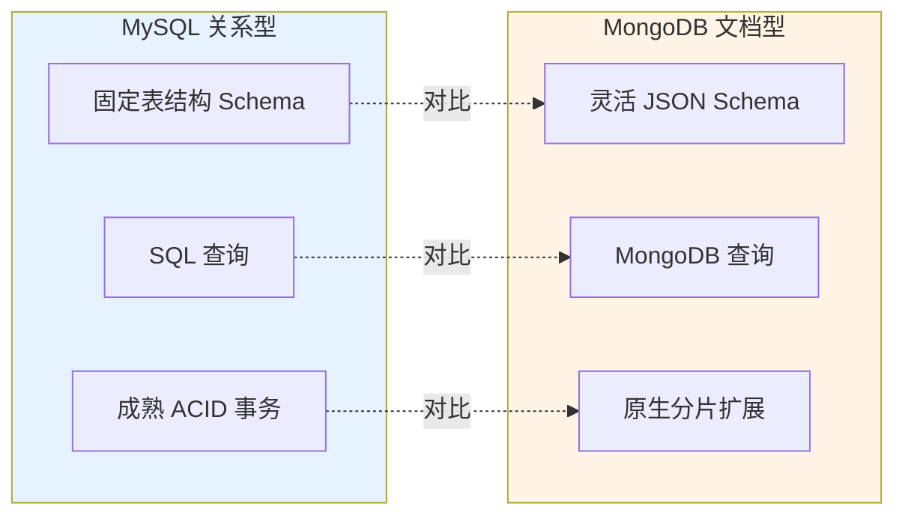

# 了解MongoDB嘛，它和MySQL有哪些区别？

MongoDB 和 MySQL 是两种不同类型的数据库，核心区别如下：

### 1. 数据模型（最本质的区别）
- **MySQL**：关系型数据库（RDBMS）。数据高度结构化，以**表**的形式存储，需预定义 Schema（表结构），表与表之间通过外键关联。
- **MongoDB**：文档型数据库。数据以 **BSON（类 JSON）** 文档的形式存储，**无固定 Schema**。文档支持嵌套结构和数组，一张集合中的文档字段可以不同。

### 2. 查询语言
- **MySQL**：使用标准的 **SQL** 语言，支持复杂的关联查询、聚合函数、视图等。
- **MongoDB**：使用类 JSON 的查询语法（如 `db.find({name: "Tom"})`），擅长查询复杂的嵌套文档，但不擅长复杂的多表关联。

### 3. 事务支持
- **MySQL**：原生支持完整的 ACID 事务，适合对数据一致性要求高的场景。
- **MongoDB**：早期不支持事务（仅支持单文档原子性）。4.0 版本开始支持多文档事务，但在性能和成熟度上略逊于 MySQL。

### 4. 扩展性
- **MySQL**：通常采用垂直扩展（升级硬件），水平扩展（分库分表）实现复杂，维护成本高。
- **MongoDB**：原生支持**分片**，水平扩展非常容易，天然适合海量数据和高并发场景。

### 5. 适用场景
- **MySQL**：适合结构化数据、事务要求高、业务逻辑复杂、需要强一致性的系统（如电商订单、金融系统）。
- **MongoDB**：适合数据结构灵活、数据量大、读写并发高、模式频繁变动的场景（如游戏数据、日志存储、社交动态）。

---

### 6. 深入补充细节

#### 底层存储结构
- **MySQL (InnoDB)**：数据以**页**为单位组织，默认 16KB。通过 B+ 树索引维护，聚簇索引叶子节点存储数据行。
- **MongoDB (WiredTiger)**：支持多种存储引擎（默认 WiredTiger）。文档存储在 B-Tree 中。WiredTiger 支持**文档级别的锁**并发控制，并提供**压缩**功能，节省磁盘空间。

#### 索引原理
- **MySQL**：主要依赖 B+ 树，支持聚簇索引和二级索引。二级索引叶子节点存储主键值，查询需要“回表”。
- **MongoDB**：也支持 B-Tree 索引，但存储的是文档的位置或部分文档内容。支持**多键索引**（对数组字段建立索引，数组内每个元素都是一个索引项）和**地理空间索引**（2dsphere）。

#### JOIN 处理
- **MySQL**：优化器对 Join 有深度优化（Nested Loop Join, Hash Join 等），适合复杂关联。
- **MongoDB**：早期不支持 Join，需应用层处理。现在支持 `$lookup` 阶段进行左外连接，但性能开销较大，建议在设计时通过**嵌入式文档**（反范式化）来规避 Join 操作。

#### 数据一致性机制
- **MySQL (Binlog)**：基于 `binlog` 实现主从复制，支持 `STATEMENT`、`ROW`、`MIXED` 三种格式。
- **MongoDB (Oplog)**：基于 `oplog` (local 库中的集合) 实现复制集，是一个固定大小的 Capped Collection，记录所有增删改操作，从库通过轮询 oplog 实现同步。

### 实战案例
在开发一款“手游背包系统”时，初期用 MySQL，因装备属性差异大导致表结构频繁变更，DDL 锁表影响业务。后迁移至 MongoDB，利用文档型特性将装备属性直接存在 Item 文档中，无需 Alter Table，且利用数组索引快速查找某个用户身上的所有特定类型装备，开发效率提升 50%。

### 代码示例 (MongoDB 聚合查询)
```javascript
// MongoDB 聚合管道：统计每个部门的平均工资，类似 MySQL GROUP BY
db.employees.aggregate([
    { $match: { status: "active" } }, // WHERE 条件
    { $group: {                     // GROUP BY
        _id: "$department", 
        avgSalary: { $avg: "$salary" }
    }},
    { $sort: { avgSalary: -1 } }    // ORDER BY
]);
```

### 对比表格：建模差异 (订单系统)
| 特性 | MySQL (范式化) | MongoDB (反范式化/嵌入) |
| :--- | :--- | :--- |
| **订单数据** | 拆分为 Order, OrderItem 表 | OrderItem 作为数组嵌入 Order 文档 |
| **查询订单详情** | 需 JOIN 两次 (或应用层合并) | 一次读取出完整订单 (O(1)) |
| **商品属性修改** | 仅需修改 Product 表 | 可能需更新所有包含该商品的订单 (原子性难保证) |
| **适用场景** | 订单项极多或需频繁修改商品属性 | 读多写少，订单项少，追求高性能 |

### 常见考点
1. **MongoDB 事务的使用限制**：MongoDB 4.0+ 支持事务，但必须建立在**复制集**环境上，且事务操作有 60MB 的内存大小限制（受限于 WiredTiger 缓存），不适合处理超大事务。
2. **MySQL 与 MongoDB 索引区别**：重点回答 MongoDB 的**多键索引**（对数组索引）和**地理空间索引**优势，以及 MySQL 的聚簇索引回表问题。
3. **场景选择（建模方式）**：面试官常给一个具体场景（如电商订单）。MySQL 需要拆分为 Order、OrderItem 表；MongoDB 可能会将 OrderItem 作为一个数组嵌在 Order 文档中（一对少关系），讲究“无 Join”设计。
4. **什么是 TokuMX / RocksDB**：追问 MongoDB 的其他存储引擎。TokuMX 使用 Fractal Tree 索引，适合高写入压缩场景，但现已不常用；RocksDB 在某些高写入场景下用于替代 WiredTiger。


## 核心流程图



## 记忆要点

- 数据模型：MySQL结构化表与SQL，MongoDB无Schema的BSON文档
- 扩展与事务：MySQL强ACID事务且难水平扩展，MongoDB原生分片且4.0+支持事务
- 关联查询：MySQL深度优化JOIN，MongoDB弱关联建议用嵌入文档规避JOIN
- 适用场景：MySQL适合强一致核心业务(金融订单)，Mongo适合多变海量场景(日志游戏)

## 结构化回答

**30 秒电梯演讲：** MySQL是严格的表格式管理，MongoDB是灵活的文档式存储。打个比方，MySQL像Excel表（规整，只能填格子），MongoDB像文件夹（随便塞各种格式的文件）。

**展开框架：**
1. **数据模型** — MySQL结构化表与SQL，MongoDB无Schema的BSON文档
2. **扩展与事务** — MySQL强ACID事务且难水平扩展，MongoDB原生分片且4.0+支持事务
3. **关联查询** — MySQL深度优化JOIN，MongoDB弱关联建议用嵌入文档规避JOIN

**收尾：** 我在项目里踩过坑——在开发一款“手游背包系统”时，初期用 MySQL，因装备属性差异大导致表结构频繁变更，DDL 锁表影响业务。您想深入聊哪一段：原理、避坑还是对比选型？

## 视频脚本

> 预计时长：3 分钟 | 由浅入深

| 时间 | 画面/字幕 | 口播台词 | 讲解要点 |
|------|----------|----------|----------|
| 0:00 | 标题卡：了解MongoDB嘛，它和MySQL… | "了解MongoDB嘛，它和MySQL有哪些区别？一句话——MySQL像Excel表（规整，只能填格子），MongoDB像文件夹（随便塞各种格式的文件）。" | 开场钩子 |
| 0:45 | 概念动画/示意图 | "MySQL是严格的表格式管理，MongoDB是灵活的文档式存储——MySQL像Excel表（规整，只能填格子），MongoDB像文件夹（随便塞各种格式的文件）" | 核心定义 |
| 1:30 | 数据模型示意 | "MySQL结构化表与SQL，MongoDB无Schema的BSON文档" | 要点1 |
| 2:15 | 扩展与事务示意 | "MySQL强ACID事务且难水平扩展，MongoDB原生分片且4.0+支持事务" | 要点2 |
| 3:00 | 总结卡 | "记住这几条，面试不慌。下期讲进阶追问。" | 收尾 |
