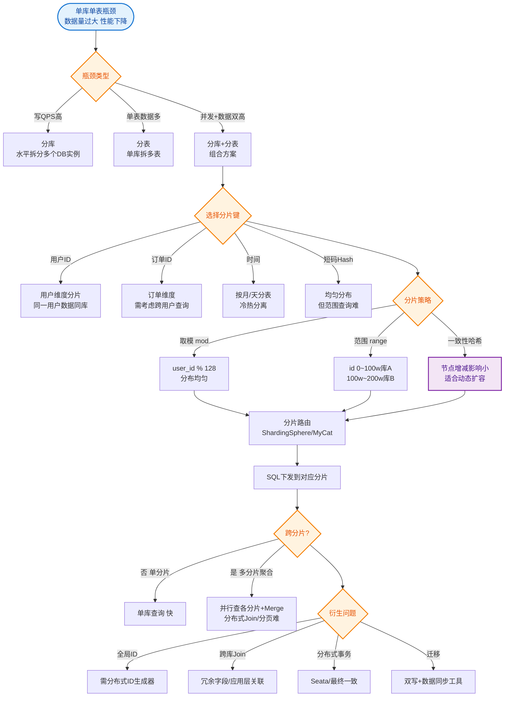

# 什么是MySQL分库分表？

当单库单表的数据量过大（如千万级）或并发过高时，需要进行分库分表来优化性能。

### 1. 垂直分（按业务拆分）
- **垂直分表**：将一张大表中**不常用**或**字段较长**（如 Text、Blob）的字段拆分到另一张表中。
  - **目的**：减少单表占用的 I/O 资源，避免查询大字段导致的性能损耗。
- **垂直分库**：将不同的业务表拆分到不同的数据库中。
  - **目的**：将业务解耦，降低单库的 CPU、IO 连接竞争，便于微服务拆分。

### 2. 水平分（按数据拆分）
- **水平分表**：将一张表的数据按照某种规则（如取模、范围）拆分到同一库的多张表中。
  - **目的**：解决单表数据量过大的问题，提高索引效率和查询速度。
- **水平分库**：将一张表的数据按照规则拆分到不同服务器上的数据库中。
  - **目的**：解决单机性能瓶颈（磁盘、连接数），突破物理极限。

### 3. 分片规则
- **Range（范围）**：如按 ID 范围、时间切分。优点是扩容容易；缺点是数据分布不均，容易产生热点。
- **Hash（取模）**：如 `user_id % 库数量`。优点是数据分布均匀；缺点是扩容时需要数据迁移（取模公式变化）。
- **地理位置**：按地区、归属地切分。

### 4. 带来的问题
1.  **分布式事务**：跨库操作无法保证本地事务 ACID，需使用最终一致性方案（如 TCC、Seata）。
2.  **跨库关联查询**：原本单库的 Join 操作变得困难，通常需要在业务层进行多次查询或数据冗余。
3.  **主键 ID 唯一性**：需引入分布式 ID 生成器（如雪花算法）。
4.  **排序分页**：翻页查询在分片场景下逻辑变得复杂。

---

### 5. 分库分表架构示意图

```text
       Application
            │
    ┌───────┴────────┐
    │  Middleware   │  (ShardingSphere, MyCat)
    │   Router      │
    └───────┬────────┘
            │
      ┌─────┴─────┬────────────┐
      ▼           ▼            ▼
┌─────────┐ ┌──────────┐ ┌──────────┐
│ DB Node1│ │ DB Node2 │ │ DB Node3 │
│ (Shard 1)│ │ (Shard 2)│ │ (Shard 3)│
└────┬────┘ └────┬─────┘ └────┬─────┘
     │           │            │
┌────┴────┐ ┌────┴─────┐ ┌────┴─────┐
│Table_1  │ │Table_1   │ │Table_1   │
│Table_2  │ │Table_2   │ │Table_2   │
└─────────┘ └──────────┘ └──────────┘
```

### 6. 深入补充细节

#### 扩容策略（解决 Hash 取模扩容难问题）
- **倍增扩容**：如果是取模分片，扩容时将节点数量翻倍（如从 2 个库扩到 4 个）。此时只需将数据按 `id % 新节点数` 重新分配，只需迁移一半的数据（原节点 0 的数据部分去 0，部分去 2）。
- **一致性哈希**：使用哈希环，节点变更时只影响相邻节点的数据，适合节点频繁变化的场景，但实现复杂。
- **基因法/分片段映射**：在 ID 中植入分片键信息，或者维护一个 ID 范围与分片的映射表，实现灵活路由。

#### 读写分离在分库分表中的位置
- **顺序**：通常先做**读写分离**（主从复制），解决读压力；当单机写压力或数据量成为瓶颈时，再进行**分库分表**。
- **配合**：分库分表后，每个分片节点本身也可以配置主从复制架构。

#### 常见中间件
- **ShardingSphere**：Apache 顶级项目，定位为轻量级 Java 框架，提供 Client 端和 Proxy 端。
- **Mycat**：基于 Cobar 演进，定位为数据库中间件（Proxy 模式）， classic 架构，但社区活跃度有所下降。

#### 实战案例
**场景**：在早期电商订单表中，直接使用 `order_id % 4` 分库。业务扩容需要从 4 库扩到 8 库时，由于不支持在线迁移，不得不停机 4 小时进行数据重分布。后来引入 ShardingSphere 的“自动分片算法”和“影子库”验证机制，实现了平滑滚动发布。

#### 分片策略对比
| 策略 | 优点 | 缺点 | 适用场景 |
| :--- | :--- | :--- | :--- |
| **Range** | 范围查询集中，扩容简单 | 数据分布不均，热点明显 | 日志数据、时间序列数据 |
| **Hash (Mod)** | 数据均匀分布，负载均衡 | 扩容困难，范围查询需全扫描 | 用户ID、订单ID |
| **Consistent Hash** | 节点增删影响最小 | 实现复杂，数据倾斜风险 | 分布式缓存、多租户 SaaS |

#### 代码示例 (Java: 雪花算法生成 ID)
```java
// 使用 Twitter Snowflake 算法生成分布式 ID
// 避免了 DB 自增 ID 的单点瓶颈和 UUID 的无序问题
Snowflake snowflake = IdUtil.getSnowflake(1, 1); 
long orderId = snowflake.nextId();
// 结果示例：1234567890123456789
// 可根据 orderId % dbCount 进行路由
```

## 常见考点
1.  **分库分表后的分页查询怎么实现？**
    - **禁用超大页码**：业务上限制只能查前 N 页。
    - **延迟关联**：先查询出分页 ID（仅查 ID 快），再关联查详情（避免全表扫描）。
    - **搜索引擎**：将数据同步到 ES，在 ES 中做复杂分页和排序。


## 核心流程图


## 记忆要点

- 核心分类：垂直分(按业务字段拆分)，水平分(按规则散列数据行)
- 分片规则：Range扩容易但易热点，Hash分布均但扩容迁移难(常倍增扩容)
- 四大痛点：分布式事务、跨库JOIN、分布式唯一ID、全局排序分页复杂
- 演进顺序：先做读写分离缓解读压力，单机扛不住写并发再分库分表
- 配套组件：需引入中间件(如ShardingSphere)路由，配合雪花算法生成全局ID

## 结构化回答

**30 秒电梯演讲：** 垂直拆分解决“表太宽”，水平拆分解决“表太长”和“库太忙”。打个比方，垂直分就像把一本厚书拆成上下册（内容分类），水平分就像把字典拆成A-Z分册（数据分流）。

**展开框架：**
1. **核心分类** — 垂直分(按业务字段拆分)，水平分(按规则散列数据行)
2. **分片规则** — Range扩容易但易热点，Hash分布均但扩容迁移难(常倍增扩容)
3. **四大痛点** — 分布式事务、跨库JOIN、分布式唯一ID、全局排序分页复杂

**收尾：** 这三点都能配合实战聊。您想深入聊原理、对比还是避坑？

## 视频脚本

> 预计时长：3 分钟 | 由浅入深

| 时间 | 画面/字幕 | 口播台词 | 讲解要点 |
|------|----------|----------|----------|
| 0:00 | 标题卡：什么是MySQL分库分表 | "什么是MySQL分库分表？一句话——垂直分就像把一本厚书拆成上下册（内容分类），水平分就像把字典拆成A-Z分册（数据分流）。" | 开场钩子 |
| 0:45 | 概念动画/示意图 | "垂直拆分解决“表太宽”，水平拆分解决“表太长”和“库太忙”——垂直分就像把一本厚书拆成上下册（内容分类），水平分就像把字典拆成A-Z分册（数据分流）" | 核心定义 |
| 1:30 | 核心分类示意 | "垂直分(按业务字段拆分)，水平分(按规则散列数据行)" | 要点1 |
| 2:15 | 分片规则示意 | "Range扩容易但易热点，Hash分布均但扩容迁移难(常倍增扩容)" | 要点2 |
| 3:00 | 总结卡 | "记住这几条，面试不慌。下期讲进阶追问。" | 收尾 |

### 视频流程图


