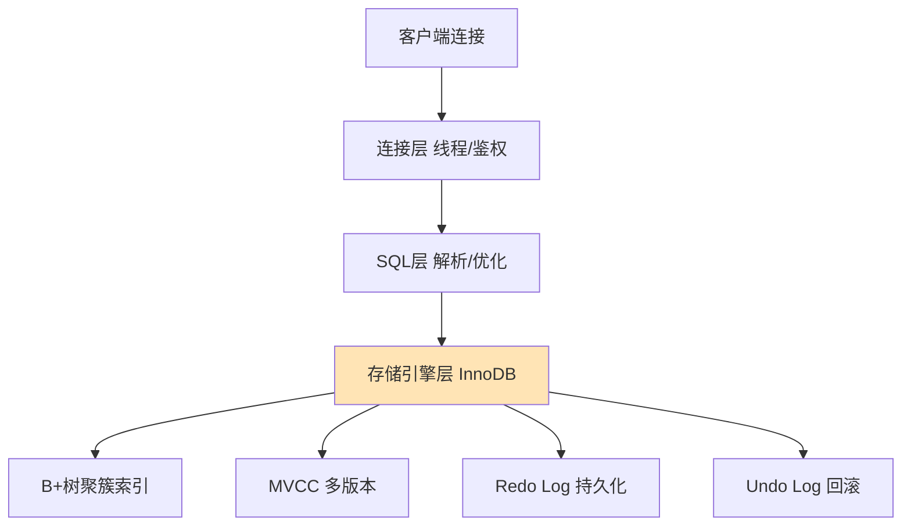
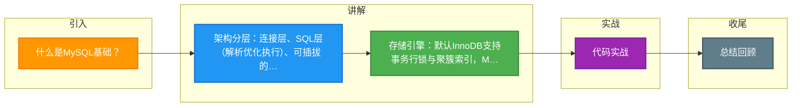

# 什么是MySQL基础？

MySQL 基础知识要点：

**1. 架构：** 客户端 → 连接层（连接池、鉴权）→ SQL 层（解析、优化、执行）→ 存储引擎层（InnoDB/MyISAM，可插拔）。

**2. 存储引擎：**
- **InnoDB**（默认）：支持事务、行锁、外键、MVCC、聚簇索引，OLTP 首选。
- **MyISAM**：不支持事务/行锁，表锁，全文索引好，只读/计数场景曾用，已废弃。

**3. 索引：**
- InnoDB 用 B+ 树，页大小 16KB，3 层可存千万级数据。
- 聚簇索引（主键，叶子存整行）+ 二级索引（叶子存主键，需回表）。
- 覆盖索引、联合索引（最左前缀）、索引下推（ICP）。

**4. 事务：** ACID，默认隔离级别 RR（可重复读，用 MVCC + Next-Key Lock 解决幻读）。

**5. 日志：** redo log（崩溃恢复，crash-safe）、undo log（回滚 + MVCC）、binlog（复制 + 备份）、relay log（从库）。

## 技术原理

MySQL 的三层架构把"连接管理、SQL 处理、数据存储"解耦，核心是**可插拔的存储引擎**——SQL 层统一处理解析/优化/执行，存储引擎层可按场景替换（InnoDB/MyISAM）：

- **连接层**：维护客户端连接池，做鉴权和线程分配。每个连接对应一个线程（MySQL 5.7 起支持线程池复用）。长连接复用避免频繁握手，但要注意内存累积（用 `mysql_reset_connection` 定期重置）。
- **SQL 层的执行流程**：查询缓存（8.0 已移除，命中率太低）→ 解析器（生成解析树）→ 预处理器（检查表/列权限）→ 优化器（生成执行计划：选索引、决定 JOIN 顺序）→ 执行器（调用存储引擎接口）。优化器是基于成本的（CBO），统计信息不准会导致选错索引。
- **InnoDB 的核心机制**：
  - **B+ 树索引**：页大小默认 16KB，3 层 B+ 树可存千万级数据（根节点和中间节点常驻内存，只有叶子存数据）。聚簇索引（主键）叶子存整行；二级索引叶子存主键值，查询非索引列需"回表"。
  - **MVCC**：通过 undo log 版本链实现"快照读"，读不阻塞写。每行有两个隐藏列（trx_id 创建事务、roll_ptr 指向 undo 链），读时根据事务的 ReadView 判断该版本是否可见。
  - **Next-Key Lock**：RR 隔离级别下，行锁 + 间隙锁组合，锁住"记录 + 记录前的间隙"，防止幻读。
- **三大日志的协作**：redo log（InnoDB 引擎层，物理日志，保证 crash-safe，WAL 机制先写日志再改页）；undo log（回滚 + MVCC 版本链）；binlog（Server 层，逻辑日志，主从复制 + 时间点恢复）。两阶段提交保证 redo 和 binlog 一致。

## 代码示例

```sql
-- 1. 索引设计与回表优化
CREATE TABLE orders (
    id BIGINT PRIMARY KEY,                          -- 聚簇索引
    user_id BIGINT NOT NULL,
    status VARCHAR(20),
    amount DECIMAL(10,2),
    created_at DATETIME,
    -- 联合索引：支持 (user_id, status) 查询，最左前缀
    INDEX idx_user_status (user_id, status),
    -- 覆盖索引：查询只需索引列，避免回表
    INDEX idx_user_amount (user_id, amount)
) ENGINE=InnoDB;

-- 覆盖索引示例：只查 user_id 和 amount，直接从二级索引取，不回表
EXPLAIN SELECT user_id, amount FROM orders WHERE user_id = 1001;
-- Extra: Using index（覆盖索引，无需回表）

-- 2. 事务与隔离级别
-- 查看/设置隔离级别（默认 RR）
SELECT @@transaction_isolation;          -- REPEATABLE-READ
SET SESSION TRANSACTION ISOLATION LEVEL READ COMMITTED;

-- 开启事务（RR + MVCC 快照读）
START TRANSACTION;
SELECT * FROM orders WHERE id = 1;       -- 快照读，走 MVCC 不加锁
SELECT * FROM orders WHERE id = 1 FOR UPDATE;  -- 当前读，加 X 锁
COMMIT;
```

```java
// JDBC 事务管理
Connection conn = dataSource.getConnection();
try {
    conn.setAutoCommit(false);                      // 开启事务
    conn.setTransactionIsolation(Connection.TRANSACTION_READ_COMMITTED);
    // 业务 SQL...
    conn.commit();
} catch (Exception e) {
    conn.rollback();                                // 失败回滚
} finally {
    conn.close();
}
```

## 注意事项

- **MyISAM 已废弃，别再用**：不支持事务、只支持表锁、崩溃后数据易损坏。8.0 起系统表都换成了 InnoDB。除非是只读归档场景，否则一律用 InnoDB。
- **索引不是越多越好**：每个索引增加写入开销（插入/更新要维护 B+ 树）和存储。单表索引建议不超过 5 个，优先建联合索引而非单列索引。
- **优化器可能选错索引**：统计信息过期会导致优化器选错执行计划。定期 `ANALYZE TABLE` 更新统计，必要时用 `FORCE INDEX` 强制指定。
- **三大日志要分清职责**：redo 保崩溃恢复（crash-safe），undo 保回滚和 MVCC，binlog 保主从复制和备份。两阶段提交保证 redo 和 binlog 一致，否则主从数据会不一致。
- **长事务有害**：长事务持有锁、占用 undo 版本链，导致 MVCC 链过长影响读性能。用 `information_schema.innodb_trx` 监控长事务并设置超时。


## 核心流程图




## 记忆要点

- 架构分层：连接层、SQL层(解析优化执行)、可插拔的存储引擎层
- 存储引擎：默认InnoDB支持事务行锁与聚簇索引，MyISAM不支持事务已废弃
- 索引核心：B+树结构，默认页16KB，主键为聚簇索引，二级索引需回表
- 事务隔离：默认RR级别，通过MVCC解决读写并发，Next-Key Lock解决幻读
- 三大日志：redo保崩溃恢复，undo保回滚MVCC，binlog用于主从复制与备份

## 结构化回答

**30 秒电梯演讲：** 基于插件引擎的关系型数据库，通过B+树索引和事务机制保证数据存储与检索效率。打个比方，像一个带目录的文件柜，InnoDB是支持修改和回滚的高级柜子。

**展开框架：**
1. **架构分层** — 连接层、SQL层(解析优化执行)、可插拔的存储引擎层
2. **存储引擎** — 默认InnoDB支持事务行锁与聚簇索引，MyISAM不支持事务已废弃
3. **索引核心** — B+树结构，默认页16KB，主键为聚簇索引，二级索引需回表

**收尾：** 这三点都能配合实战聊。您想深入聊原理、对比还是避坑？

## 视频脚本

> 预计时长：3 分钟 | 由浅入深

| 时间 | 画面/字幕 | 口播台词 | 讲解要点 |
|------|----------|----------|----------|
| 0:00 | 标题卡：什么是MySQL基础 | "什么是MySQL基础？一句话——像一个带目录的文件柜，InnoDB是支持修改和回滚的高级柜子。" | 开场钩子 |
| 0:45 | 概念动画/示意图 | "基于插件引擎的关系型数据库，通过B+树索引和事务机制保证数据存储与检索效率——像一个带目录的文件柜，InnoDB是支持修改和回滚的高级柜子" | 核心定义 |
| 1:30 | 架构分层示意 | "连接层、SQL层(解析优化执行)、可插拔的存储引擎层" | 要点1 |
| 2:15 | 存储引擎示意 | "默认InnoDB支持事务行锁与聚簇索引，MyISAM不支持事务已废弃" | 要点2 |
| 3:00 | 总结卡 | "记住这几条，面试不慌。下期讲进阶追问。" | 收尾 |

### 视频流程图



