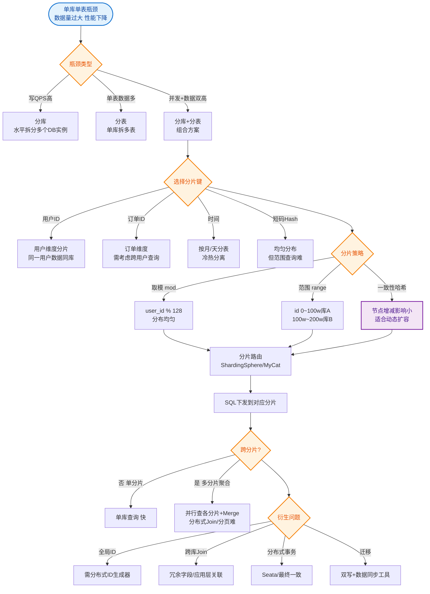

# 什么是MySQL架构升级之路？

**MySQL 架构升级与高可用演进**

**1. 主从复制原理**
- **步骤 1**：从库 I/O 线程请求主库指定 binlog 位置之后的日志。
- **步骤 2**：主库 I/O 线程根据请求读取 binlog，返回给从库（包含 binlog file 和 position）。
- **步骤 3**：从库 I/O 线程将接收到的日志写入 relay log（中继日志），并保存读取位置到 master-info 文件。
- **步骤 4**：从库 SQL 线程检测到 relay log 新增内容，解析并执行 SQL，实现数据同步。

**2. 复制模式**
- **异步复制**：主库执行完直接返回，不等待从库确认（性能高，可能丢数据）。
- **半同步复制**：主库等待至少一个从库接收确认才返回（折中方案）。
- **全同步复制**：主库等待所有从库执行完才返回（性能低，强一致）。
- **GTID 复制**：使用全局事务 ID (GTID) 标识事务，简化主从切换和故障恢复。

**3. 高可用方案**
- **传统主从 + VIP**：配合 Keepalived/Heartbeat 实现故障漂移。
- **Galera Cluster**：基于 Galera 协议的同步多主集群（如 PXC）。
- **中间件/Proxy**：使用 MyCat、ShardingSphere 等实现路由与高可用。
- **共享存储**：多节点挂载同一磁盘，解决单点故障。

**4. 架构演进路线**
1.  **单机**：起步阶段，受限于硬件资源（CPU、IO、连接数）。
2.  **主从复制**：读写分离，从库分担读压力，主库扛写。解决读瓶颈，写瓶颈仍在。
3.  **双主/多主**：多个主节点分担写压力。需解决数据冲突、循环复制等问题，复杂度高。
4.  **分库分表**：数据量极大时（单表超千万），采用水平拆分（Sharding-JDBC、MyCat 等）。解决单机数据量和并发瓶颈。

**5. 性能优化思路（面试重点）**
优化原则：**先软后硬，最后分表**。
- **软优化**：SQL 改写、索引优化、表结构调整、引入缓存。
- **硬优化**：升级硬件（磁盘 SSD、内存扩容）。
- **分库分表**：仅当数据量及并发极大时考虑。
    - 分表：解决单表数据量过大查询慢的问题。
    - 分库：解决单机连接数和 IO 瓶颈。
    - 策略：需根据业务选择（如 Hash 取模、范围分片），避免跨库 Join。

---

### 6. 主从复制流程架构图

```text
     Master Server                  Slave Server
    ┌─────────────────┐          ┌─────────────────┐
    │   MySQL Engine │          │   MySQL Engine │
    └────────┬────────┘          └────────┬────────┘
             │                           │
    (1) Data Changes            (4) Apply SQL
             │                           │
    ┌────────▼────────┐          ┌────────▼────────┐
    │     Binlog      │          │    Relay Log    │
    │  (Binary Log)   │          └────────┬────────┘
    └────────┬────────┘                   │
             │          (2) Dump          │
             │  ───────────────────────▶  │
             │  (Binlog Event Stream)     │
             │                           │
             ▼                           ▼
    ┌─────────────────┐          ┌─────────────────┐
    │ Master I/O Thread│◀─────────┤ Slave I/O Thread│ (3) Write Relay Log
```

### 7. 深化实战细节

#### 实战案例
**故障切换**：在一次主库宕机事故中，使用 MHA (Master High Availability) 进行自动切换。但由于未开启 GTID，且主从复制存在轻微延迟，导致切换后新主库丢失了最后 2 秒的订单数据。后续强制开启 `半同步复制 (rpl_semi_sync_master=1)` 和 `GTID_MODE=ON` 保障数据安全。

#### 架构方案对比
| 方案 | 复制方式 | 一致性 | 复杂度 | 适用场景 |
| :--- | :--- | :--- | :--- | :--- |
| **异步复制** | 异步 | 弱 (可能丢数据) | 低 | 对数据一致性要求不高的日志、报表 |
| **半同步复制** | 半同步 | 最终一致 | 中 | 金融、交易核心业务 (MySQL 5.7+ 推荐) |
| **MGR (Group Replication)** | 组复制 (Paxos/Raft) | 强一致 | 高 | 需要自动故障转移且数据零丢失的场景 |
| **PXC (Percona XtraDB)** | 同步复制 | 强一致 | 高 | 高可用金融级集群，基于 Galera |

#### 关键代码配置
```sql
-- MySQL 主库配置 (my.cnf)
[mysqld]
server-id = 1
log-bin = mysql-bin
binlog_format = ROW  # 推荐使用 ROW 格式，更安全
binlog_row_image = FULL

-- 开启半同步复制插件
INSTALL PLUGIN rpl_semi_sync_master SONAME 'semisync_master.so';
SET GLOBAL rpl_semi_sync_master_enabled = 1;
SET GLOBAL rpl_semi_sync_master_timeout = 1000; -- 毫秒，超时降级为异步
```


## 核心流程图


## 记忆要点

- 架构演进路线：单机 -> 主从读写分离 -> 多主集群 -> 分库分表，层层突破瓶颈。
- 复制模式对比：异步可能丢数据，半同步保不丢，全同步强一致但性能低。
- 复制原理口诀：主库Dump推，从库IO收写Relay，SQL线程执行同步。
- 性能优化原则：先软后硬最后分表，分表解决单表过大，分库解决并发瓶颈。

## 结构化回答

**30 秒电梯演讲：** 通过主从复制、读写分离及分库分表，解决数据库单机在容量和并发上的瓶颈。打个比方，就像图书馆扩建，从一个人管理（单机），到设分馆（主从），再到按类别分流（分库分表）。

**展开框架：**
1. **架构演进路线** — 单机 -> 主从读写分离 -> 多主集群 -> 分库分表，层层突破瓶颈。
2. **复制模式对比** — 异步可能丢数据，半同步保不丢，全同步强一致但性能低。
3. **复制原理口诀** — 主库Dump推，从库IO收写Relay，SQL线程执行同步。

**收尾：** 这三点都能配合实战聊。您想深入聊原理、对比还是避坑？

## 视频脚本

> 预计时长：3 分钟 | 由浅入深

| 时间 | 画面/字幕 | 口播台词 | 讲解要点 |
|------|----------|----------|----------|
| 0:00 | 标题卡：什么是MySQL架构升级之路 | "什么是MySQL架构升级之路？一句话——就像图书馆扩建，从一个人管理（单机），到设分馆（主从），再到按类别分流（分库分表）。" | 开场钩子 |
| 0:45 | 概念动画/示意图 | "通过主从复制、读写分离及分库分表，解决数据库单机在容量和并发上的瓶颈——就像图书馆扩建，从一个人管理（单机），到设分馆（主从），再到按类别分流（分库分表）" | 核心定义 |
| 1:30 | 架构演进路线示意 | "单机 -> 主从读写分离 -> 多主集群 -> 分库分表，层层突破瓶颈。" | 要点1 |
| 2:15 | 复制模式对比示意 | "异步可能丢数据，半同步保不丢，全同步强一致但性能低。" | 要点2 |
| 3:00 | 总结卡 | "记住这几条，面试不慌。下期讲进阶追问。" | 收尾 |
