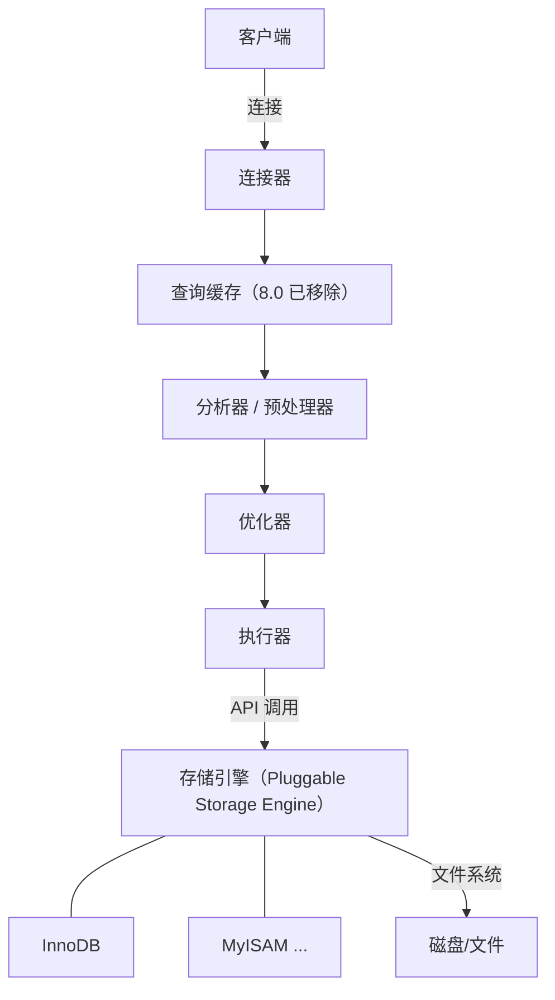

# 什么是MySQL语句？

**SQL 语句执行流程与权限管理**

**一、SQL 查询语句执行流程**

1.  **连接器**：客户端与服务器建立连接（TCP/Socket），校验身份权限（从 `user` 表获取权限），获取连接线程。
2.  **查询缓存（MySQL 8.0 已移除）**：
    -   命中缓存则直接返回。
    -   未命中则继续执行，并将结果存入缓存（表结构或数据变更会导致缓存失效）。
3.  **分析器**：
    -   **词法分析**：识别出字符串、关键字（如 SELECT），拆分为多个 Token。
    -   **语法分析**：判断 SQL 语法是否正确，构建语法树。
4.  **预处理器**：检查表是否存在、列是否存在，将 `*` 展开为所有列，并展开视图。
5.  **优化器**：生成执行计划。如选择哪个索引、决定多表连接顺序（Join Reorder）、优化 `WHERE`/`ORDER BY`。
6.  **执行器**：根据执行计划调用存储引擎 API，检查权限后逐行执行操作，将结果返回客户端。



**二、更新语句流程与日志机制**

Update 语句流程除了上述查询流程外，还涉及两个关键日志：

1.  **Redo Log（重做日志）**：
    -   **归属**：InnoDB 引擎特有。
    -   **特性**：物理日志，记录“数据页上的修改”；循环写，空间固定（Write Ahead Log）。
    -   **作用**：实现 Crash-safe（崩溃恢复），保证持久性（D）。
2.  **Binlog（归档日志）**：
    -   **归属**：MySQL Server 层，所有引擎可用。
    -   **特性**：逻辑日志，记录“原始 SQL 语句（或 Row 格式数据）”；追加写，文件可无限增长。
    -   **作用**：用于数据恢复（PITR）和主从复制。

**两阶段提交**：为了保证 Redo Log 和 Binlog 逻辑一致，MySQL 内部采用两阶段提交。

```text
两阶段提交流程
┌──────────┐      ┌──────────────┐      ┌──────────────┐
│ 执行器   │ ──>  │ InnoDB 引擎  │      │  Binlog      │
└──────────┘      └──────┬───────┘      └──────┬───────┘
                        │                     │
                        │ 1. prepare         │
                        │ ──────────────────> │
                        │                     │
                        │ 2. write binlog     │
                        │ <────────────────── │
                        │                     │
                        │ 3. commit           │
                        │ ──────────────────> │
```

#### 实战案例
**脏页刷盘**：在凌晨的业务低峰期，发现 MySQL I/O 偶尔飙升。通过 `show engine innodb status` 发现 `Buffer Pool hit rate` 极高，但 `Checkpoint` 频繁触发。原因是 Redo Log 写满导致强制刷脏页。解决方案是调大 `innodb_log_file_size` 以减少 Checkpoint 频率，并配合 `innodb_io_capacity` 限制刷盘速度，避免影响业务查询。

#### 日志机制对比
| 特性 | Redo Log | Binlog (Binary Log) |
| :--- | :--- | :--- |
| **实现层级** | InnoDB 引擎层 | MySQL Server 层 |
| **日志类型** | 物理日志 (修改了哪些页) | 逻辑日志 (原始 SQL 或 行数据) |
| **写入方式** | 循环写 (固定大小，覆盖旧日志) | 追加写 (无限追加，需定期清理) |
| **核心作用** | 崩溃恢复 | 主从复制、数据备份/恢复 |

#### 关键代码示例 (分析 SQL 执行计划)
```sql
-- 使用 EXPLAIN 分析 SQL 执行计划
-- 关注 type, key, rows, Extra 字段
-- type: ref (索引查找) > range (范围) > ALL (全表扫描)
EXPLAIN SELECT * FROM users WHERE age > 20 AND name = 'Bob';

-- 查看最近一次事务的 Binlog 位置 (用于恢复)
SHOW MASTER STATUS;
```


## 记忆要点

- 查询流程口诀：连接、缓存、分析、优化、执行（注意8.0已移除查询缓存）。
- 两阶段提交：一备二写三提交，保证Redo和Binlog状态的逻辑一致。
- 日志对比：Redo属引擎专有物理循环写，Binlog属Server层逻辑追加写。
- 引擎层：Redo Log用于崩溃恢复，Server层：Binlog用于主从复制与恢复。

## 结构化回答

**30 秒电梯演讲：** SQL执行需经解析、优化和执行，更新操作依赖Redo Log和Binlog保证一致性与持久性。打个比方，像做菜，先看菜单（解析），再规划步骤（优化），最后烹饪（执行），并记录日志以便复原。

**展开框架：**
1. **查询流程口诀** — 连接、缓存、分析、优化、执行（注意8.0已移除查询缓存）。
2. **两阶段提交** — 一备二写三提交，保证Redo和Binlog状态的逻辑一致。
3. **日志对比** — Redo属引擎专有物理循环写，Binlog属Server层逻辑追加写。

**收尾：** 这三点都能配合实战聊。您想深入聊原理、对比还是避坑？

## 视频脚本

> 预计时长：3 分钟 | 由浅入深

| 时间 | 画面/字幕 | 口播台词 | 讲解要点 |
|------|----------|----------|----------|
| 0:00 | 标题卡：什么是MySQL语句 | "什么是MySQL语句？一句话——像做菜，先看菜单（解析），再规划步骤（优化），最后烹饪（执行），并记录日志以便复原。" | 开场钩子 |
| 0:45 | 概念动画/示意图 | "SQL执行需经解析、优化和执行，更新操作依赖Redo Log和Binlog保证一致性与持久性——像做菜，先看菜单（解析），再规划步骤（优化），最后烹饪（执行），并记录日志以便复原" | 核心定义 |
| 1:30 | 查询流程口诀示意 | "连接、缓存、分析、优化、执行（注意8.0已移除查询缓存）。" | 要点1 |
| 2:15 | 两阶段提交示意 | "一备二写三提交，保证Redo和Binlog状态的逻辑一致。" | 要点2 |
| 3:00 | 总结卡 | "记住这几条，面试不慌。下期讲进阶追问。" | 收尾 |
