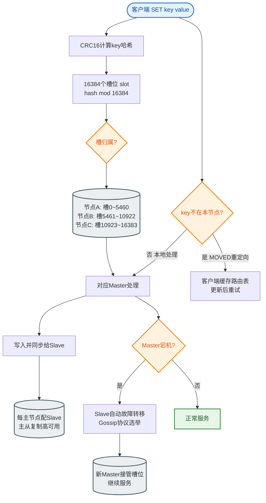

# 什么是Redis为什么快？

**Redis 基础与高性能原理**

**一、Redis 是什么**
Redis 是一个基于内存的 Key-Value 数据库，读写速度极快。常用作缓存、消息队列、分布式锁等。支持 String、Hash、List、Set、ZSet、Bitmap、HyperLogLog、Geospatial 等多种数据结构。

**二、Redis 为什么快？**

1.  **基于内存操作**：数据存储在内存中，避免了磁盘 I/O 的开销，内存读写速度是纳秒级，远高于磁盘的毫秒级。
2.  **高效的数据结构**：
    -   专门为特定场景优化（如 SDS 简单动态字符串、跳表 SkipList、压缩列表/IntSet）。
    -   底层使用哈希表实现 O(1) 读写，渐进式 Rehash 避免阻塞。
3.  **单线程模型（主要指命令执行）**：
    -   **优势**：省去了多线程上下文切换和锁竞争的开销；CPU 不容易成为瓶颈（内存操作快）。
    -   **注意**：Redis 6.0 引入多线程处理网络 IO（读取/解析/写入），但核心命令执行依然是单线程。
4.  **I/O 多路复用**：
    -   使用 **epoll**（Linux）机制，单个线程可以同时监听多个网络连接的读写事件。
    -   "Reactor 模式"：当某个 Socket 有数据到达时，才触发对应的回调处理，避免了无效的轮询等待。

```text
Redis I/O 多路复用模型 (Reactor)
┌─────────────────────────────────────────────┐
│          Redis Client (多连接)              │
└───────────────┬─────────────┬───────────────┘
                │             │
                ▼             ▼
┌─────────────────────────────────────────────┐
│             TCP Socket Array                │
└──────────────────┬──────────────────────────┘
                   │
                   ▼
┌─────────────────────────────────────────────┐
│           I/O Multiplexer (epoll)           │
│   (监听 Socket 事件状态：可读/可写/错误)     │
└──────────────────┬──────────────────────────┘
                   │ (事件就绪通知)
                   ▼
┌─────────────────────────────────────────────┐
│           File Event Handler (单线程)        │
│  (请求解析 -> 命令执行 -> 响应打包)          │
└─────────────────────────────────────────────┘
```

**三、缓存常见问题与策略**

1.  **数据一致性**
    -   **策略**：通常采用「先更新数据库，再删除缓存」（Cache Aside Pattern）。
    -   **原因**：更新缓存并发时容易导致脏数据，删除缓存则下次读取时自动加载最新数据。
    -   **兜底**：为保证删除成功，可采用消息队列重试机制，或订阅 MySQL Binlog 异步删除（如 Canal），或设置「延迟双删」。
2.  **缓存穿透**
    -   **现象**：查询不存在的 Key，请求直接打到数据库（可能是恶意攻击）。
    -   **解决**：缓存空值（设置短过期时间）、布隆过滤器、接口层校验。
3.  **缓存击穿**
    -   **现象**：热点 Key 过期瞬间，大量请求打到数据库。
    -   **解决**：互斥锁重建缓存（只允许一个线程去查库）、逻辑过期（不设置 TTL，后台异步更新）。
4.  **缓存雪崩**
    -   **现象**：大量 Key 在同一时间集中过期，或 Redis 宕机，导致数据库压力骤增。
    -   **解决**：过期时间加随机值、构建高可用 Redis 集群。

---

**深化内容：实战与进阶**

**1. 实战案例**
- **BigKey 导致阻塞**：曾遇到线上 Redis 偶发卡顿，经排查是一个包含数百万元素的 List Key，在执行 `LRANGE` 时阻塞主线程长达数秒。**教训**：生产环境严禁存储 BigKey，使用 `MEMORY USAGE` 命令监控大 Key，超过 10KB 的集合类型建议拆分。
- **CPU 飙升 100%**：业务使用 `KEYS *` 命令在生产环境进行模糊匹配，导致单线程 CPU 飙升。**教训**：严禁在线上使用 `KEYS`，应使用 `SCAN` 命令进行渐进式遍历。

**2. 代码示例（Go 实现简单的布隆过滤器防穿透）**
```go
import "github.com/bits-and-blooms/bloom/v3"

// 初始化布隆过滤器，预计元素100万，误判率0.01
filter := bloom.NewWithEstimates(1000000, 0.01)

// 查询逻辑
func getUser(id string) *User {
    // 1. 先判断布隆过滤器
    if !filter.Test([]byte(id)) {
        return nil // 一定不存在，直接拦截，保护数据库
    }
    // 2. 查询 Redis
    val := redis.Get(id)
    if val != nil { return val }
    // 3. 查询数据库并回写...
}
```

**3. 核心数据结构选型对比**

| 数据结构 | 底层实现 | 典型应用场景 | 时间复杂度 | 注意事项 |
| :--- | :--- | :--- | :--- | :--- |
| **String** | SDS (Simple Dynamic String) | 缓存、计数器、分布式锁 | O(1) | 最大值 512MB；数值命令 (`INCR`) 原子性 |
| **Hash** | 哈希表 + ZipList (小数据量) | 用户信息、购物车 | O(1) | `HGETALL` 可能导致 BigKey，建议 `HSCAN` |
| **List** | QuickList (双向链表) | 消息队列、最新列表 | 头尾 O(1) | 不建议存大量数据，可考虑 Stream 或 MQ |
| **ZSet** | 跳表 + Hash 表 | 排行榜、延时队列 | O(log N) | 跳表查找效率极高，但内存占用稍高 |


## 核心流程图


## 记忆要点

- 四大核心原因：纯内存操作、单线程免锁竞争、IO多路复用、高效数据结构。
- 单线程模型：核心命令执行单线程，6.0后引入多线程仅处理网络IO。
- 缓存三大坑：穿透查不到(布隆过滤器)、击穿热点过(互斥锁)、雪崩大面积(随机TTL)。
- 缓存一致性策略：推荐先更新数据库再删除缓存，可结合延迟双删兜底。

## 结构化回答

**30 秒电梯演讲：** 基于内存的 KV 数据库，利用单线程、多路复用和高效数据结构实现极速读写。打个比方，像巨大的内存笔记本，单手（单线程）快速翻页，不需要跑图书馆（磁盘）。

**展开框架：**
1. **四大核心原因** — 纯内存操作、单线程免锁竞争、IO多路复用、高效数据结构。
2. **单线程模型** — 核心命令执行单线程，6.0后引入多线程仅处理网络IO。
3. **缓存三大坑** — 穿透查不到(布隆过滤器)、击穿热点过(互斥锁)、雪崩大面积(随机TTL)。

**收尾：** 我在项目里踩过坑——BigKey 导致阻塞：曾遇到线上 Redis 偶发卡顿，经排查是一个包含数百万元素的 List Key，在执行 `LRANGE` 时阻塞主线程长达数秒。您想深入聊哪一段：原理、避坑还是对比选型？

## 视频脚本

> 预计时长：3 分钟 | 由浅入深

| 时间 | 画面/字幕 | 口播台词 | 讲解要点 |
|------|----------|----------|----------|
| 0:00 | 标题卡：什么是Redis为什么快 | "什么是Redis为什么快？一句话——像巨大的内存笔记本，单手（单线程）快速翻页，不需要跑图书馆（磁盘）。" | 开场钩子 |
| 0:45 | 概念动画/示意图 | "基于内存的 KV 数据库，利用单线程、多路复用和高效数据结构实现极速读写——像巨大的内存笔记本，单手（单线程）快速翻页，不需要跑图书馆（磁盘）" | 核心定义 |
| 1:30 | 四大核心原因示意 | "纯内存操作、单线程免锁竞争、IO多路复用、高效数据结构。" | 要点1 |
| 2:15 | 单线程模型示意 | "核心命令执行单线程，6.0后引入多线程仅处理网络IO。" | 要点2 |
| 3:00 | 总结卡 | "记住这几条，面试不慌。下期讲进阶追问。" | 收尾 |
