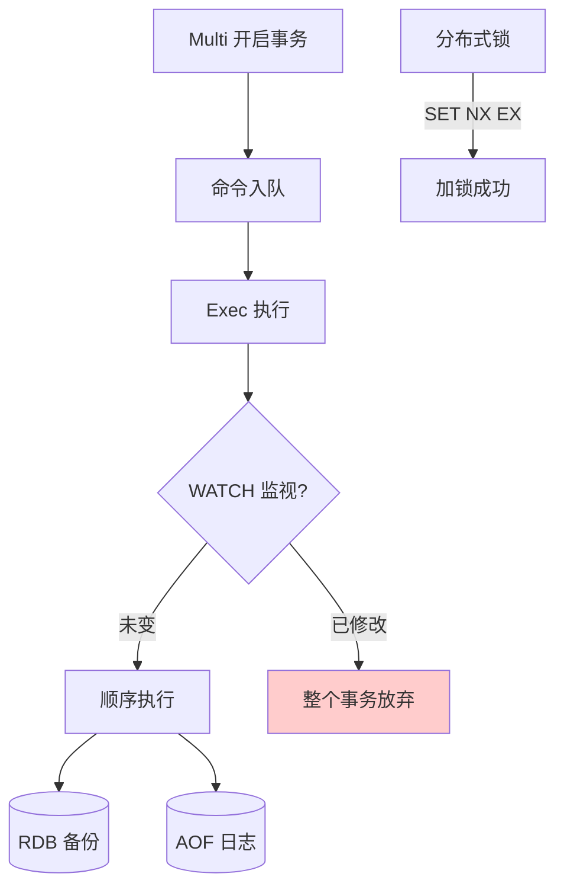

# 什么是Redis事务？

**Redis 事务与分布式锁**

**一、Redis 事务**
Redis 事务通过 `MULTI`、`EXEC`、`DISCARD` 和 `WATCH` 命令实现，允许将一组命令打包，一次性、顺序性、排他性地执行。

1.  **基本流程**：
    -   `MULTI`：标记事务开始，后续命令进入队列，不立即执行（返回 QUEUED）。
    -   `EXEC`：触发执行队列中的所有命令。
    -   `DISCARD`：取消事务，清空队列。
2.  **特性**：
    -   **原子性（部分）**：事务中的命令要么全部执行，要么都不执行（注意：如果命令语法错误，所有命令不执行；如果运行时错误，如类型错误，已执行的命令**不会回滚**，这是 Redis 事务常被诟病的一点）。
    -   **隔离性**：事务执行期间不会被其他命令打断（单线程特性保证）。
    -   **无隔离级别**：Redis 没有像 MySQL 那样的 MVCC 隔离级别。
3.  **乐观锁（WATCH）**：
    -   `WATCH key`：监视一个或多个 Key，如果在事务执行前这些 Key 被修改，事务将拒绝执行（EXEC 返回 nil）。
    -   用于解决并发修改冲突问题（CAS 思想）。

**二、Redis 分布式锁**

1.  **实现原理（不可重入）**：
    -   **加锁**：`SET lock_key unique_value NX PX 10000`。
        -   `NX`：Key 不存在才设置（互斥）。
        -   `PX`：设置过期时间（防止死锁）。
        -   `unique_value`：唯一标识（如 UUID + ThreadId），确保只有加锁者能解锁，防止误删别人的锁。
    -   **解锁**：使用 Lua 脚本保证“判断唯一标识”和“删除 Key”的原子性。
        ```lua
        if redis.call("get",KEYS[1]) == ARGV[1] then
            return redis.call("del",KEYS[1])
        else
            return 0
        end
        ```
2.  **Redlock 算法**：
    -   为了解决单点故障，在多个 Redis 节点上同时加锁，只有大多数节点（N/2 + 1）加锁成功才算成功。

**三、Redis 持久化机制**

1.  **RDB（快照）**：
    -   在指定时间间隔内生成数据集的时间点快照（二进制文件）。
    -   **优点**：恢复速度快；文件紧凑，适合备份。
    -   **缺点**：可能丢失最后一次快照后的数据；fork 子进程可能导致阻塞（数据量大时）。
2.  **AOF（Append Only File）**：
    -   记录服务器执行的所有写操作命令，恢复时重新执行一遍。
    -   **写回策略**：
        -   `Always`：每次写都同步落盘（慢，最安全）。
        -   `Everysec`：每秒写回一次（折中，推荐，默认丢失1秒数据）。
        -   `No`：由操作系统控制（快，不安全）。
    -   **AOF 重写**：压缩 AOF 文件，去除冗余命令（如多次 Set 变为最后一次 Set）。
3.  **混合持久化（Redis 4.0+）**：
    -   AOF 重写时，将 RDB 的内容写入 AOF 文件头部，增量命令以 AOF 格式追加。
    -   结合了 RDB 恢复快和 AOF 丢失数据少的优点。

## 常见考点
1.  **Redis 事务与数据库事务的区别**：重点在于 Redis 不支持回滚。
2.  **WATCH 的实现机制**：基于版本号机制，Key 被 CAS 修改后会标记为脏。
3.  **分布式锁的超时问题**：如果业务执行时间超过锁过期时间，如何处理？（看门狗机制/续期）。
4.  **RDB 和 AOF 的选择**：对数据恢复敏感度高的选 AOF 或混合，对性能要求高且能容忍少量数据丢失选 RDB。

---

**深化内容：实战与进阶**

**1. 实战案例**
- **分布式锁误删**：早期代码中，A 线程拿到锁但业务执行超时，锁过期释放，B 线程拿到锁，此时 A 线程执行完毕释放锁，误删了 B 的锁。**解决**：必须引入 `UUID+ThreadId` 作为 Value，并在 Lua 脚本中校验。
- **Fork 阻塞导致主从断开**：在主节点内存高达 16GB 时开启 RDB 生成，`fork` 子进程耗时数秒，导致主线程无法响应心跳，哨兵判定主节点下线并触发故障转移（FAILOVER）。**优化**：调整 `repl-backlog-size` 和 `auto-aof-rewrite-percentage`，必要时考虑关闭自动 RDB 或在业务低峰手动触发。

**2. 代码示例（Redisson 看门狗续期机制简化版 Java）**
```java
// Redisson 自动续期原理：后台线程检测，如果锁未释放且还持有，自动重置过期时间
RLock lock = redissonClient.getLock("myLock");
try {
    // lockWatchdogTimeout 默认 30s，自动续期
    lock.lock(); 
    doBusiness();
} finally {
    lock.unlock();
}
```

**3. 持久化方案选型对比**

| 特性 | RDB | AOF | 混合持久化 (RDB+AOF) |
| :--- | :--- | :--- | :--- |
| **数据完整性** | 低 (丢失分钟级数据) | 高 (通常仅丢失1秒) | 较高 (RDB部分无损，增量部分丢失1秒) |
| **文件体积** | 小 (二进制压缩) | 大 (文本日志) | 较小 (RDB部分压缩，增量部分追加) |
| **恢复速度** | 快 (直接加载) | 慢 (需逐条执行命令) | 快 (先加载RDB，再重放少量命令) |
| **性能影响** | 重负荷时 Fork 阻塞主线程 | 每秒刷盘或 Always 模式影响磁盘 IO | Fork 阻塞，但重写后读盘性能提升 |
| **适用场景** | 允许丢数据的缓存 | 数据不丢失的存储 (如金融) | 兼顾性能与数据安全的主流选择 |


## 核心流程图



## 记忆要点

- 事务本质：打包命令顺序排他执行，但语法错误才整体回滚，运行错误不回滚。
- 乐观锁机制：通过WATCH监听Key，若被修改则事务拒绝执行。
- 分布式锁口诀：SET NX PX加锁，Lua脚本校验唯一标解锁。
- 持久化对比：RDB快照恢复快但可能丢数据，AOF命令丢失少但恢复慢。

## 结构化回答

**30 秒电梯演讲：** 事务打包命令保证顺序执行，分布式锁利用NX实现互斥，持久化通过RDB和AOF防止数据丢失。打个比方，事务像购物车统一结账；分布式锁像公厕单人占用；持久化像定期拍照和写日记。

**展开框架：**
1. **事务本质** — 打包命令顺序排他执行，但语法错误才整体回滚，运行错误不回滚。
2. **乐观锁机制** — 通过WATCH监听Key，若被修改则事务拒绝执行。
3. **分布式锁口诀** — SET NX PX加锁，Lua脚本校验唯一标解锁。

**收尾：** 我在项目里踩过坑——分布式锁误删：早期代码中，A 线程拿到锁但业务执行超时，锁过期释放，B 线程拿到锁，此时 A 线程执行完毕释放锁，误删了 B 的锁。您想深入聊哪一段：原理、避坑还是对比选型？

## 视频脚本

> 预计时长：3 分钟 | 由浅入深

| 时间 | 画面/字幕 | 口播台词 | 讲解要点 |
|------|----------|----------|----------|
| 0:00 | 标题卡：什么是Redis事务 | "什么是Redis事务？一句话——事务像购物车统一结账；分布式锁像公厕单人占用；持久化像定期拍照和写日记。" | 开场钩子 |
| 0:45 | 概念动画/示意图 | "事务打包命令保证顺序执行，分布式锁利用NX实现互斥，持久化通过RDB和AOF防止数据丢失——事务像购物车统一结账；分布式锁像公厕单人占用；持久化像定期拍照和写日记" | 核心定义 |
| 1:30 | 事务本质示意 | "打包命令顺序排他执行，但语法错误才整体回滚，运行错误不回滚。" | 要点1 |
| 2:15 | 乐观锁机制示意 | "通过WATCH监听Key，若被修改则事务拒绝执行。" | 要点2 |
| 3:00 | 总结卡 | "记住这几条，面试不慌。下期讲进阶追问。" | 收尾 |
