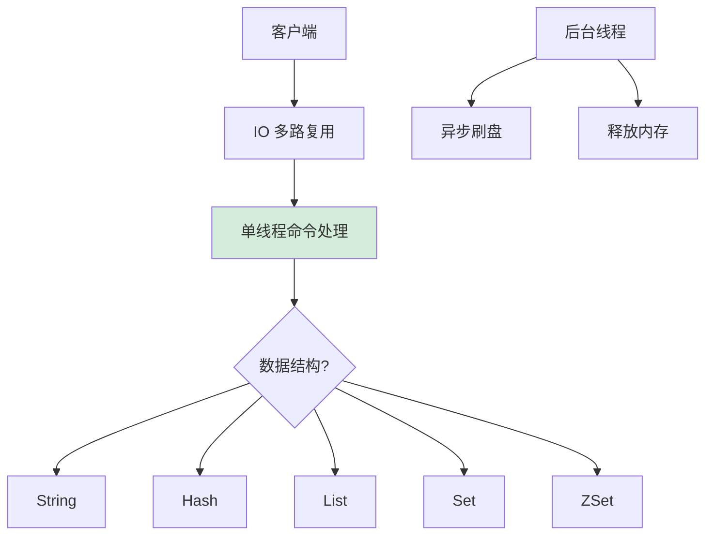

# 什么是Redis基础？

Redis基础

Redis是什么，有哪些特点

Redis是一个开源的基于内存的数据库，读写速度非常快，通常被用作缓存、消息队列、分布式锁和键值存储数据库。它支持多种数据结构，如字符串、哈希表、列表、集合、有序集合等，除此之外，Redis 还支持事务 、持久化、Lua 脚本、多种集群方案（主从复制模式、哨兵模式、切片机群模式）、发布/订阅模式，内存淘汰机制、过期删除机制等。
具有以下特点：
基于内存： Redis 将数据存储在内存中，使得它 具有快速的读写访问速度。这也使得 Redis 适用于需要高性能的应用场景，比如缓存。
持久性：虽然 Redis 主要是内存中的存储系统，但它可以通过将数据持久化到磁盘上的快照和日志文件来保证数据的持久性，以防止数据丢失。
多数据结构：Redis 不仅支持简单的键值对存储，还提供了丰富的数据结构，如列表、哈希表、集合等，使得它更灵活地适应不同的应用场景。
原子性操作： Redis 支持原子性操作，这意味着它可以保证一个操作是原子的，要么执行成功，要么完全不执行，这对于并发环境下的数据一致性很重要。
分布式： Redis 提供了分布式特性，可以将数据分布在多个节点上，以提高可扩展性和可用性。
为什么要使用 Redis 而不仅仅依赖 MySQL

 Redis 具备「高性能」和「高并发」两种特性
Redis读写非常快速，对于需要频繁读写的数据，特别是缓存数据，Redis 的性能优势非常明显，将一部分常用的、频繁访问的数据存储在 Redis 中，可以有效减轻对 MySQL 等持久性数据库的压力。
Redis 提供了丰富的数据结构，这使得 Redis 在处理特定类型数据和实现特定功能时更为灵活。
Redis 能够更好地处理高并发请求，尤其适用于一些需要快速响应的场景。通过缓存和原子性操作，可以降低数据库的并发压力
Redis 更适合处理高速、高并发的数据访问，以及需要复杂数据结构和功能的场景，在实际应用中，很多系统会同时使用 MySQL 和 Redis。
Redis是单线程吗

Redis 是单线程的，但是Redis 单线程指的是网络请求模块使用单线程进行处理，其他模块仍用多个线程，Redis程序并不是单线程的，在启动的时候，会启动后台线程。
Redis 在 2.6 版本，会启动 2 个后台线程，分别处理关闭文件、AOF 刷盘这两个任务；
Redis 在 4.0 版本之后，新增了一个新的后台线程，用来异步释放 Redis 内存，也就是 lazyfree 线程。
之所以 Redis 为「关闭文件、AOF 刷盘、释放内存」这些任务创建单独的线程来处理，是因为这些任务的操作都是很耗时的，如果把这些任务都放在主线程来处理，那么 Redis 主线程就很容易发生阻塞，这样就无法处理后续的请求了。
为了提高网络 I/O 的并行度，Redis 6.0 采用了多个 I/O 线程来处理网络请求，但是对于命令的执行，Redis 仍然使用单线程来处理。

---

**深化内容：实战与进阶**

**1. 实战案例**
- **内存碎片率过高**：曾监控到 Redis 实例内存使用率 80%，但实际数据只占 40%，导致 OOM。**原因**：频繁存取大小不一的对象导致内存碎片。**解决**：执行 `MEMORY PURGE`（需高版本）或在低峰期重启 Redis，或者调整 `activedefrag yes` 开启主动内存碎片整理（Redis 4.0+）。
- **Key 过期策略误用**：业务代码依赖 Redis 的 `notify-keyspace-events` 做过期回调，但在高并发下，由于惰性删除和定期删除的机制，Key 并不会在 TTL 到达的毫秒级立即删除，导致业务处理延迟。**教训**：不要依赖 Key 过期时间做精确的时间控制，如需精确处理，应使用 ZSet 存储时间戳并通过轮询扫描任务。

**2. 代码示例（连接池配置与 Pipeline 批量操作 Java/Jedis）**
```java
// 1. 生产环境连接池配置示例
JedisPoolConfig config = new JedisPoolConfig();
config.setMaxTotal(200);     // 最大连接数
config.setMaxIdle(50);       // 最大空闲连接
config.setMinIdle(10);       // 最小空闲连接
config.setBlockWhenExhausted(true); // 连接耗尽时阻塞

// 2. 使用 Pipeline 减少网络 RTT (批量插入 10000 条数据)
Jedis jedis = pool.getResource();
Pipeline p = jedis.pipelined();
for (int i = 0; i < 10000; i++) {
    p.set("key:" + i, "value:" + i);
}
p.sync(); // 真正发送请求并执行
```

**3. Redis 过期策略与内存淘汰对比**

| 机制分类 | 具体策略 | 触发条件 | 适用场景 | 特点 |
| :--- | :--- | :--- | :--- | :--- |
| **过期删除** | **惰性删除** (Lazy) | 访问 Key 时检查 | 低频访问的 Key | CPU 友好，但可能导致内存泄漏（死数据） |
| | **定期删除** (Active) | 周期性随机抽样检查 | 通用场景 | 平衡 CPU 和 内存，可能存在漏网之鱼 |
| **内存淘汰** | **noeviction** | 内存满且写请求 | 不允许丢失数据的缓存 | 写入报错，默认策略 |
| | **allkeys-lru** | 内存满且写请求 | 通用缓存系统 | 优先淘汰最久未使用的数据 (LRU算法近似实现) |
| | **volatile-lru** | 内存满且写请求 | 只淘汰设置了 TTL 的 Key | 保护未设置过期时间的持久化数据 |
| | **allkeys-lfu** (Redis 4.0+) | 内存满且写请求 | 需要保留高频热点数据 | 优先淘汰访问频率最低的数据 (LFU算法) |


## 核心流程图



## 核心知识点图


## 记忆要点

- 核心定位：基于内存的高性能KV数据库，支持多种数据结构与持久化。
- 单线程澄清：指命令执行是单线程，关闭文件/AOF刷盘/异步释放内存走后台线程。
- 两大价值：利用内存实现高性能，通过缓存拦截减轻MySQL高并发压力。
- 过期与淘汰：惰性+定期删除防内存泄漏，内存满时按LRU等策略淘汰。

## 结构化回答

**30 秒电梯演讲：** 基于内存的 NoSQL 数据库，支持丰富数据结构，通过单线程模型实现高性能并发处理。打个比方，像内存里的超级字典，查得快，功能多，一个人翻书（单线程）效率最高。

**展开框架：**
1. **核心定位** — 基于内存的高性能KV数据库，支持多种数据结构与持久化。
2. **单线程澄清** — 指命令执行是单线程，关闭文件/AOF刷盘/异步释放内存走后台线程。
3. **两大价值** — 利用内存实现高性能，通过缓存拦截减轻MySQL高并发压力。

**收尾：** 我在项目里踩过坑——内存碎片率过高：曾监控到 Redis 实例内存使用率 80%，但实际数据只占 40%，导致 OOM。您想深入聊哪一段：原理、避坑还是对比选型？

## 视频脚本

> 预计时长：3 分钟 | 由浅入深

| 时间 | 画面/字幕 | 口播台词 | 讲解要点 |
|------|----------|----------|----------|
| 0:00 | 标题卡：什么是Redis基础 | "什么是Redis基础？一句话——像内存里的超级字典，查得快，功能多，一个人翻书（单线程）效率最高。" | 开场钩子 |
| 0:45 | 概念动画/示意图 | "基于内存的 NoSQL 数据库，支持丰富数据结构，通过单线程模型实现高性能并发处理——像内存里的超级字典，查得快，功能多，一个人翻书（单线程）效率最高" | 核心定义 |
| 1:30 | 核心定位示意 | "基于内存的高性能KV数据库，支持多种数据结构与持久化。" | 要点1 |
| 2:15 | 单线程澄清示意 | "指命令执行是单线程，关闭文件/AOF刷盘/异步释放内存走后台线程。" | 要点2 |
| 3:00 | 总结卡 | "记住这几条，面试不慌。下期讲进阶追问。" | 收尾 |
