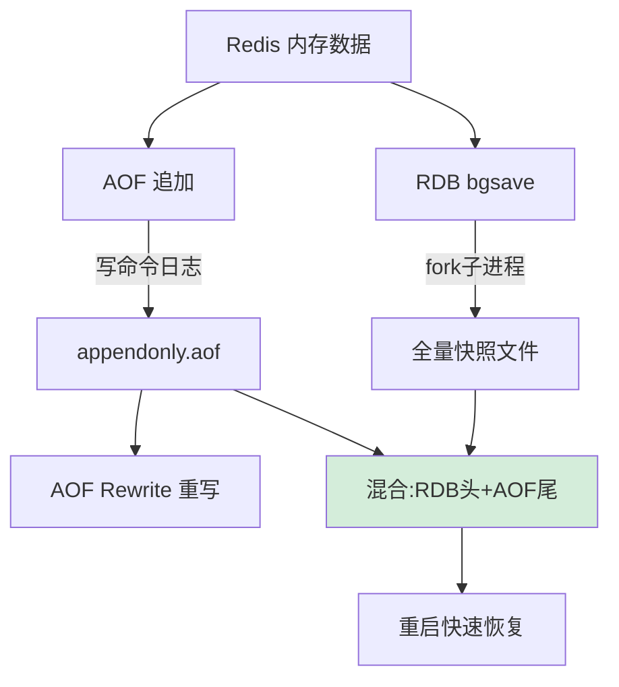

# 什么是Redis持久化？

**Redis 持久化机制详解**

**一、为什么需要持久化**
Redis 是内存数据库，重启后数据会丢失。持久化机制将内存数据保存到磁盘，重启时恢复，防止数据丢失，兼顾数据的“高性能”与“可靠性”。

**二、RDB（Redis Database）**

1.  **原理**：在指定的时间间隔内，将内存中的数据集快照生成二进制文件（默认 `dump.rdb`）。采用 Copy-on-Write 机制。
2.  **触发方式**：
    -   `save`：同步阻塞主线程，生成 RDB（生产环境禁用）。
    -   `bgsave`：fork 子进程生成 RDB，主线程继续处理命令（推荐）。
    -   自动触发：符合 `save 900 1` 等配置规则时自动执行 `bgsave`。
3.  **优点**：
    -   文件紧凑，恢复速度快（直接加载到内存）。
    -   适合冷备份和灾难恢复。
4.  **缺点**：
    -   可能丢失最后一次快照后的数据（取决于 save 配置）。
    -   fork 时若数据量大，会阻塞主线程（虽然时间短，但在大数据量下不可忽视）。

**三、AOF（Append Only File）**

1.  **原理**：记录服务器执行的所有写操作命令（文本格式），恢复时重新执行一遍。
2.  **流程**：
    -   命令追加（append）
    -   文件写入（write）
    -   文件同步（sync）
3.  **写回策略**（配置 `appendfsync`）：
    -   `Always`：每次写操作都同步落盘（最安全，性能开销最大）。
    -   `Everysec`：每秒写回一次（折中，推荐，Redis 默认值，最多丢失1秒数据）。
    -   `No`：由操作系统决定何时写回（最快，最不安全）。
4.  **AOF 重写**：
    -   当 AOF 文件过大（超过 `auto-aof-rewrite-min-size`），fork 子进程将内存数据压缩为新的 AOF 文件（去除冗余命令，如 `del`、`srem` 等无效操作）。

**四、混合持久化（Redis 4.0+）**

1.  **原理**：
    -   AOF 重写时，子进程先将内存数据以 **RDB 格式**写入 AOF 文件开头。
    -   主线程将重写期间的新增命令以 **AOF 格式**追加到文件末尾。
2.  **优点**：
    -   结合 RDB 恢复快（加载 RDB 部分快）和 AOF 数据丢失少（重写期间增量记录）的优点。
3.  **缺点**：
    -   AOF 文件可读性变差（二进制+文本混合）。
    -   兼容性差（4.0 之前版本无法识别）。

| 特性 | RDB | AOF | 混合持久化 |
| :--- | :--- | :--- | :--- |
| **存储格式** | 二进制快照 | 文本命令（追加写） | RDB (头部) + AOF (增量) |
| **恢复速度** | 很快（直接加载） | 慢（需重放命令） | 快（RDB部分加载快） |
| **数据安全性** | 低（可能丢失分钟级数据） | 高（通常最多丢失1秒） | 极高（结合二者优点） |
| **IO 开销（写入）** | 低（fork开销为主） | 高（频繁刷盘） | 中等 |
| **文件体积** | 小 | 大 | 较小 |

**实战案例：**
在某大促活动中，我们遇到主库 AOF 重写导致 fork 阻塞主线程超过 10 秒，引发集群超时。**优化方案**：将 `auto-aof-rewrite-percentage` 调大，减少重写频率；同时将数据迁移到物理机以利用 Copy-on-Write 优化。

**关键代码（配置）：**
```conf
# redis.conf 关键配置示例
# RDB 配置
save 900 1
save 300 10

# AOF 配置
appendonly yes
appendfsync everysec
auto-aof-rewrite-percentage 100
auto-aof-rewrite-min-size 64mb

# 开启混合持久化 (Redis 4.0+)
aof-use-rdb-preamble yes
```

## 常见考点
1.  **RDB 的 fork 阻塞问题**：fork 子进程时，主线程需要拷贝页表，如果内存数据很大（如几十GB），fork 耗时较长，会导致主线程无法处理请求。


## 核心流程图



## 核心知识点图


## 记忆要点

- RDB快照：bgsave利用COW机制fork子进程，二进制紧凑恢复快，但可能丢数据。
- AOF追加：记录写命令，Everysec(每秒刷盘)为推荐默认值，最多丢1秒数据。
- 混合持久化(4.0+)：AOF重写时头部以RDB格式保存，兼具恢复快与数据全优点。
- AOF重写作用：压缩冗余命令文件，防止文件过大导致恢复过慢。

## 结构化回答

**30 秒电梯演讲：** 通过RDB快照和AOF日志将内存数据持久化到磁盘，确保重启后数据可恢复。打个比方，RDB是定期拍照存档，AOF是写日记记录全过程，混合模式是照片加日记。

**展开框架：**
1. **RDB快照** — bgsave利用COW机制fork子进程，二进制紧凑恢复快，但可能丢数据。
2. **AOF追加** — 记录写命令，Everysec(每秒刷盘)为推荐默认值，最多丢1秒数据。
3. **混合持久化(4.0+)** — AOF重写时头部以RDB格式保存，兼具恢复快与数据全优点。

**收尾：** 我在项目里踩过坑——在某大促活动中，我们遇到主库 AOF 重写导致 fork 阻塞主线程超过 10 秒，引发集群超时。您想深入聊哪一段：原理、避坑还是对比选型？

## 视频脚本

> 预计时长：3 分钟 | 由浅入深

| 时间 | 画面/字幕 | 口播台词 | 讲解要点 |
|------|----------|----------|----------|
| 0:00 | 标题卡：什么是Redis持久化 | "什么是Redis持久化？一句话——RDB是定期拍照存档，AOF是写日记记录全过程，混合模式是照片加日记。" | 开场钩子 |
| 0:45 | 概念动画/示意图 | "通过RDB快照和AOF日志将内存数据持久化到磁盘，确保重启后数据可恢复——RDB是定期拍照存档，AOF是写日记记录全过程，混合模式是照片加日记" | 核心定义 |
| 1:30 | RDB快照示意 | "bgsave利用COW机制fork子进程，二进制紧凑恢复快，但可能丢数据。" | 要点1 |
| 2:15 | AOF追加示意 | "记录写命令，Everysec(每秒刷盘)为推荐默认值，最多丢1秒数据。" | 要点2 |
| 3:00 | 总结卡 | "记住这几条，面试不慌。下期讲进阶追问。" | 收尾 |
