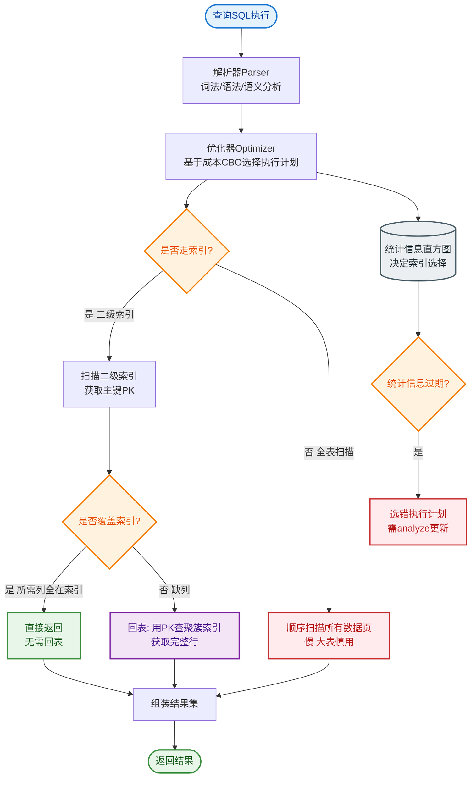

# 什么是主键、索引、外键？

**主键**：唯一标识表中每一行的一列或列组合，值不能为空且不能重复。一张表只能有一个主键。通常使用聚簇索引组织数据。

**索引**：帮助数据库高效获取数据的数据结构（如 B+ 树），类似于书的目录。通过牺牲写入性能（需要维护索引结构）和存储空间来换取查询性能的提升。

**外键**：一个表中的字段，指向另一个表的主键，用于建立和约束两表之间的关联关系，保证参照完整性（不能插入不存在的关联 ID）。

**关系示意简图：**
```text
┌─────────────────────┐
│      Users 表        │
├──────────┬──────────┤
│ id (PK)  │  name    │  ───┐
├──────────┼──────────┤    │ 关联 (Foreign Key)
│    1     │  Alice   │    │
│    2     │  Bob     │    │
└──────────┴──────────┘    │
                          │
┌─────────────────────┐    │
│      Orders 表       │    │
├──────────┬──────────┤    │
│ order_id │ user_id  │◀───┘ (外键指向 Users.id)
├──────────┼──────────┤
│   1001   │    1     │
│   1002   │    1     │
│   1003   │    2     │
└──────────┴──────────┘
```

## 常见考点
1. **主键和唯一索引的区别？**
   - 主键不允许为 NULL，唯一索引允许为 NULL（且可以有多个 NULL）。
   - 一张表只能有一个主键，但可以有多个唯一索引。
   - InnoDB 中主键默认是聚簇索引，唯一索引是非聚簇索引（二级索引）。
2. **外键约束在实际生产中常用吗？为什么？**
   - 在高并发互联网大厂中较少使用。原因：外键检查需要跨表查询，严重影响并发插入性能；容易导致死锁；数据一致性更多倾向于在应用层或逻辑层控制，方便分库分表。
3. **索引失效的常见情况？**
   - 使用 `LIKE '%xxx'`（左模糊）；
   - 对索引列进行函数运算或隐式类型转换（如字符串转数字）；
   - `OR` 连接的部分字段没有索引；
   - 违反最左前缀原则（联合索引）。


## 核心流程图


## 记忆要点

- 核心对比：主键唯一且非空（仅一个）；唯一索引允许NULL（可多个）
- 索引本质：类似目录，以牺牲写性能和空间换取查询速度
- 外键作用：跨表关联，保证参照完整性，但生产因锁和性能风险极少使用
- 应用场景：高并发场景数据一致性尽量在业务层控制，避免外键死锁

## 结构化回答

**30 秒电梯演讲：** 主键标识唯一性，索引加速查询，外键关联表间关系。打个比方，主键是身份证号，索引是书本目录，外键是订单里的用户ID。

**展开框架：**
1. **核心对比** — 主键唯一且非空（仅一个）；唯一索引允许NULL（可多个）
2. **索引本质** — 类似目录，以牺牲写性能和空间换取查询速度
3. **外键作用** — 跨表关联，保证参照完整性，但生产因锁和性能风险极少使用

**收尾：** 这三点都能配合实战聊。您想深入聊原理、对比还是避坑？

## 视频脚本

> 预计时长：3 分钟 | 由浅入深

| 时间 | 画面/字幕 | 口播台词 | 讲解要点 |
|------|----------|----------|----------|
| 0:00 | 标题卡：什么是主键、索引、外键 | "什么是主键、索引、外键？一句话——主键是身份证号，索引是书本目录，外键是订单里的用户ID。" | 开场钩子 |
| 0:45 | 概念动画/示意图 | "主键标识唯一性，索引加速查询，外键关联表间关系——主键是身份证号，索引是书本目录，外键是订单里的用户ID" | 核心定义 |
| 1:30 | 核心对比示意 | "主键唯一且非空（仅一个）；唯一索引允许NULL（可多个）" | 要点1 |
| 2:15 | 索引本质示意 | "类似目录，以牺牲写性能和空间换取查询速度" | 要点2 |
| 3:00 | 总结卡 | "记住这几条，面试不慌。下期讲进阶追问。" | 收尾 |
