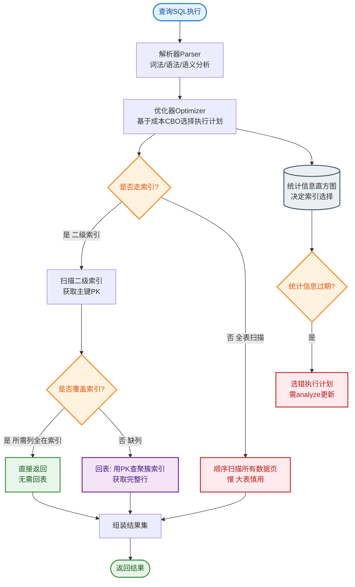

# 什么是查询效率？

### 1. Count() 的执行原理与效率

**核心原则**：
- Server 层要什么就给什么；
- InnoDB 只给必要的值；
- 优化器只优化了 `count(*)` 的语义为“取行数”。

#### (1) count(字段)
- **NOT NULL 字段**：逐行读取字段值，判断非 NULL 后累加。涉及解析数据行和拷贝字段值。
- **允许 NULL 字段**：逐行读取字段值，必须取值判断是否为 NULL，非 NULL 才累加。成本比 NOT NULL 略高。

#### (2) count(主键 id)
InnoDB 遍历整张表，取出每一行的 id 值返回给 Server 层。Server 层判断 id 不可能为空，直接累加。
- **成本**：涉及解析数据行及拷贝主键值。

#### (3) count(1)
InnoDB 遍历整张表，**不取值**。Server 层对于返回的每一行，放入数字“1”，判断非空后累加。
- **效率**：通常比 count(字段) 和 count(id) 稍快，因为减少了数据拷贝。

#### (4) count(*)
**最优解**。MySQL 专门做了优化，不取具体字段值，直接按行累加。
- **语义**：统计行数，而非统计特定字段非空值。

---
### 2. Order By 排序机制

MySQL 会为每个线程分配一块内存 `sort_buffer` 用于排序。

**示例 SQL**：
```sql
select city, name, age from t where city='杭州' order by name limit 1000;
```

#### (1) 全字段排序
1. 初始化 `sort_buffer`，放入 `city, name, age` 三个字段。
2. 通过主键索引回表，查出符合条件的行，将这三个字段拷贝到 `sort_buffer`。
3. 在 `sort_buffer` 中按 `name` 排序。
4. 排序完成后，取前 1000 行返回客户端。

**内存不足的情况**：
如果 `sort_buffer_size` 太小，放不下所有字段，MySQL 会利用**磁盘临时文件**进行归并排序。
- 监控指标：`number_of_tmp_files`（使用的临时文件数量）。
- 性能影响：磁盘 I/O 会导致性能急剧下降。

#### (2) rowid 排序
当要查询的字段总长度太大（如包含大文本），导致 `sort_buffer` 能放的行数极少时，MySQL 会切换算法：
1. `sort_buffer` 只放入排序字段 `name` 和主键 `id`。
2. 在内存中排序。
3. 排序完成后，根据 `id` 回表查出 `city, name, age`（**多一次回表**）。

**结论**：
- MySQL 优先选择**全字段排序**（省去回表，内存够大时最快）。
- 只有在担心内存太小影响排序效率时，才会选择 **rowid 排序**（省空间，但多一次回表）。
- **优化**：建立联合索引 `(city, name)` 或 `(city, name, age)`，可以直接利用索引有序性，完全避免排序（Using Index）。

---
### 3. 随机排序 (Order by Rand()) 的陷阱与优化

**低效实现**：
```sql
select * from words order by rand() limit 3;
```
**执行流程**：
1. 创建临时表，给每行生成一个随机数。
2. 初始化 `sort_buffer`，将（随机数, 字段）放入内存。
3. 对随机数排序。
4. 取前 N 行。

**缺点**：需要全表扫描 + 排序，`EXPLAIN` 显示 `Using temporary; Using filesort`，随着数据量增大，性能线性下降。

#### 优化方案：优先队列
如果只需要取少量随机行（如 limit 3），MySQL 内部会使用优先队列算法（堆排序）：
1. 维护一个大小为 3 的大顶堆（假设 3 是 limit 值）。
2. 遍历全表，每行算出 rand() 值，如果小于堆顶元素，则替换堆顶。
3. 遍历结束后，堆中即为最小的 3 个随机值对应的行。

**注意**：即使使用堆排序，依然需要全表扫描生成随机数。如果数据量极大，建议在业务层先随机获取 ID，再 `IN` 查询。

```text
ASCII: Order By 全字段排序流程
┌─────────────┐     ┌──────────────┐     ┌──────────────┐
│   Client    │────▶│   Server     │────▶│ InnoDB Engine│
└─────────────┘     └──────┬───────┘     └──────┬───────┘
                          │                     │
                          ▼                     ▼
                   ┌──────────────┐     ┌──────────────┐
                   │  sort_buffer │◀─── │  Index Scan  │
                   │ (city,name,  │     │  (Filter by  │
                   │     age)     │     │   city='HZ')  │
                   └──────┬───────┘     └──────────────┘
                          │
                          ▼ (Full Sort in Memory)
                   ┌──────────────┐
                   │ Return Top 3 │
                   └──────────────┘
```

## 常见考点
1. **Count(*) vs Count(1)**：现代 MySQL 优化器通常将它们视为等价，但 count(字段) 较慢。
2. **Order By 优化**：如何利用联合索引消除排序？
3. **临时文件**：什么情况下会产生磁盘临时表？如何调优 `sort_buffer_size`？
4. **随机函数**：为什么 `ORDER BY RAND()` 在大数据量下极慢？有什么替代方案（如 ID 随机抽样）？


## 核心流程图


## 记忆要点

- 效率口诀：count(*) > count(1) > count(主键) > count(字段)，推荐用count(*)
- 全字段 vs rowid排序：内存够用全字段，空间不足退化为rowid（多一次回表）
- 内存不足触发临时磁盘文件：sort_buffer_size太小会导致I/O骤降引发性能瓶颈
- 排序优化终极方案：建立联合索引天然有序，彻底避免filesort排序

## 结构化回答

**30 秒电梯演讲：** 利用排序缓冲区和索引优化，减少磁盘 I/O 和回表操作。打个比方，像整理扑克牌，内存够时全拿手里排，不够时分堆再合并。

**展开框架：**
1. **效率口诀** — count(*) > count(1) > count(主键) > count(字段)，推荐用count(*)
2. **全字段 vs rowid排序** — 内存够用全字段，空间不足退化为rowid（多一次回表）
3. **内存不足触发临时磁盘文件** — sort_buffer_size太小会导致I/O骤降引发性能瓶颈

**收尾：** 这三点都能配合实战聊。您想深入聊原理、对比还是避坑？

## 视频脚本

> 预计时长：3 分钟 | 由浅入深

| 时间 | 画面/字幕 | 口播台词 | 讲解要点 |
|------|----------|----------|----------|
| 0:00 | 标题卡：什么是查询效率 | "什么是查询效率？一句话——像整理扑克牌，内存够时全拿手里排，不够时分堆再合并。" | 开场钩子 |
| 0:45 | 概念动画/示意图 | "利用排序缓冲区和索引优化，减少磁盘 I/O 和回表操作——像整理扑克牌，内存够时全拿手里排，不够时分堆再合并" | 核心定义 |
| 1:30 | 效率口诀示意 | "count(*) > count(1) > count(主键) > count(字段)，推荐用count(*)" | 要点1 |
| 2:15 | 要点2图解示意 | "内存够用全字段，空间不足退化为rowid（多一次回表）" | 要点2 |
| 3:00 | 总结卡 | "记住这几条，面试不慌。下期讲进阶追问。" | 收尾 |
