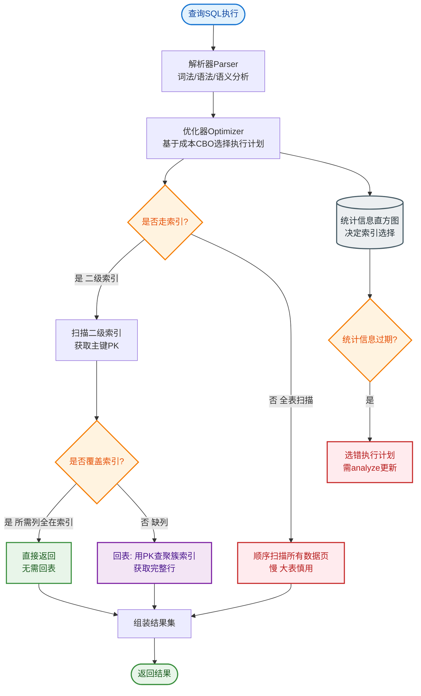
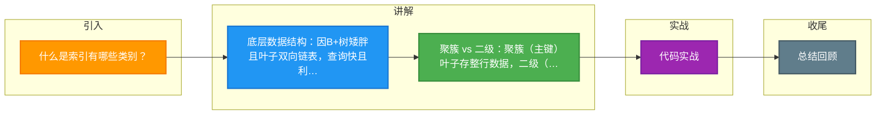

# 什么是索引有哪些类别？

索引是存储引擎用于快速找到记录的一种数据结构。

### 1. 按数据结构分类

#### (1) Hash 索引
- **结构**：Key-Value 存储，基于哈希表实现。
- **优点**：仅适用于等值查询（`=`，`IN`），查询速度极快 O(1)。
- **缺点**：
  - **无序**：不支持范围查询（`>`, `<`, `between`）和排序。
  - **Hash 冲突**：如果很多键值 Hash 冲突，性能退化为链表查询。
- **场景**：Memory 引擎，NDB 集群引擎。

#### (2) 有序数组索引
- **结构**：数据按顺序存储。
- **优点**：
  - 等值查询：二分查找，O(logN)。
  - 范围查询：找到左边界后向右遍历，效率极高。
- **缺点**：插入/删除成本极高（需要移动大量数据）。
- **场景**：静态数据存储（如早年信息系统的归档数据）。

#### (3) B+ 树索引 (InnoDB 默认)
- **为什么不用二叉树？**
  二叉树树高过高，查找时需要多次磁盘 I/O。数据库访问磁盘极慢，目标是“减少 I/O 次数”。
- **为什么用 B+ 树？**
  - **N 叉结构**：一个节点（页）可以存大量索引项，大大降低树高（通常 3-4 层即可存千万级数据）。
  - **范围查询强**：所有数据都在叶子节点，且叶子节点通过双向链表连接，非常适合范围扫描。

```text
ASCII: B+ 树结构示意图
┌───────────────┐
│   Root Node   │ (非叶子节点，仅存索引键)
│  [10 | 20 | 30]
└───────┬───────┘
    ┌───┴───┐
    ▼       ▼
┌─────┐ ┌─────┐
│Leaf │◀─▶│Leaf │ (叶子节点，存数据/主键)
│ ... │ │ ... │
└─────┘ └─────┘
```

### 2. 按物理存储分类

#### (1) 聚簇索引
- **定义**：就是主键索引。
- **叶子节点**：存储的是**整行数据**。
- **特点**：一张表只能有一个聚簇索引（因为数据只能按一种物理顺序存储）。

#### (2) 二级索引 / 辅助索引
- **定义**：我们自己建的索引（如 `index(k)`）。
- **叶子节点**：存储的是**索引列的值 + 主键值**。

**回表 查询流程**：
1. 在二级索引树中找到 `k`，拿到对应的主键 `id`。
2. 拿着 `id` 去聚簇索引树中查找完整的行数据。

**覆盖索引**：
如果查询的列正好包含在二级索引中（例如 `select id from t where k=1`），直接返回，无需回表。这是重要的性能优化手段。

```text
ASCII: 回表流程
┌─────────────┐
│ Query: k=6  │
└──────┬──────┘
       ▼
┌───────────────┐       ┌───────────────┐
│  Secondary    │──────▶│    Primary    │
│  Index (k)    │ id=10 │  Index (id)   │
│ Leaf: (6,10)  │       │ Leaf: Full Row│
└───────────────┘       └───────────────┘
```

### 3. 按字段特性分类

1. **主键索引**：数据唯一且非空，一张表一个。
2. **唯一索引**：数据唯一，但允许空值（NULL）。
3. **普通索引**：无任何约束。
4. **前缀索引**：
   - 只对文本的前 N 个字符建索引（如 `index(name(10))`）。
   - **优势**：节省索引空间。
   - **劣势**：无法使用覆盖索引（因为索引不完整）；无法用于 Order By / Group By（因为排序不完整）。

### 4. 联合索引

**最左前缀原则**：
联合索引 `(a, b, c)`，相当于建立了 `a`，`(a,b)`，`(a,b,c)` 三个索引。
- 查询 `where a=1`：命中索引。
- 查询 `where b=1`：未命中索引（除非是索引覆盖扫描）。
- 查询 `where a=1 and b=1 and c=1`：命中索引。

## 常见考点
1. **聚簇索引 vs 非聚簇索引**：MyISAM（非聚簇，叶子存地址）与 InnoDB（聚簇，叶子存数据）的区别。
2. **回表的代价**：什么情况下会发生回表？如何利用覆盖索引避免回表？
3. **索引下推**：在二级索引遍历过程中，对 `where` 中包含但索引未包含的字段进行过滤，减少回表次数。
4. **索引失效**：常见的导致索引失效的场景（函数计算、类型转换、Like '%xx' 等）。


## 核心流程图


## 记忆要点

- 底层数据结构：因B+树矮胖且叶子双向链表，查询快且利于范围扫描（对比Hash不支持范围）
- 聚簇 vs 二级：聚簇（主键）叶子存整行数据，二级（普通）叶子存主键值
- 核心代价回表：二级索引查到主键后，需再查一遍聚簇索引树获取整行数据
- 优化关键：联合索引遵守最左前缀法则，利用覆盖索引直接返回避免回表

## 结构化回答

**30 秒电梯演讲：** 按数据结构、存储方式、字段特性对索引进行多维分类。打个比方，索引类型像书的目录：有普通目录、拼音目录、章节目录。

**展开框架：**
1. **底层数据结构** — 因B+树矮胖且叶子双向链表，查询快且利于范围扫描（对比Hash不支持范围）
2. **聚簇 vs 二级** — 聚簇（主键）叶子存整行数据，二级（普通）叶子存主键值
3. **核心代价回表** — 二级索引查到主键后，需再查一遍聚簇索引树获取整行数据

**收尾：** 这三点都能配合实战聊。您想深入聊原理、对比还是避坑？

## 视频脚本

> 预计时长：3 分钟 | 由浅入深

| 时间 | 画面/字幕 | 口播台词 | 讲解要点 |
|------|----------|----------|----------|
| 0:00 | 标题卡：什么是索引有哪些类别 | "什么是索引有哪些类别？一句话——索引类型像书的目录：有普通目录、拼音目录、章节目录。" | 开场钩子 |
| 0:45 | 概念动画/示意图 | "按数据结构、存储方式、字段特性对索引进行多维分类——索引类型像书的目录：有普通目录、拼音目录、章节目录" | 核心定义 |
| 1:30 | 底层数据结构示意 | "因B+树矮胖且叶子双向链表，查询快且利于范围扫描（对比Hash不支持范围）" | 要点1 |
| 2:15 | 聚簇 vs 二级示意 | "聚簇（主键）叶子存整行数据，二级（普通）叶子存主键值" | 要点2 |
| 3:00 | 总结卡 | "记住这几条，面试不慌。下期讲进阶追问。" | 收尾 |

### 视频流程图



