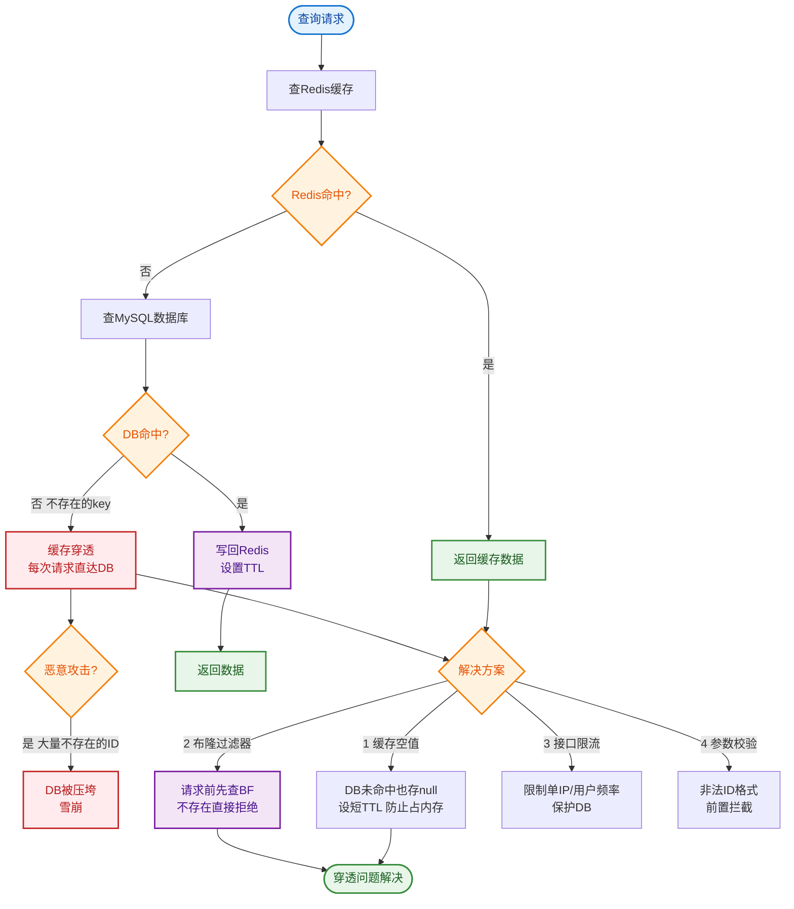

# 什么是缓存雪崩？

### 缓存雪崩

**定义**：
缓存在**同一时刻集体失效**（或 Redis 宕机），导致海量请求瞬间穿透缓存，直接击垮数据库。

#### 与其他“穿透”类的区别
- **缓存穿透**：查不存在的数据，绕过缓存直打 DB。
- **缓存击穿**：**单个**热点 Key 过期，大量线程并发重建缓存。
- **缓存雪崩**：**批量** Key 同时过期，或缓存服务整体不可用。

### 原因分析
1. **批量过期**：在业务高峰期前，集中加载了一大批数据并设置了相同的过期时间（如 1 小时），导致 1 小时后集体失效。
2. **Redis 宕机**：Redis 实例故障重启，内存数据清空。
3. **秒杀场景**：流量突增，缓存即使正常，QPS 也可能超过 DB 承受能力。

### 解决方案

#### 1. 过期时间打散 (互斥锁过期时间)
- **原理**：在设置过期时间时，增加一个随机值。
- **公式**：`expire_time = base_time + random(0, 300)`。
- **效果**：避免 Key 在同一秒集体失效，将失效压力平滑分摊。

#### 2. 多级缓存架构
- **原理**：本地缓存 + 分布式缓存。
- **流程**：请求先查本地缓存，未命中再查 Redis，Redis 未命中才查 DB。
- **效果**：如果 Redis 挂了，本地缓存依然能抗住一部分流量；即使全挂，本地限流也能保护 DB。

```text
ASCII: 多级缓存防护
┌──────┐    ┌──────┐    ┌──────┐    ┌──────┐
│Client│───▶│ Local│───▶│ Redis│───▶│  DB  │
└──────┘    │Cache │    └──────┘    └──────┘
            └──────┘
   (L1: Caffeine)   (L2: Redis)
```

#### 3. 熔断降级
- **原理**：当 DB 压力超过阈值（如 CPU 80%）时，开启熔断。
- **策略**：
  - 返回默认空值或兜底数据。
  - 返回“系统繁忙，请稍后再试”。
- **效果**：牺牲部分可用性，换取系统存活，防止雪崩扩散。

#### 4. Redis 高可用 (HA)
- **主从 + Sentinel**：自动故障转移，尽量减少宕机时间。
- **Cluster 集群**：分片存储，避免单点瓶颈。

#### 5. 缓存预热
- **原理**：系统启动或定时任务，提前将热点数据加载到 Redis。
- **场景**：秒杀活动开始前，将商品详情刷入缓存。

## 常见考点
1. **穿透、击穿、雪崩的区别**：面试常考，需分清是个体问题还是批量问题，是数据不存在还是数据过期。
2. **过期时间策略**：除了加随机值，还有没有其他策略？（如逻辑过期）。
3. **限流保护**：在缓存雪崩发生时，应用层如何做限流（如 Sentinel/Guava RateLimiter）？
4. **实战排查**：遇到 DB 突然飙升，如何判断是雪崩、击穿还是慢 SQL？


## 核心流程图


## 记忆要点

- 定义：大量Key同时过期或Redis宕机，流量瞬间穿透压垮DB。
- 三者区别：穿透=查不存在数据，击穿=单热点Key过期，雪崩=批量Key集体失效。
- 核心方案：过期时间加随机值打散(base+random)，避免同时失效。
- 多级缓存：本地缓存(Caffeine)+Redis+DB，Redis挂了本地仍能抗压。
- 兜底防护：熔断降级返回兜底数据，Redis主从+Sentinel保证高可用。

## 结构化回答

**30 秒电梯演讲：** 缓存集体失效导致流量瞬间压垮数据库。打个比方，商场开门瞬间，所有保安同时下班，人群直接冲进柜台。

**展开框架：**
1. **定义** — 大量Key同时过期或Redis宕机，流量瞬间穿透压垮DB。
2. **三者区别** — 穿透=查不存在数据，击穿=单热点Key过期，雪崩=批量Key集体失效。
3. **核心方案** — 过期时间加随机值打散(base+random)，避免同时失效。

**收尾：** 这三点都能配合实战聊。您想深入聊原理、对比还是避坑？

## 视频脚本

> 预计时长：3 分钟 | 由浅入深

| 时间 | 画面/字幕 | 口播台词 | 讲解要点 |
|------|----------|----------|----------|
| 0:00 | 标题卡：什么是缓存雪崩 | "什么是缓存雪崩？一句话——商场开门瞬间，所有保安同时下班，人群直接冲进柜台。" | 开场钩子 |
| 0:45 | 概念动画/示意图 | "缓存集体失效导致流量瞬间压垮数据库——商场开门瞬间，所有保安同时下班，人群直接冲进柜台" | 核心定义 |
| 1:30 | 定义示意 | "大量Key同时过期或Redis宕机，流量瞬间穿透压垮DB。" | 要点1 |
| 2:15 | 三者区别示意 | "穿透=查不存在数据，击穿=单热点Key过期，雪崩=批量Key集体失效。" | 要点2 |
| 3:00 | 总结卡 | "记住这几条，面试不慌。下期讲进阶追问。" | 收尾 |
