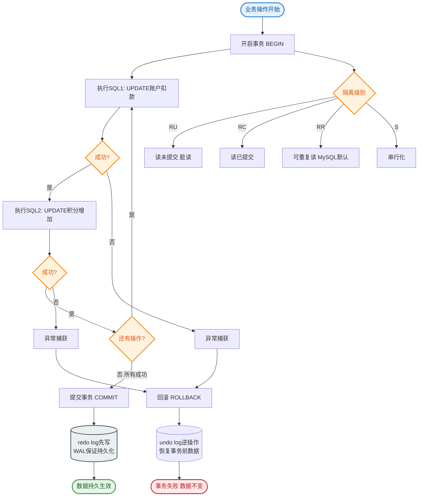

# 什么是隔离级别？

### 事务隔离级别

事务的 ACID 特性中，**隔离性** 重点关注并发事务之间如何相互干扰。
隔离性是通过 **MVCC（多版本并发控制）** 和 **锁机制** 共同保证的。

#### 并发事务带来的三大问题

1. **脏读**
   - **现象**：事务 A 读到了事务 B **未提交** 的数据。
   - **后果**：如果 B 回滚，A 读到的数据就是脏数据，无效。
   - **解决**：提交读 隔离级别及以上。

2. **不可重复读**
   - **现象**：事务 A 在事务内两次读取同一行数据，结果不一样（因为期间事务 B **修改并提交**了该行）。
   - **侧重**：针对**数据内容**的修改。
   - **解决**：可重复读 隔离级别及以上。

3. **幻读**
   - **现象**：事务 A 查询某个范围内的记录（如 `where id > 100`），两次查询结果的**数量**不一样（因为期间事务 B **插入/删除**了新记录并提交）。
   - **侧重**：针对**数据行数**的变化。
   - **解决**：串行化，或者 InnoDB 的 RR 级别通过 **Next-Key Lock** 一定程度上解决。

#### SQL 标准定义的 4 种隔离级别

| 隔离级别 | 脏读 | 不可重复读 | 幻读 | 锁机制 | 默认级别 |
| :--- | :---: | :---: | :---: | :--- | :---: |
| **读未提交** | 可能 | 可能 | 可能 | 无 | - |
| **读已提交 (RC)** | 避免 | 可能 | 可能 | MVCC | Oracle, PostgreSQL |
| **可重复读 (RR)** | 避免 | 避免 | 可能 | MVCC + Next-Key Lock | **MySQL (InnoDB)** |
| **串行化** | 避免 | 避免 | 避免 | 读锁/写锁 | - |

#### MySQL InnoDB 的实现细节

1. **MVCC (Read View)**
   - 在 **RC** 和 **RR** 级别下，普通的 `SELECT` 操作（快照读）不会加锁，通过 Read View 实现非阻塞读取。
   - **RC 级别**：每次 SELECT 都生成一个新的 Read View，所以能看到其他事务已提交的修改（导致不可重复读）。
   - **RR 级别**：只在事务**第一次** SELECT 时生成 Read View，后续复用，因此看不到其他事务的提交（实现了可重复读）。

2. **Next-Key Lock (临键锁)**
   - 在 RR 级别下，为了解决幻读，InnoDB 的当前读（`SELECT ... FOR UPDATE` / `UPDATE` / `DELETE`）会使用 Next-Key Lock。
   - **组成**：`Record Lock (行锁)` + `Gap Lock (间隙锁)`。
   - **作用**：锁住记录本身，以及记录之间的间隙，阻止其他事务在这个间隙插入新记录，从而防止幻读。

```text
ASCII: Next-Key Lock 示例
假设有记录: 10, 20, 30
Select * from t where id = 20 for update;

锁住的范围:
(10, 20]  (Previous Gap + Record 20)  <-- Next-Key Lock
[20, 20]  (Record Lock only)
[20, 30)  (Next Gap only, depending on isolation level)
```

## 常见考点
1. **MySQL 默认隔离级别**：是可重复读（RR），这与其他数据库（如 Oracle 默认 RC）不同。
2. **RR 级别是否完全解决了幻读**：在快照读下通过 MVCC 解决，在当前读下通过 Next-Key Lock 解决。
3. **RC vs RR**：什么业务场景适合 RC（需要读到最新数据）？什么适合 RR（需要数据一致性）？
4. **MVCC 原理**：Undo Log 版本链是如何配合 Read View 实现可见性判断的？


## 核心流程图


## 记忆要点

- 并发异常：脏读（读未提交）、不可重复读（改）、幻读（增删导致行数变化）
- MySQL默认级别：可重复读（RR），而Oracle等多数数据库默认为读已提交（RC）
- MVCC原理：RC每次SELECT生成新Read View，RR仅首次生成并复用解决重复读
- 防幻读机制：RR级别下快照读靠MVCC，当前读靠Next-Key Lock（行锁+间隙锁）

## 结构化回答

**30 秒电梯演讲：** 规定事务并发执行时的隔离程度，以平衡性能与数据正确性。打个比方，隔板厚度：太薄隔壁说话听得见（脏读），太厚交流费劲（性能差）。

**展开框架：**
1. **并发异常** — 脏读（读未提交）、不可重复读（改）、幻读（增删导致行数变化）
2. **MySQL默认级别** — 可重复读（RR），而Oracle等多数数据库默认为读已提交（RC）
3. **MVCC原理** — RC每次SELECT生成新Read View，RR仅首次生成并复用解决重复读

**收尾：** 这三点都能配合实战聊。您想深入聊原理、对比还是避坑？

## 视频脚本

> 预计时长：3 分钟 | 由浅入深

| 时间 | 画面/字幕 | 口播台词 | 讲解要点 |
|------|----------|----------|----------|
| 0:00 | 标题卡：什么是隔离级别 | "什么是隔离级别？一句话——隔板厚度：太薄隔壁说话听得见（脏读），太厚交流费劲（性能差）。" | 开场钩子 |
| 0:45 | 概念动画/示意图 | "规定事务并发执行时的隔离程度，以平衡性能与数据正确性——隔板厚度：太薄隔壁说话听得见（脏读），太厚交流费劲（性能差）" | 核心定义 |
| 1:30 | 并发异常示意 | "脏读（读未提交）、不可重复读（改）、幻读（增删导致行数变化）" | 要点1 |
| 2:15 | MySQL默认级别示意 | "可重复读（RR），而Oracle等多数数据库默认为读已提交（RC）" | 要点2 |
| 3:00 | 总结卡 | "记住这几条，面试不慌。下期讲进阶追问。" | 收尾 |
