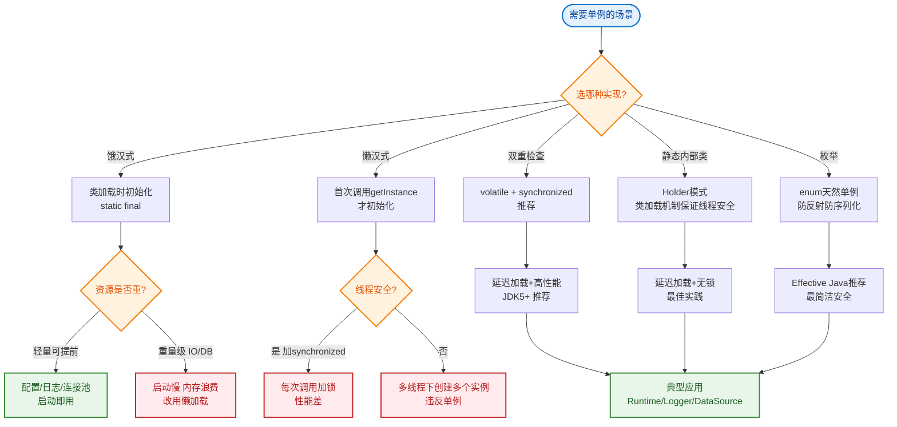

# 单例模式有几种实现方式？各自的优缺点？

单例模式确保一个类只有一个实例，并提供全局访问点。

### 实现方式与优缺点分析

#### 1. 饿汉式
- **实现**：类加载时直接初始化静态实例。
- **优点**：简单，无线程安全问题（由类加载机制保证）。
- **缺点**：如果该实例从未被使用，会造成内存浪费；加载时间可能较长。

#### 2. 懒汉式 (线程不安全)
- **实现**：在首次调用 `getInstance()` 时初始化。
- **优点**：懒加载，节省资源。
- **缺点**：多线程环境下可能创建多个实例，**线程不安全**。

#### 3. 懒汉式 (同步方法)
- **实现**：在 `getInstance()` 方法上加 `synchronized`。
- **优点**：线程安全。
- **缺点**：每次获取实例都要加锁，并发性能极差。

#### 4. 双重检查锁
- **实现**：
  ```java
  if (instance == null) { // 1st check
      synchronized (Singleton.class) {
          if (instance == null) { // 2nd check
              instance = new Singleton();
          }
      }
  }
  ```
- **关键点**：必须配合 `volatile` 关键字。
  - **原因**：`new Singleton()` 不是原子操作，分为 1.分配内存 2.初始化对象 3.引用指向内存。指令重排序可能导致步骤 3 先于 2 执行，导致其他线程拿到未初始化的对象（半初始化）。`volatile` 禁止指令重排。
- **优点**：懒加载，线程安全，锁粒度小（仅在第一次创建时加锁）。
- **缺点**：写法稍复杂，JDK 1.4 及之前对 volatile 支持不佳。

#### 5. 静态内部类
- **实现**：
  ```java
  public class Singleton {
      private Singleton() {}
      private static class Holder {
          private static final Singleton INSTANCE = new Singleton();
      }
      public static Singleton getInstance() {
          return Holder.INSTANCE;
      }
  }
  ```
- **原理**：利用类加载机制。外部类加载时不会加载内部类，只有在调用 `getInstance()` 访问内部类成员时，JVM 才会加载 `Holder` 类并初始化实例。
- **优点**：懒加载，线程安全（JVM 保证类加载的线程安全性），代码简洁，不依赖 `synchronized`。

#### 6. 枚举
- **实现**：`public enum Singleton { INSTANCE; }`
- **优点**：
  - **无线程安全问题**：枚举实例由 JVM 保证。
  - **防反射攻击**：反射通过构造器创建实例时，JVM 会拒绝枚举类型的构造调用。
  - **防序列化破坏**：枚举类默认实现了序列化机制，保证序列化前后是同一个实例。
- **缺点**：不是懒加载（类加载时初始化）；使用场景受限（不能继承其他类）。

```text
ASCII: DCL 内存模型与重排序
Thread A                    Thread B
    │                           │
    ▼                           │
1. 分配内存                      │
    │                           │
3. 引用指向内存 (非volatile)─────▶  判空检查通过
    │                       (看到引用非null)   
    │                           │
    │                       ▼
    │                      使用对象 (此时对象未初始化!)
    │                           │
2. 初始化对象  (指令重排导致)      │
```

## 常见考点
1. **DCL 为什么要加 volatile？**：解释指令重排和半初始化问题。
2. **反射如何破坏单例？**：通过 `setAccessible(true)` 调用私有构造器。除了枚举，其他方式都需要在构造函数里加判断防止重复创建。
3. **序列化如何破坏单例？**：反序列化时会通过反射创建新对象。解决方法是实现 `readResolve()` 方法返回单例实例，或者直接用枚举。
4. **Spring Bean 的单例**：Spring 的 Bean 默认是单例的，但它是基于容器的单例，且是懒加载还是饿加载可配置，与 Java 设计模式的单例实现原理不同。


## 核心流程图


## 记忆要点

- 饿汉类加载初始化，枚举天然防反射防序列化，二者皆非懒加载
- 懒汉同步锁性能差，DCL（双重检查锁）实现懒加载且仅首次加锁
- DCL必加volatile：因为new对象非原子，为防指令重排导致“半初始化”
- 静态内部类最优：兼顾懒加载与线程安全，因为由JVM类加载机制保证
- 反射和序列化会破坏单例，所以除枚举外需在构造函数或readResolve中防御

## 结构化回答

**30 秒电梯演讲：** 严格限制类的实例化次数，并提供全局统一访问入口。打个比方，公司的打印机，全公司共享这一台，大家排队打印。

**展开框架：**
1. **饿汉类加载初始化** — 枚举天然防反射防序列化，二者皆非懒加载
2. **懒汉同步锁性能差** — DCL（双重检查锁）实现懒加载且仅首次加锁
3. **DCL必加volatile** — 因为new对象非原子，为防指令重排导致“半初始化”

**收尾：** 这三点都能配合实战聊。您想深入聊原理、对比还是避坑？

## 视频脚本

> 预计时长：3 分钟 | 由浅入深

| 时间 | 画面/字幕 | 口播台词 | 讲解要点 |
|------|----------|----------|----------|
| 0:00 | 标题卡：单例模式有几种实现方式？各自的优缺点 | "单例模式有几种实现方式？各自的优缺点？一句话——公司的打印机，全公司共享这一台，大家排队打印。" | 开场钩子 |
| 0:45 | 概念动画/示意图 | "严格限制类的实例化次数，并提供全局统一访问入口——公司的打印机，全公司共享这一台，大家排队打印" | 核心定义 |
| 1:30 | 饿汉类加载初始化示意 | "枚举天然防反射防序列化，二者皆非懒加载" | 要点1 |
| 2:15 | 懒汉同步锁性能差示意 | "DCL（双重检查锁）实现懒加载且仅首次加锁" | 要点2 |
| 3:00 | 总结卡 | "记住这几条，面试不慌。下期讲进阶追问。" | 收尾 |
