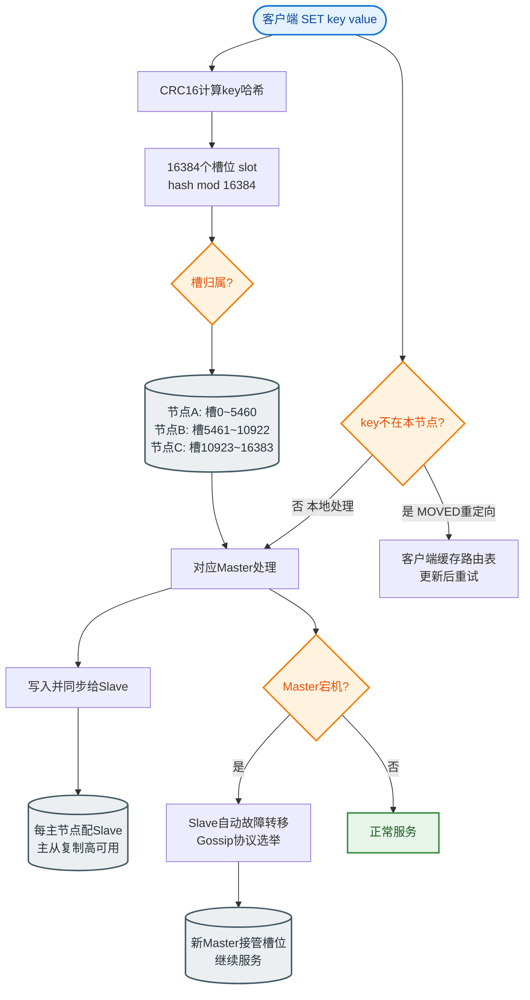

# 哨兵的工作原理是什么？

### 哨兵的工作原理

**1. 哨兵核心功能**
Redis 哨兵是 Redis 高可用架构的组件，主要解决主节点故障后的自动故障转移问题。其核心功能包括：
- **监控**：持续监控主节点和从节点是否存活。
- **通知**：当节点发生故障时，通过 API 通知管理员或其他程序。
- **自动故障转移**：主节点下线时，自动将从节点晋升为主节点，并通知其他从节点和客户端。
- **配置提供者**：客户端连接哨兵获取当前主节点的地址。

**2. 核心工作流程与原理**

#### (1) 主观下线 与 客观下线
- **主观下线 (SDOWN)**：
  单个哨兵实例判定节点下线。哨兵默认每 1 秒向所有节点发送 `PING` 命令，若 `down-after-milliseconds` 毫秒内无有效回复（除 `-LOADING` 和 `-MASTERDOWN` 外），则标记为**主观下线**。

- **客观下线 (ODOWN)**：
  只有当主节点被判定为**主观下线**时，哨兵才会询问其他哨兵。当足够数量的哨兵（达到 `quorum` 配置值）确认主节点主观下线后，才判定主节点为**客观下线**，并开始发起故障转移。

#### (2) 哨兵 Leader 选举
当主节点客观下线后，哨兵集群需选举出一个 Leader 来执行故障转移。选举采用 Raft 算法思想：
1. 发现主节点客观下线的哨兵向其他哨兵发送 `is-master-down-by-addr` 命令请求投票。
2. 收到请求的哨兵若尚未给其他人投票，则同意投票。
3. 票数超过半数 的哨兵成为 Leader。

#### (3) 从节点选举 (Slave Selection)
Leader 选出后，需从从节点中选一个新的主节点。筛选规则如下（按优先级排序）：
1. **筛选状态**：排除离线、断线的从节点。
2. **优先级**：选择 `replica-priority` 配置值最高的从节点（默认均为 100，可手动调低某从节点权重使其不当选）。
3. **复制偏移量**：选择复制进度最靠前（`master_repl_offset` 最大）的从节点，保证数据最完整。
4. **Run ID**：若上述条件相同，选择 Run ID 较小的从节点。

#### (4) 故障转移执行
1. **晋升主节点**：Leader 向选中的从节点发送 `SLAVEOF NO ONE` 命令，将其升级为主节点。
2. **复制重配置**：Leader 向其余从节点发送 `SLAVEOF` 命令，让它们指向新的主节点。
3. **广播公告**：故障转移完成后，Leader 将新的主节点信息广播给所有哨兵和客户端。

```text
┌─────────────┐         PING          ┌─────────────┐
│   Sentinel  │ <───────────────────> │  Redis Master│
│  (Leader)   │                        │   (Down)    │
└──────┬──────┘                        └──────┬──────┘
       │                                      │
       │ (1) 领导选举                          │
       │ (Raft Vote)                          │
       ▼                                      │
┌─────────────────────────────────────────────┐
│            Sentinel 集群共识                │
└─────────────────────────────────────────────┘
       │                                      │
       │ (2) 选举新主                          │
       │ (Offset/Priority)                    ▼
       │                              ┌─────────────┐
       └────────────────────────────> │ Redis Slave1│
                                      │  (New Master)│
                                      └──────┬──────┘
                                             │
                                     Replicaof
                                             │
                              ┌──────────────┴──────────────┐
                              ▼                             ▼
                        ┌─────────────┐              ┌─────────────┐
                        │ Redis Slave2│              │ Redis Slave3│
                        └─────────────┘              └─────────────┘
```

## 常见考点
1. **脑裂问题**：如果主节点与哨兵网络分区，主节点可能仍认为自己是主，导致出现两个主节点。
   - *解决*：配置 `min-replicas-to-write` 和 `min-replicas-max-lag`，要求主节点至少有 N 个从节点连接且延迟小于 M 秒才能写入，否则拒绝写入。
2. **哨兵集群数量**：为什么通常是奇数（如 3、5）？
   - *原因*：为了方便半数投票判断，防止偶数节点导致的平票僵局，同时兼顾容错率（如 3 节点允许挂 1 个，5 节点允许挂 2 个）。
3. **无限循环故障转移**：如果从节点晋升失败（如网络抖动），哨兵会怎么做？
   - *机制*：设置 `failover-timeout`，超时后会重新尝试选举。
4. **哨兵本身的可用性**：
   - *机制*：哨兵之间通过 Redis Pub/Sub 发布订阅消息来交换状态，即使部分哨兵挂掉，只要满足 quorum 数量，集群仍可工作。


## 核心流程图


## 记忆要点

- 四大核心功能：监控、通知、故障转移、配置提供者
- 主观下线靠单节点PING超时，客观下线靠quorum法定人数共识确认
- Leader选举用Raft算法，因为要超半数同意才能主导转移
- 选新主四步曲：先排故障节点，比优先级，再比复制偏移量，最后比Run ID
- 转移动作：发SLAVEOF NO ONE晋升新主，再让其他从节点指向新主

## 结构化回答

**30 秒电梯演讲：** 自动监控 Redis 主从状态，实现故障自动转移。打个比方，主医生晕倒后，助手们（哨兵）投票选新主治医生。

**展开框架：**
1. **四大核心功能** — 监控、通知、故障转移、配置提供者
2. **主观下线靠单节点PING超时** — 客观下线靠quorum法定人数共识确认
3. **Leader选举用Raft算法** — 因为要超半数同意才能主导转移

**收尾：** 这三点都能配合实战聊。您想深入聊原理、对比还是避坑？

## 视频脚本

> 预计时长：3 分钟 | 由浅入深

| 时间 | 画面/字幕 | 口播台词 | 讲解要点 |
|------|----------|----------|----------|
| 0:00 | 标题卡：哨兵的工作原理是什么 | "哨兵的工作原理是什么？一句话——主医生晕倒后，助手们（哨兵）投票选新主治医生。" | 开场钩子 |
| 0:45 | 概念动画/示意图 | "自动监控 Redis 主从状态，实现故障自动转移——主医生晕倒后，助手们（哨兵）投票选新主治医生" | 核心定义 |
| 1:30 | 四大核心功能示意 | "监控、通知、故障转移、配置提供者" | 要点1 |
| 2:15 | 要点2图解示意 | "客观下线靠quorum法定人数共识确认" | 要点2 |
| 3:00 | 总结卡 | "记住这几条，面试不慌。下期讲进阶追问。" | 收尾 |
