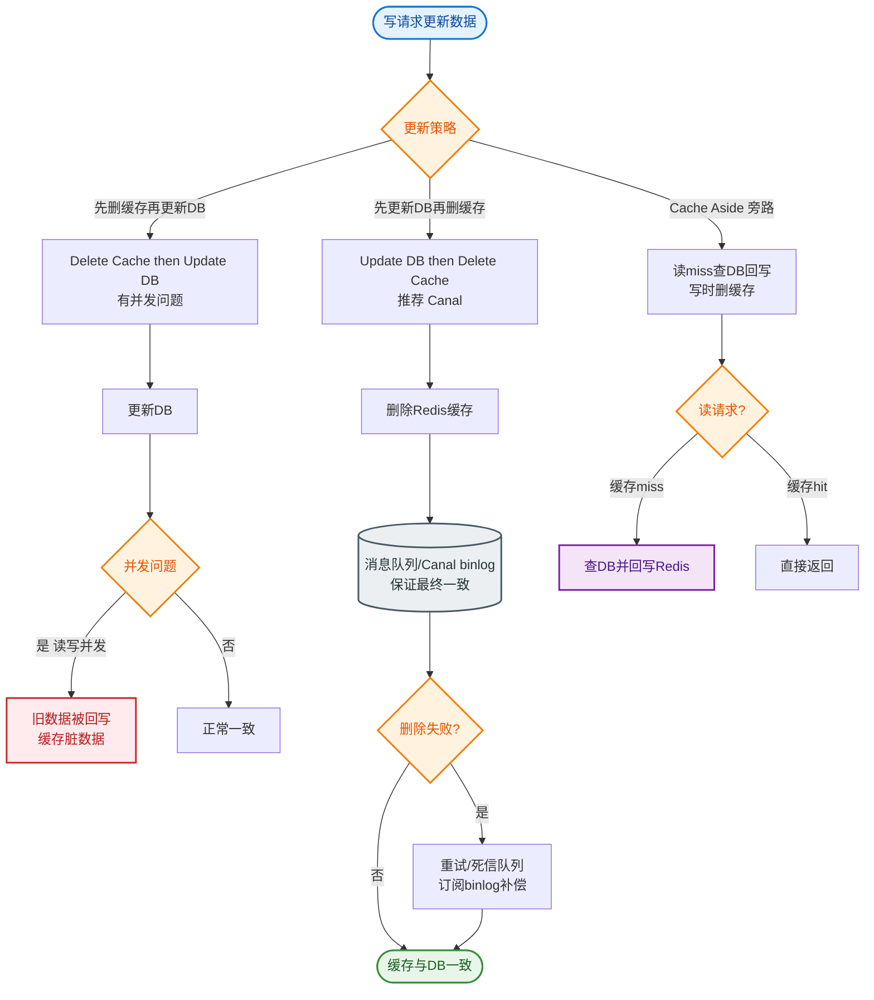

# 如何保证数据库和缓存的一致性？

### 如何保证数据库和缓存的一致性

**1. 核心策略：Cache Aside Pattern (旁路缓存模式)**
这是业界最常用的策略。

**读操作流程**：
1. 先读缓存。
2. 缓存命中，直接返回。
3. 缓存未命中，读数据库。
4. 将数据写入缓存，并返回。

**写操作流程**：
- **推荐方案**：先更新数据库，再删除缓存。
  - *原因*：如果先删缓存，再更新数据库，在并发场景下，A 线程删缓存，B 线程读缓存未命中读 DB 并写旧值，导致 A 更新后缓存仍是旧数据。

**2. 为什么是“删除缓存”而不是“更新缓存”？
- **懒加载**：删除操作开销小，且避免了频繁写操作导致的无效计算（如果数据写入库后马上又被修改，更新缓存浪费资源）。
- **并发安全**：先更新 DB 再删缓存，虽然极端情况下仍有脏数据可能，但概率极低（要求 DB 写操作比缓存写操作慢，且刚好有并发读）。

**3. 最终一致性保障方案**

#### (1) 延时双删
针对“先更 DB，后删缓存”在极端情况下的不一致（如删除失败），可采用延时双删。
1. 先删除缓存。
2. 更新数据库。
3. 休眠一段时间（如 500ms，需大于数据库主从同步延迟 + 读取耗时）。
4. 再次删除缓存。

#### (2) 异步重试机制 (binlog 订阅)
为了确保“删除缓存”这步一定成功（避免因网络抖动或服务宕机导致删失败），引入消息队列重试机制。
1. 业务代码更新数据库。
2. 数据库产生 binlog。
3. Canal 等中间件监听 binlog，解析变更数据。
4. 发送消息到 MQ（如 RabbitMQ/Kafka）。
5. 消费者接收消息，尝试删除缓存。
6. 若删除失败，进行指数退避重试。

```text
┌───────────┐    Write    ┌──────────────┐           ┌─────────────┐
│  Client   │ ──────────> │    Database  │ ── Binlog │   Canal/MQ  │
└───────────┘             └──────────────┘           └──────┬──────┘
     │                                                     │
     │                                                     │ (消息)
     │                                                     ▼
     │                                              ┌─────────────┐
     └────────────────────────────────────────────> │   Redis     │
            (异步重试确保删除成功)                     │   (Del)     │
                                                    └─────────────┘
```

**4. Read/Write Through (穿透模式)**
- **原理**：应用程序只与缓存交互，缓存层负责维护数据库。
- **Write Through**：写缓存时，缓存同步写入数据库，成功后才返回。
- **Read Through**：读缓存未命中时，由缓存层加载数据库数据。
- **适用**：代码维护成本较低，适合简单场景，但缓存层开发复杂度增加（通常由专门的缓存中间件支持）。

## 常见考点
1. **先删缓存还是先更新数据库？**
   - *推荐*：先更新数据库，再删除缓存。理由是“失败的影响面最小”：删缓存失败可能造成短期不一致，但更新 DB 失败则数据永久丢失。
2. **如何解决删除缓存失败的问题？**
   - *方案*：使用消息队列（MQ）对删除操作进行异步重试，确保最终一致性。
3. **强一致性场景如何处理？**
   - *方案*：使用读写锁（ReadWriteLock），即 2PL 思想。写操作加写锁，读操作加读锁。但这会严重降低并发性能，通常仅在金融核心账务等场景使用。
4. **缓存雪崩、穿透、击穿的区别和解决方案？**
   - *雪崩*：大量 key 同时过期。解：随机 TTL。
   - *穿透*：查询不存在的 key。解：布隆过滤器、缓存空对象。
   - *击穿*：热点 key 过期。解：互斥锁、逻辑过期。


## 核心流程图


## 记忆要点

- 常规缓存策略用旁路模式：读先查缓存，写先更DB再删缓存
- 写操作推荐先更DB再删缓存，因为先删缓存会导致并发读旧值回填
- 因为更新缓存浪费资源，所以选用删除而非更新（懒加载思想）
- 防删缓存失败用延时双删，或用Canal监听binlog发MQ做异步重试
- 强一致用读写锁降并发，防雪崩随机TTL，防穿透布隆过滤，防击穿互斥锁

## 结构化回答

**30 秒电梯演讲：** 通过特定的更新策略和重试机制，最终达成数据一致。打个比方，修改档案后，先撕毁旧的备忘录（删缓存），下次查时再贴新的。

**展开框架：**
1. **常规缓存策略用旁路模式** — 读先查缓存，写先更DB再删缓存
2. **写操作推荐先更DB再删缓存** — 因为先删缓存会导致并发读旧值回填
3. **选用删除而非更新（懒加载思想）** — 因为更新缓存浪费资源，所以选用删除而非更新（懒加载思想）。

**收尾：** 这三点都能配合实战聊。您想深入聊原理、对比还是避坑？

## 视频脚本

> 预计时长：3 分钟 | 由浅入深

| 时间 | 画面/字幕 | 口播台词 | 讲解要点 |
|------|----------|----------|----------|
| 0:00 | 标题卡：如何保证数据库和缓存的一致性 | "如何保证数据库和缓存的一致性？一句话——修改档案后，先撕毁旧的备忘录（删缓存），下次查时再贴新的。" | 开场钩子 |
| 0:45 | 概念动画/示意图 | "通过特定的更新策略和重试机制，最终达成数据一致——修改档案后，先撕毁旧的备忘录（删缓存），下次查时再贴新的" | 核心定义 |
| 1:30 | 常规缓存策略用旁路模式示意 | "读先查缓存，写先更DB再删缓存" | 要点1 |
| 2:15 | 要点2图解示意 | "因为先删缓存会导致并发读旧值回填" | 要点2 |
| 3:00 | 总结卡 | "记住这几条，面试不慌。下期讲进阶追问。" | 收尾 |
